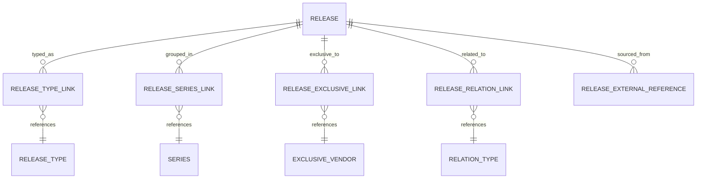

# Release Relationships

The release model relies heavily on **explicit relationship entities**.

This page documents the link models that connect a release to classification data, vendors, other releases, and external identifiers.

---

## Link Models

### ReleaseTypeLink

Connects a release to `ReleaseType`.

| Purpose |
|---|
| Normalize release classification |
| Avoid hardcoded type strings on the release itself |
| Keep classification extensible |

### ReleaseSeriesLink

Connects a release to `Series` and stores `relation_type`.

| Purpose |
|---|
| Support primary and secondary series membership |
| Allow richer navigation and grouping |

### ReleaseExclusiveLink

Connects a release to an `ExclusiveVendor`.

| Purpose |
|---|
| Model retailer exclusives explicitly |
| Support filtering by exclusive channel |
| Preserve normalized vendor metadata |

### ReleaseRelationLink

Connects one release to another through a `RelationType`.

Examples: reissue, variant, collection inclusion, related edition.

### ReleaseExternalReference

Connects a canonical release to a source-country external identifier.

| Purpose |
|---|
| Preserve traceability to source systems |
| Support re-ingestion and reconciliation |
| Avoid using source IDs as canonical identity |

---

## Supporting Reference Models

These relationship models rely on catalog reference data:

| Reference | Used By |
|---|---|
| `ReleaseType` | `ReleaseTypeLink` |
| `ExclusiveVendor` | `ReleaseExclusiveLink` |
| `RelationType` | `ReleaseRelationLink` |
| `CharacterRole` | `ReleaseCharacter` |

---

## Diagram

---

## Important Design Note

:::note Current Inconsistency
There is a documented inconsistency in relation type representations:

- `ReleaseSeriesLink` stores `relation_type` as a **string code** directly.
- `ReleaseRelationLink` stores `relation_type_id` as a **foreign-key-style identifier**.

This is not necessarily wrong, but the platform should eventually decide whether typed relationships consistently use string codes or consistently use reference entities.
:::

---

## External Reference Strategy

External references are deliberately separate from canonical entities.

This means Monstrino can:

- merge duplicate source pages into one canonical object,
- survive source URL changes,
- preserve per-source IDs without leaking them into user-facing identity.

---

## Relationship Modeling Guideline

:::tip When to create a dedicated link entity
Use a dedicated link entity when at least one of the following is true:

- the relation **has metadata**,
- the relation **may evolve independently**,
- the relation **needs timestamps**,
- the relation is **many-to-many**,
- the relation **needs business semantics**.

This rule is followed throughout the release domain.
:::

---

## Related Pages

- [Release Model](./release-model)
- [Catalog Domain](./catalog-domain)
- [Reference Data](./reference-data)
