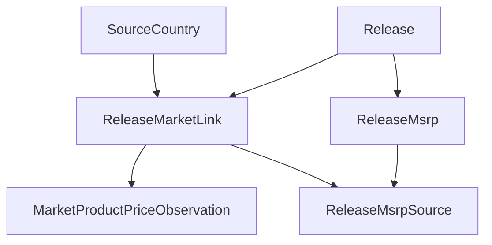

# Market Model

The market domain tracks **how releases appear in commerce** and how pricing changes over time.

It is intentionally separate from the canonical catalog because market data is volatile, source-specific, and historical.

---

## Core Models

### ReleaseMarketLink

Connects a canonical release to a concrete store or marketplace page.

| Field | Description |
|---|---|
| `release_id` | internal release reference |
| `source_country_id` | source and country context |
| `url` | canonical URL of the market listing |
| `external_id` | optional source-specific item identifier |

This is the bridge between a release and market-specific observation streams.

### MarketProductPriceObservation

Records **point-in-time market price observations**.

| Field | Description |
|---|---|
| `release_market_link_id` | which listing was observed |
| `observed_at` | timestamp of observation |
| `currency_code` | ISO currency code |
| `price_amount_minor` | price in minor currency units |
| `shipping_amount_minor` | optional shipping cost in minor units |
| `availability` | availability state at observation time |
| `raw_payload` | optional raw response snapshot |

:::warning
This model should be treated as **append-oriented historical data**. Price observations must never overwrite older observations.
:::

### ReleaseMsrp

Stores canonical MSRP-like pricing facts for a release by country and currency.

| Field | Description |
|---|---|
| `release_id` | which release |
| `country_code` | which country |
| `currency_code` | which currency |
| `msrp_amount_minor` | price in minor currency units |
| `valid_from` | start of validity window |
| `valid_to` | end of validity window (nullable = still valid) |

### ReleaseMsrpSource

Preserves **provenance for MSRP records**.

| Field | Description |
|---|---|
| `release_msrp_id` | which MSRP record |
| `release_market_link_id` | optional link to a market page source |
| `url` | direct source URL |
| `source_type` | how the value was obtained |
| `confidence` | optional confidence score |
| `captured_at` | when the value was observed |
| `note` | optional editorial context |

---

## Why MSRP and Observations Are Separate

| Model | Answers the question |
|---|---|
| `MarketProductPriceObservation` | What was seen on a page at a certain time? |
| `ReleaseMsrp` | What should be treated as a structured baseline retail price fact? |

One is **observational and time-series oriented**. The other is **normalized business data**.

---

## Diagram

---

## Modeling Rules

:::note
1. A market page is **not** a release - it is linked to a release.
2. Price observations should **never** overwrite older observations.
3. MSRP should remain country- and currency-aware.
4. MSRP provenance should be retained whenever possible.
5. Currency values should be stored in **minor units** to avoid floating-point errors.
:::

---

## Common Queries This Model Supports

- current observed price per source page
- price history for a release
- current lowest observed price in a region
- MSRP by country and time range
- confidence and provenance for retail baseline values

---

## Future Extensions

This model is ready for later additions such as:

- seller type distinctions
- marketplace confidence scoring
- condition grading
- deduplicated offer normalization
- regional market analytics

---

## Related Pages

- [Release Model](./release-model)
- [Reference Data](./reference-data)
