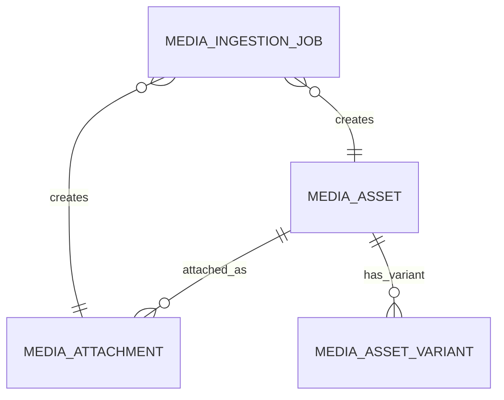

# Media Model

The media domain is designed as a **reusable asset system** rather than a collection of image URLs scattered across business tables.

---

## Core Models

### MediaAsset

`MediaAsset` is the canonical stored asset record - it describes the **file in storage**.

| Field Group | Fields |
|---|---|
| **Storage coordinates** | `provider`, `bucket`, `storage_key`, `public_url` (optional) |
| **Classification** | `visibility`, `source_type`, `media_kind` |
| **Content** | `content_hash`, dimensions, `original_filename` |
| **Traceability** | `source_url`, ingestion trace |
| **Rights** | `license`, attribution fields |
| **State** | `storage_state`, `moderation_state` |

### MediaAttachment

`MediaAttachment` describes **how an asset is used by a business entity** - its role and ownership context.

| Field | Description |
|---|---|
| `asset_id` | which asset is attached |
| `owner_service` | which service owns this attachment |
| `owner_type` | entity type (e.g., `release`, `character`) |
| `owner_id` | entity identifier |
| `owner_ref` | optional stable reference string |
| `role` | attachment role (e.g., `primary_image`, `gallery`) |
| `sort_order` | display ordering |
| `filename`, `caption`, `alt_text` | display and accessibility fields |
| `source_context` | how this attachment originated |

One asset can be attached to many different entities across different services without duplicating the physical file.

### MediaAssetVariant

`MediaAssetVariant` stores transformed or derivative versions of an asset.

| Field | Description |
|---|---|
| `asset_id` | the original asset this variant derives from |
| `variant_name` | e.g., `thumbnail`, `webp_optimized` |
| `transform` | optional transform definition |
| storage coordinates | provider, bucket, key |
| content metadata | hash, dimensions, MIME type |
| `status` | `active`, `generating`, `failed` |
| `error_message` | failure context if applicable |

Variants are useful for thumbnails, web-optimized versions, crops, or future AI-generated derivations.

### MediaIngestionJob

`MediaIngestionJob` tracks the **processing lifecycle of media work** - the operational bridge between external URLs and final stored attachments.

| Field Group | Fields |
|---|---|
| **Identity** | job ID, `idempotency_key` |
| **Target** | `owner_service`, `owner_type`, `owner_id`, `role`, `sort_order` |
| **Source** | `source_url`, source metadata |
| **Execution** | `processing_state`, `retry_count`, lease state |
| **Results** | `asset_id`, `attachment_id` (after completion) |
| **Content** | captured content metadata |
| **Errors** | error code, error message |

---

## Diagram



---

## Why MediaAsset and MediaAttachment Are Separate

| Model | Describes |
|---|---|
| `MediaAsset` | the file in storage - what it is |
| `MediaAttachment` | how the file is used by the domain - what role it plays |

This means the same physical asset could be attached to:

- a release gallery,
- a character page,
- an admin record,
- a parsed record under review.

Without duplicating the file model.

---

## Media Ownership Pattern

The owner fields on `MediaAttachment` are intentionally generic:

```
owner_service + owner_type + owner_id + owner_ref
```

:::warning
This pattern is very flexible, but it also means **ownership conventions must be documented clearly and applied consistently** across services. Unclear conventions lead to orphaned assets or duplicate attachments.
:::

---

## Recommended Invariants

:::note
1. `content_hash_sha256` should be the **primary deduplication signal** whenever available.
2. `MediaAttachment` should be the only supported path for attaching assets to business entities.
3. Asset variants should always point back to **one original asset**.
4. Asset visibility and moderation state must remain **explicit fields** - never inferred.
5. Media job idempotency must be preserved across retries.
:::

---

## Legacy vs Modern Media

The catalog DTOs still include legacy image models:
- `ReleaseImage`
- `ReleaseCharacterImage`
- `ReleasePetImage`

These are useful today, but the long-term architecture points toward `MediaAsset` + `MediaAttachment` as the more scalable approach.

---

## Related Pages

- [Ingest Model](./ingest-model)
- [Value Objects and Enums](./value-objects-and-enums)
- [Processing and Scheduling](./processing-and-scheduling)
