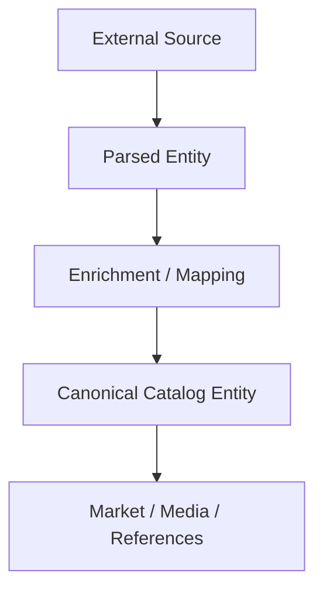

# Ingest Model

The ingest domain is the **raw and semi-structured staging layer** of Monstrino.

It exists to capture source data before it becomes canonical business truth.

---

## Core Parsed Models

### ParsedRelease

`ParsedRelease` is the richest ingest model and captures what the source said about a product:

| Field Group | Fields |
|---|---|
| **Product attributes** | `title`, `mpn`, `year`, `gtin` |
| **Release-related lists** | characters, gender, series, content type, pack type, tier type, exclusive vendor, pet titles, reissue hints |
| **Image fields** | `primary_image`, `images`, `images_url` |
| **Text fields** | raw description, box text |
| **Source info** | URL, `source_country_id`, `external_id` |
| **Raw storage** | original HTML, raw JSON payload, `content_hash` |
| **Processing** | `processing_state`, `processing_errors` |

### ParsedCharacter
Captures source-derived character data before canonical normalization.

### ParsedSeries
Captures source-derived series data, including optional parent title and source linkage.

### ParsedPet
Captures source-derived pet data, including owner-title hints from the source.

---

## Why Parsed Models Matter

Parsed entities allow the platform to **preserve source reality without forcing early normalization**.

Source data can be:

| Issue | Why it matters |
|---|---|
| **Incomplete** | missing required fields should not block storage |
| **Ambiguous** | multiple interpretations may exist |
| **Inconsistent across countries** | same product described differently per locale |
| **Wrong** | sources make errors |
| **Partially structured** | some fields are embedded in free text |

---

## Canonicalization Flow

---

## Processing States

Parsed entities store **explicit processing state** instead of relying on implicit queue logic.

Benefits:

- retryable workflows are transparent,
- failure visibility is built-in,
- operator review is possible at any stage,
- incremental enrichment can proceed step by step.

---

## Modeling Rules

:::note
1. Parsed entities are **not user-facing canonical truth**.
2. Parsed entities may contain lossy, redundant, or source-specific fields.
3. Source payload preservation is **allowed and expected** in ingest.
4. Mapping from parsed to canonical should be **deterministic where possible**, reviewable where not.
5. Parsed entities should remain traceable to source country and external identifiers.
:::

---

## The Boundary That Matters Most

:::warning Important architectural boundary
The catalog should never depend on parsed wording directly for business identity.

- **Ingest** stores what the source said.
- **Catalog** stores what Monstrino decided is true enough to publish.

That boundary is one of the most important architectural lines in the whole system.
:::

---

## Related Pages

- [Catalog Domain](./catalog-domain)
- [Reference Data](./reference-data)
- [Processing and Scheduling](./processing-and-scheduling)
