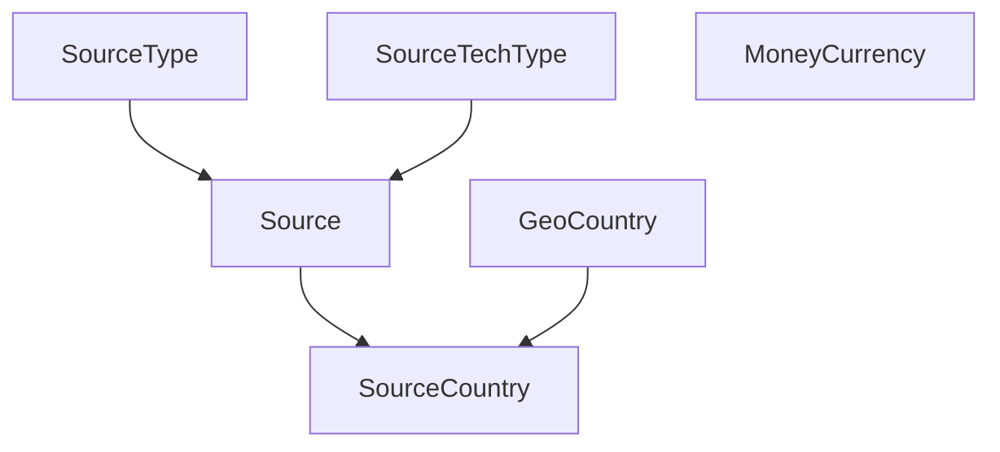

# Reference Data

Reference data provides the **shared controlled vocabulary and identifiers** used by multiple Monstrino services.

Without these models, domain logic would leak hardcoded strings and ad-hoc assumptions across services.

---

## Core Models

### Source

Defines a crawlable or queryable external system.

| Field | Description |
|---|---|
| `code` | stable identifier for the source |
| `title` | display name |
| `source_type_id` | functional classification |
| `source_tech_type_id` | technical access pattern |
| `base_url` | entry URL for the source |
| `description` | optional context |
| `last_parsed_at` | when this source was last successfully crawled |
| `is_enabled` | whether this source is active |

### SourceCountry

Defines a **country-specific view of a source**.

| Field | Description |
|---|---|
| `source_id` | parent source |
| `source_code` | source-specific code for this country context |
| `country_code` | ISO country code |
| `base_url` | optional country-specific URL override |
| `is_active` | whether this country view is active |

:::note
Many retail and content sources differ meaningfully by country - product availability, pricing, and even product names vary. `SourceCountry` models this explicitly rather than collapsing it into the parent `Source`.
:::

### GeoCountry

Defines country-level reference metadata used for geographic normalization across the platform.

### MoneyCurrency

Defines currency-level metadata.

| Key Field | Why It Matters |
|---|---|
| `minor_unit` | number of decimal places - essential for correct price normalization and storage in minor units |

### SourceType

Classifies a source **functionally**.

Examples: marketplace, official store, wiki, catalog page, community database.

### SourceTechType

Classifies the **technical access pattern** of the source.

Examples: HTML, REST API, RSS, Shopify-style storefront.

---

## Diagram

---

## Why These Models Matter

| What it enables | How reference data helps |
|---|---|
| Ingest traceability | know exactly which source and country produced a record |
| Market localization | `source_country_id` ties a market link to a specific locale |
| Pricing correctness | `MoneyCurrency.minor_unit` enables correct minor-unit storage |
| Collector grouping | `SourceTechType` groups sources by technical integration strategy |
| Source lifecycle | `is_enabled` and `last_parsed_at` support operational monitoring |

---

## Modeling Rules

:::note
1. Source identity should be **stable and code-driven** - `source.code` should not change.
2. Country-specific source behavior belongs on `SourceCountry`, not on `Source` itself.
3. Currency logic should rely on `MoneyCurrency` and **minor units** throughout.
4. Source types and technical source types should remain **separate** - functional classification is independent from technical access method.
:::

---

## Common Usage Patterns

| Usage | Field Used |
|---|---|
| `ReleaseExternalReference` | `source_country_id` |
| `ReleaseMarketLink` | `source_country_id` |
| Parsed entities | `source_country_id` |
| Series, character, pet external references | `source_id` |

:::warning
The difference between `source_country_id` and `source_id` usage across entity types **affects reconciliation logic**. This distinction should be kept documented and applied consistently.
:::

---

## Related Pages

- [Ingest Model](./ingest-model)
- [Market Model](./market-model)
- [Release Relationships](./release-relationships)
