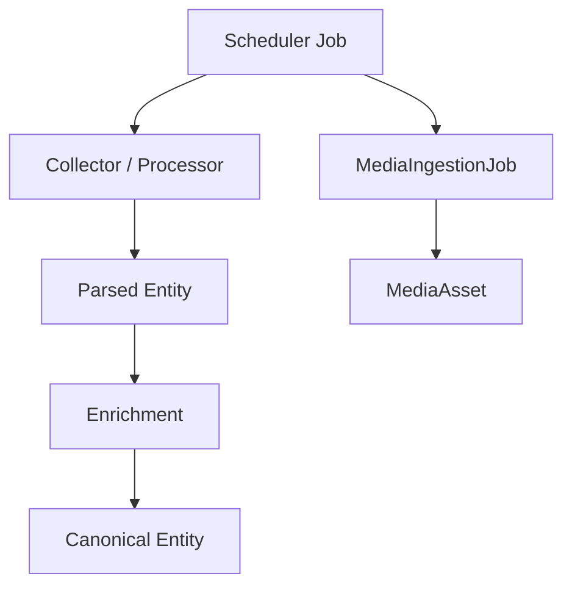

# Processing and Scheduling

Although scheduling is not part of the core collectible business domain, Monstrino benefits from documenting its processing model because **many domain transitions depend on recurring jobs**.

---

## Scheduler Job Model

The current scheduler `Job` model contains:

| Field Group | Fields |
|---|---|
| **Identity** | `id` |
| **Trigger config** | `trigger`, `run_date`, `day`, `hour`, `minute`, `day_of_week` |
| **Execution target** | `func` - the callable to invoke |
| **Execution inputs** | `args`, `kwargs` |
| **Planning** | `next_run_time` |
| **Classification** | optional `job_type` |

This model represents **when and how** work is executed - not business truth itself.

---

## Domain-Adjacent Responsibilities

Scheduling drives processes such as:

- source collection,
- reprocessing parsed entities,
- media ingestion retries,
- price observation collection,
- release discovery loops.

---

## Relation to MediaIngestionJob

:::note Two distinct layers
| Model | What it represents |
|---|---|
| `Job` (scheduler) | orchestration metadata - **when and how** to trigger work |
| `MediaIngestionJob` | domain-aware operational state - **what happened** to a specific media task |

One is infrastructure-level orchestration. The other is a business-relevant processing record.
:::

---

## Recommended Boundary

Keep the scheduler model **outside the canonical business core**, but document it here because it is essential for understanding lifecycle transitions.

---

## Example Lifecycle

---

## Processing Design Guidelines

:::note
1. Scheduling metadata should **not** be mixed into canonical catalog entities.
2. Retry logic should live in **operational job models**, not in release or character records.
3. Domain publication should depend on **explicit processing outcomes**, not merely on job execution attempts.
4. **Idempotency** should be preserved wherever jobs can be replayed.
5. Lease and retry fields belong on execution-state models such as `MediaIngestionJob`.
:::

---

## Why This Page Exists

Projects with many pipelines often fail because the relationship between domain models and execution models is left implicit.

> Making that boundary explicit keeps Monstrino maintainable as the number of pipelines grows.

---

## Related Pages

- [Ingest Model](./ingest-model)
- [Media Model](./media-model)
