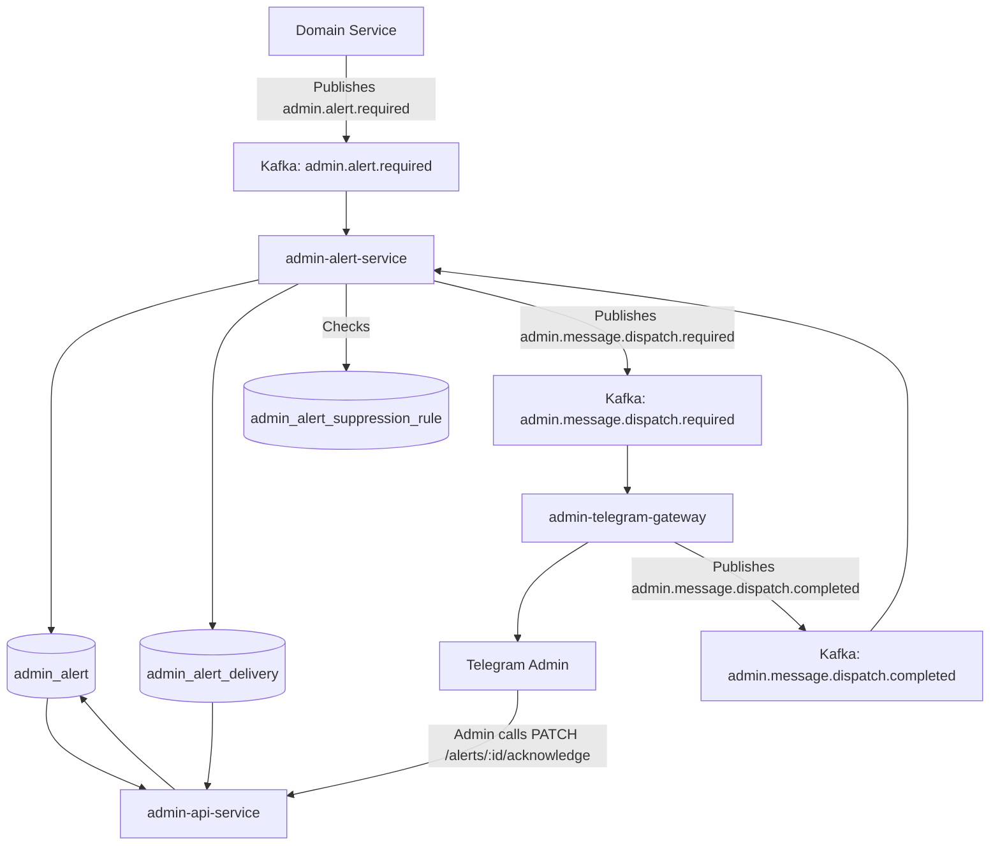
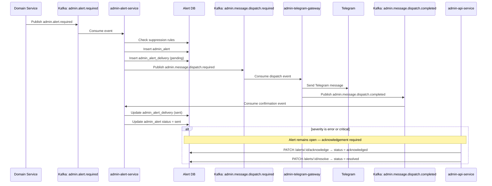
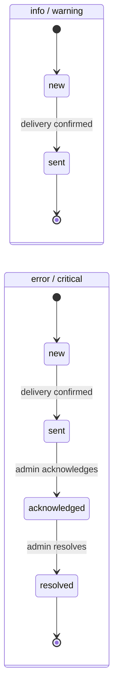
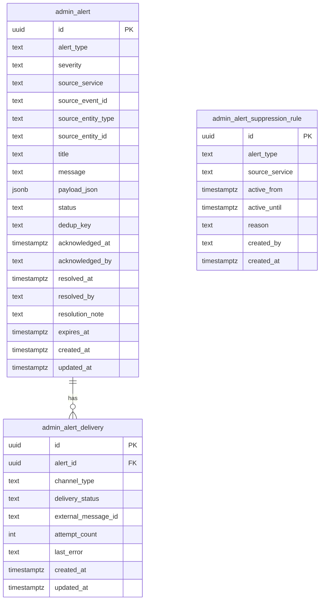

# Admin Alert Pipeline

## Overview

The **Admin Alert Pipeline** is responsible for turning important
platform events into actionable admin notifications.

It is intentionally separated from review and decision workflows.
Its job is not to collect admin input or store review decisions.
Its job is to:

- listen to important domain events
- materialize alerts inside the admin domain
- prepare channel delivery
- dispatch notifications to the admin communication layer
- track delivery state and delivery confirmation
- require acknowledgement for high-severity alerts

This pipeline is used for events such as:

- job failures
- stuck jobs
- source connectivity issues
- credential expiration warnings
- new release detected notifications
- manual review required notifications

---

## Scope and Responsibilities

### What this pipeline does

- Consumes alert-worthy Kafka events
- Creates a persistent admin alert record
- Deduplicates repeated alerts when needed
- Creates channel delivery records
- Publishes message dispatch events for external channels such as Telegram
- Tracks delivery attempts and delivery outcome
- Receives delivery confirmations from the gateway via Kafka
- Requires acknowledgement and resolution for `error` and `critical` alerts
- Suppresses alerts that match active suppression rules

### What this pipeline does not do

- It does not store manual review options or review decisions
- It does not apply domain changes in source services
- It does not interpret Telegram replies as review decisions
- It does not act as a universal admin orchestration layer

---

## Services Involved

### `admin-alert-service`

Owns the alert domain. It consumes alert-required events, stores alert
records, prepares outgoing notifications, and processes delivery
confirmation events from the gateway.

### `admin-telegram-gateway`

Acts as a transport adapter for Telegram. It consumes dispatch events,
sends messages to the admin, and publishes delivery confirmation events
back to Kafka.

### `admin-api-service`

Provides a unified admin-facing read API across the admin domain. It may
read alert tables in read-only mode, but it does not own alert
persistence. It exposes the acknowledge and resolve endpoints for
`error`/`critical` alerts.

---

## High-Level Flow



---

## End-to-End Sequence



---

## Alert Lifecycle

Alert lifecycle depends on severity. Low-severity alerts are closed
automatically after confirmed delivery. High-severity alerts require
explicit admin action.



| Severity | Required lifecycle |
|---|---|
| `info` | `new → sent` |
| `warning` | `new → sent` |
| `error` | `new → sent → acknowledged → resolved` |
| `critical` | `new → sent → acknowledged → resolved` |

Alerts with `error` or `critical` severity that remain in `sent` status
without acknowledgement represent open incidents visible in the admin
dashboard.

---

## Kafka Topics

### `admin.alert.required`

Purpose: carries domain events that should become admin alerts.

Typical producers:

- catalog services
- ingest services
- media services
- review-related services that also want alert visibility

Typical consumers:

- `admin-alert-service`

#### Payload: admin.alert.required

```json
{
  "event_id": "uuid",
  "event_type": "admin.alert.required",
  "event_version": 1,
  "occurred_at": "2026-03-14T15:30:00Z",
  "source_service": "catalog-importer",
  "alert": {
    "alert_type": "new_release_detected",
    "severity": "info",
    "title": "New release detected",
    "message": "A new release candidate was detected in the source pipeline.",
    "entity_type": "release",
    "entity_id": "uuid",
    "dedup_key": "new_release:uuid",
    "payload": {
      "release_title": "Monster High Example Release"
    }
  }
}
```

---

### `admin.message.dispatch.required`

Purpose: internal admin-domain dispatch event for external communication
gateways.

Typical producers:

- `admin-alert-service`
- later also `admin-review-service` if review prompts are sent through
  the same channel layer

Typical consumers:

- `admin-telegram-gateway`

#### Payload: admin.message.dispatch.required

```json
{
  "event_id": "uuid",
  "event_type": "admin.message.dispatch.required",
  "event_version": 1,
  "occurred_at": "2026-03-14T15:32:00Z",
  "source_service": "admin-alert-service",
  "message": {
    "message_type": "alert",
    "channel": "telegram",
    "reference_type": "alert",
    "reference_id": "uuid",
    "text": "New release detected",
    "reply_markup": null
  }
}
```

---

### `admin.message.dispatch.completed`

Purpose: delivery confirmation published by the gateway after a message
is successfully sent to the external channel. Consumed by
`admin-alert-service` to update delivery and alert status.

Typical producers:

- `admin-telegram-gateway`

Typical consumers:

- `admin-alert-service`

#### Payload: admin.message.dispatch.completed

```json
{
  "event_id": "uuid",
  "event_type": "admin.message.dispatch.completed",
  "event_version": 1,
  "occurred_at": "2026-03-14T15:32:05Z",
  "source_service": "admin-telegram-gateway",
  "delivery": {
    "reference_type": "alert",
    "reference_id": "uuid",
    "channel": "telegram",
    "external_message_id": "telegram-message-id",
    "status": "sent"
  }
}
```

---

## Data Model

### Core Tables

#### `admin_alert`

Stores the canonical alert record inside the admin domain.

| Column | Type | Purpose |
|---|---|---|
| `id` | UUID | Primary key |
| `alert_type` | text | Semantic alert type code |
| `severity` | text | `info`, `warning`, `error`, `critical` |
| `source_service` | text | Service that emitted the originating event |
| `source_event_id` | UUID/text | Original event identifier |
| `source_entity_type` | text | Related entity type |
| `source_entity_id` | UUID/text | Related entity identifier |
| `title` | text | Short admin-facing title |
| `message` | text | Human-readable message |
| `payload_json` | jsonb | Extra event context |
| `status` | text | `new`, `sent`, `acknowledged`, `resolved`, `suppressed`, `failed` |
| `dedup_key` | text | Stable deduplication key |
| `acknowledged_at` | timestamptz | When acknowledged (error/critical only) |
| `acknowledged_by` | text | Admin user identifier who acknowledged |
| `resolved_at` | timestamptz | When resolved (error/critical only) |
| `resolved_by` | text | Admin user identifier who resolved |
| `resolution_note` | text | Optional note left at resolution |
| `expires_at` | timestamptz | When eligible for archival |
| `created_at` | timestamptz | Creation timestamp |
| `updated_at` | timestamptz | Last update timestamp |

#### `admin_alert_delivery`

Stores delivery attempts per external channel.

| Column | Type | Purpose |
|---|---|---|
| `id` | UUID | Primary key |
| `alert_id` | UUID | FK to `admin_alert.id` |
| `channel_type` | text | `telegram`, later possibly `email`, `slack` |
| `delivery_status` | text | `pending`, `sent`, `failed` |
| `external_message_id` | text | Message identifier from the external channel |
| `attempt_count` | integer | Delivery retries |
| `last_error` | text | Last delivery error |
| `created_at` | timestamptz | Creation timestamp |
| `updated_at` | timestamptz | Last update timestamp |

#### `admin_alert_suppression_rule`

Stores active suppression rules. Alerts matching a rule are stored with
status `suppressed` and not dispatched.

Suppression is needed in cases where the platform is expected to
generate a high volume of alerts that do not require admin attention:

- **Planned maintenance** — a source or service is intentionally taken
  offline; connectivity or job failure alerts during that window are
  expected noise
- **Known degraded state** — a source is already being investigated;
  repeated alerts for the same entity add no value until the issue is
  resolved
- **Bulk import or migration** — a large operation is running that
  intentionally triggers events such as "new release detected" at high
  volume; the admin is already aware
- **Testing or staging activity** — events fired from non-production
  workflows that share the same Kafka topics

| Column | Type | Purpose |
|---|---|---|
| `id` | UUID | Primary key |
| `alert_type` | text | Alert type to suppress, or `*` for all types |
| `source_service` | text | Source service to suppress, or `*` for all |
| `active_from` | timestamptz | Start of suppression window |
| `active_until` | timestamptz | End of suppression window |
| `reason` | text | Human-readable reason (e.g. "Planned maintenance") |
| `created_by` | text | Admin user who created the rule |
| `created_at` | timestamptz | Creation timestamp |

---

## Data Model Diagram



---

## Processing Rules

### Suppression

Before creating an alert, `admin-alert-service` checks
`admin_alert_suppression_rule` for an active rule matching the incoming
`alert_type` and `source_service`.

If a matching rule exists:

- the alert record is created with `status = suppressed`
- no delivery record is created
- no dispatch event is published

### Severity routing

`admin-alert-service` uses `severity` to determine the expected
lifecycle at alert creation time:

- `info` / `warning` — alert closes automatically when delivery is
  confirmed
- `error` / `critical` — alert requires explicit admin acknowledgement
  and resolution

### Delivery confirmation

When `admin-alert-service` consumes an
`admin.message.dispatch.completed` event:

- updates `admin_alert_delivery.delivery_status = sent`
- if severity is `info` or `warning` → updates
  `admin_alert.status = sent` (terminal)
- if severity is `error` or `critical` → updates
  `admin_alert.status = sent` (open, awaiting acknowledgement)

### Acknowledgement and resolution

Acknowledgement and resolution are performed via `admin-api-service`
HTTP endpoints and apply only to `error` and `critical` alerts:

- `PATCH /alerts/:id/acknowledge` → sets `status = acknowledged`,
  `acknowledged_at`, `acknowledged_by`
- `PATCH /alerts/:id/resolve` → sets `status = resolved`,
  `resolved_at`, `resolved_by`, optional `resolution_note`

### Open incidents query

Alerts that require attention but have not been acknowledged:

```sql
SELECT * FROM admin_alert
WHERE severity IN ('error', 'critical')
  AND status = 'sent'
  AND acknowledged_at IS NULL;
```

### Deduplication

The pipeline supports semantic deduplication through `dedup_key`.

Examples:

- same failing source polled repeatedly within a short period
- repeated warning for the same credential expiration window
- repeated "new release detected" event caused by retry loops

Recommended rule:

- deduplicate on `dedup_key` + active status window
- keep the original alert record stable
- update `updated_at` rather than creating a new record when appropriate

### Delivery retry

`admin_alert_delivery` tracks retries independently from alert creation.

Recommended rule:

- alert persistence must succeed before dispatch is attempted
- dispatch retry must not recreate the parent alert
- retries should be idempotent per delivery row

### Retention

Resolved and sent alerts are eligible for archival based on `expires_at`.
The `expires_at` column is set at creation time based on severity:

| Severity | Retention |
| --- | --- |
| `info` | 30 days |
| `warning` | 60 days |
| `error` | 90 days |
| `critical` | 90 days |

A scheduled job archives expired records to a separate
`admin_alert_archive` table or cold storage.

---

## Suggested Indexes

### `admin_alert`

- unique or selective index on `source_event_id` when upstream
  guarantees uniqueness
- index on `dedup_key`
- index on `status`
- index on `severity`
- index on `(severity, status)` — supports open incidents query
- index on `(source_service, source_entity_type, source_entity_id)`
- index on `created_at`
- index on `expires_at`

### `admin_alert_delivery`

- index on `alert_id`
- index on `(channel_type, delivery_status)`
- index on `external_message_id`

### `admin_alert_suppression_rule`

- index on `(alert_type, active_from, active_until)`
- index on `active_until` — for efficiently expiring rules

---

## Failure Handling

### If alert creation fails

The message should be retried by Kafka consumer mechanics. Processing
must be safe to repeat without creating duplicate records.

### If channel dispatch fails

The alert remains stored. Only the delivery row is retried or marked as
failed.

### If Telegram is unavailable

The alert pipeline must not lose the alert record. Transport failure is
a delivery concern, not a domain state loss.

### If delivery confirmation is lost

The delivery row remains in `pending` status. A background check or
redelivery mechanism may reconcile stale pending deliveries against the
external channel.

---

## Relationship to the Review Pipeline

The alert pipeline may also notify the admin that a manual review is
required. In that case:

- `admin-review-service` owns the review request and review options
- `admin-alert-service` only owns the alert representation of that fact

This keeps notification state and decision state separated.

---

## Recommended Boundaries

### Write ownership

- `admin-alert-service` writes alert tables and processes delivery
  confirmations
- `admin-api-service` writes `acknowledged_by`, `resolved_by`, and
  related fields via explicit admin actions
- `admin-telegram-gateway` does not write alert domain state directly

### Read ownership

- `admin-api-service` may read alert tables in read-only mode to expose
  aggregated admin views

---

## Summary

The **Admin Alert Pipeline** is the notification-focused branch of the
admin domain. It converts important system events into persistent alerts
and external admin messages. Delivery is confirmed via a Kafka feedback
loop from the gateway. High-severity alerts (`error`, `critical`) require
explicit admin acknowledgement and resolution, while low-severity alerts
(`info`, `warning`) close automatically after confirmed delivery. Alert
state and review decision state remain separated.
