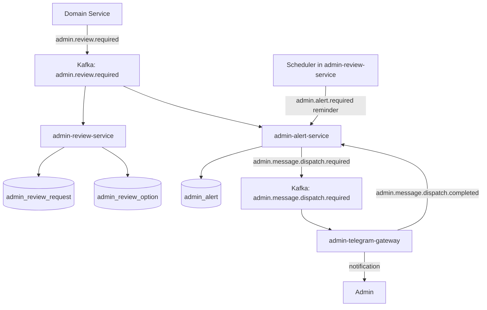
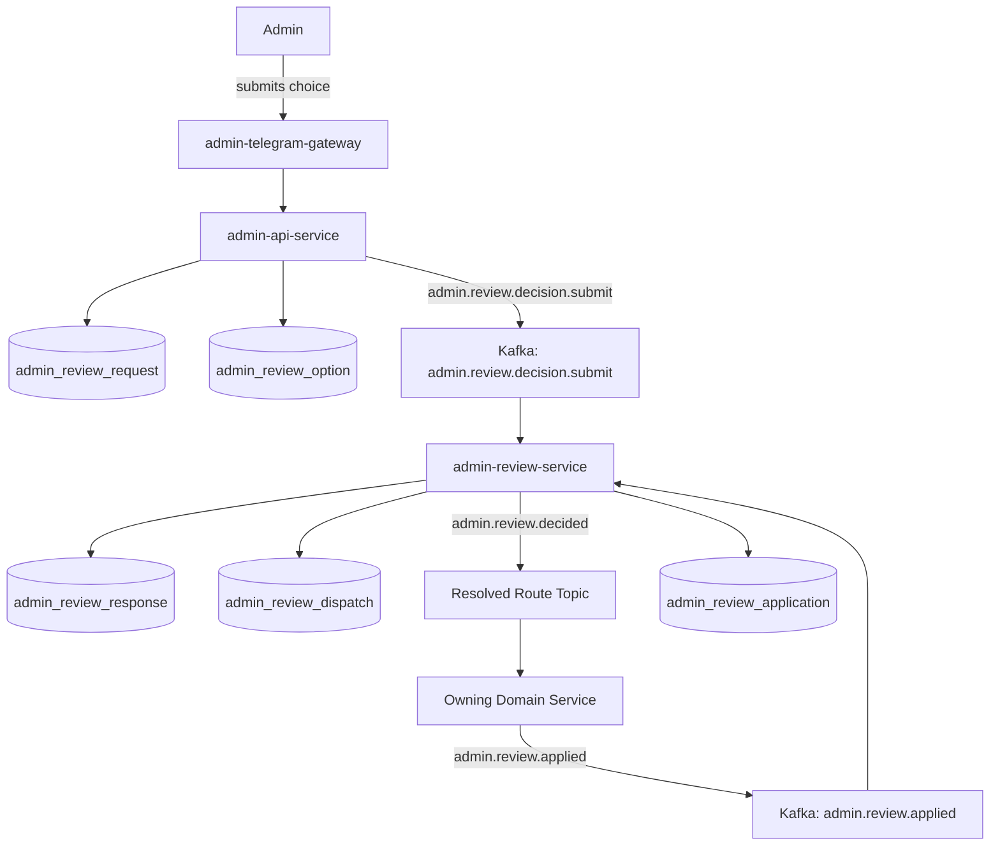
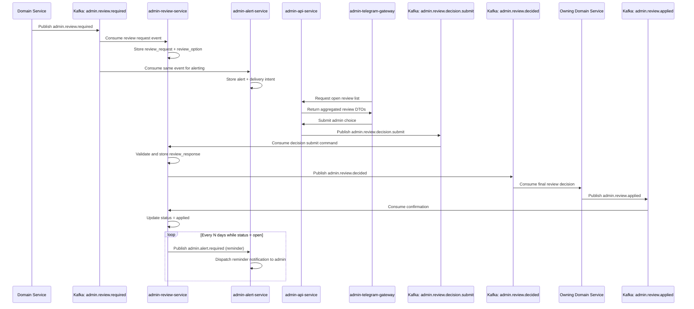
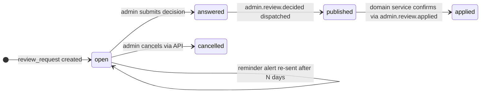
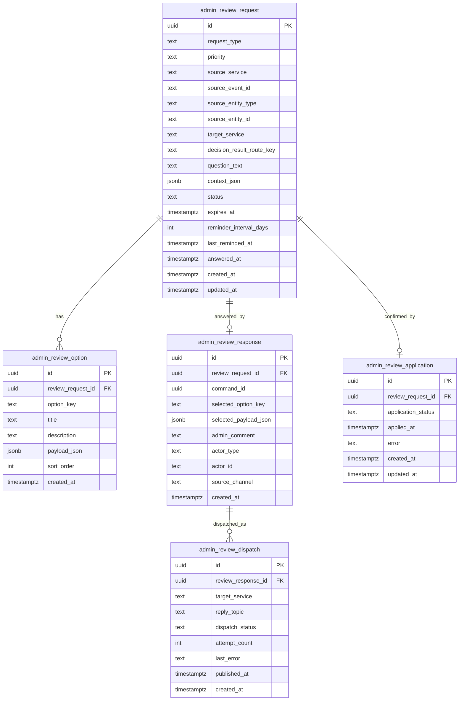

# Admin Review Pipeline

## Overview

The **Admin Review Pipeline** handles cases where the platform cannot
safely make a final decision automatically and an administrator must
choose the correct outcome.

This pipeline is used for scenarios such as:

- canonical title ambiguity
- duplicate candidate resolution
- series matching ambiguity
- conflicting normalized values
- manual approval of high-impact data corrections

The review pipeline is intentionally separated from the alert pipeline.

- The **alert pipeline** answers: *How does the admin get notified?*
- The **review pipeline** answers: *How is the review request stored,
  answered, and published back to the owning domain service?*

---

## Scope and Responsibilities

### What this pipeline does

- Consumes `admin.review.required`
- Creates and persists review requests and options
- Exposes review data through the admin-facing API layer
- Accepts admin decisions through an asynchronous command flow
- Persists review responses
- Publishes `admin.review.decided` to the target domain route
- Receives application confirmations from domain services via Kafka
- Re-notifies the admin via the alert pipeline when a review remains
  unanswered past the configured reminder interval

### What this pipeline does not do

- It does not directly mutate source domain tables
- It does not own generic alerting responsibilities
- It does not let external transports bypass review validation

---

## Services Involved

### `admin-review-service`

Owns the review domain. It stores review requests, options, responses,
and publishes final decision events. It also runs a scheduled job that
emits reminder alerts for unanswered reviews.

### `admin-alert-service`

Consumes the same `admin.review.required` event only to notify the admin
that action is needed. Also receives reminder events published by the
review service scheduler.

### `admin-api-service`

Acts as the unified admin entrypoint. It reads admin-domain tables and
publishes decision submit commands instead of writing review state
directly. Exposes the cancel endpoint for open reviews.

### `admin-telegram-gateway`

Acts as a transport adapter. It talks to `admin-api-service`, not
directly to `admin-review-service`.

---

## High-Level Flow

### Part 1 — Admin receives a review request

A domain service emits an event. The review service stores the case.
The alert service notifies the admin through the notification gateway.



### Part 2 — Admin submits a decision

The admin sends a choice through the notification gateway. The API
layer publishes a command. The review service validates, stores the
response, and dispatches the final decision back to the domain service.



---

## Review Lifecycle Sequence



---

## Review Lifecycle



| Status | Description |
|---|---|
| `open` | Awaiting admin decision |
| `answered` | Decision recorded, pending dispatch |
| `published` | Decision published to domain service |
| `applied` | Domain service confirmed application |
| `cancelled` | Cancelled by admin before decision |
| `expired` | Past `expires_at` with no decision |

---

## Kafka Topics

### `admin.review.required`

Purpose: emitted by a domain service when automatic resolution is not
safe and admin review is required.

Typical producers:

- catalog-data-enricher
- catalog-importer
- matching or normalization services

Typical consumers:

- `admin-review-service`
- `admin-alert-service`

#### Payload: admin.review.required

```json
{
  "event_id": "uuid",
  "event_type": "admin.review.required",
  "event_version": 1,
  "occurred_at": "2026-03-14T15:31:00Z",
  "source_service": "catalog-data-enricher",
  "review": {
    "request_id": "uuid",
    "request_type": "select_canonical_title",
    "priority": "normal",
    "entity_type": "release",
    "entity_id": "uuid",
    "target_service": "catalog-data-enricher",
    "decision_result_route_key": "catalog-enricher.canonical-title",
    "title": "Canonical title review required",
    "question_text": "Choose the canonical title for this release.",
    "context": {
      "raw_title": "Monster High Skulltimate Secrets ..."
    },
    "options": [
      {
        "option_key": "a",
        "title": "Skulltimate Secrets: Gore-geous Oasis",
        "description": "Preferred normalized title",
        "payload": {
          "canonical_title": "Skulltimate Secrets: Gore-geous Oasis"
        }
      },
      {
        "option_key": "b",
        "title": "Destination: Gore-geous Oasis",
        "description": "Alternative title candidate",
        "payload": {
          "canonical_title": "Destination: Gore-geous Oasis"
        }
      }
    ],
    "expires_at": null
  }
}
```

---

### `admin.review.decision.submit`

Purpose: asynchronous command published by `admin-api-service` after
the admin submits a decision.

Typical producers:

- `admin-api-service`

Typical consumers:

- `admin-review-service`

#### Payload: admin.review.decision.submit

```json
{
  "command_id": "uuid",
  "command_type": "admin.review.decision.submit",
  "command_version": 1,
  "occurred_at": "2026-03-14T15:40:00Z",
  "source_service": "admin-api-service",
  "decision": {
    "request_id": "uuid",
    "selected_option_key": "a",
    "selected_payload": {
      "canonical_title": "Skulltimate Secrets: Gore-geous Oasis"
    },
    "admin_comment": null,
    "actor": {
      "type": "telegram_admin",
      "id": "telegram-user-id"
    },
    "source_channel": "telegram"
  }
}
```

---

### `admin.review.decided`

Purpose: final result event published by `admin-review-service` after
the decision is validated and persisted.

Typical producers:

- `admin-review-service`

Typical consumers:

- owning source domain service determined by route key resolution

#### Payload: admin.review.decided

```json
{
  "event_id": "uuid",
  "event_type": "admin.review.decided",
  "event_version": 1,
  "occurred_at": "2026-03-14T15:41:00Z",
  "source_service": "admin-review-service",
  "decision": {
    "request_id": "uuid",
    "request_type": "select_canonical_title",
    "target_service": "catalog-data-enricher",
    "entity_type": "release",
    "entity_id": "uuid",
    "selected_option_key": "a",
    "selected_payload": {
      "canonical_title": "Skulltimate Secrets: Gore-geous Oasis"
    },
    "actor": {
      "type": "telegram_admin",
      "id": "telegram-user-id"
    },
    "comment": null
  }
}
```

---

### `admin.review.applied`

Purpose: confirmation published by the owning domain service after
successfully applying the decision. Consumed by `admin-review-service`
to transition the request status from `published` to `applied`.

Typical producers:

- owning domain services (catalog-data-enricher, catalog-importer, etc.)

Typical consumers:

- `admin-review-service`

#### Payload: admin.review.applied

```json
{
  "event_id": "uuid",
  "event_type": "admin.review.applied",
  "event_version": 1,
  "occurred_at": "2026-03-14T15:42:00Z",
  "source_service": "catalog-data-enricher",
  "application": {
    "request_id": "uuid",
    "entity_type": "release",
    "entity_id": "uuid",
    "status": "applied"
  }
}
```

---

## Route Resolution via ConfigMap

The review-required event should not hardcode the final Kafka topic
name. Instead, it should carry a stable route key such as:

- `catalog-enricher.canonical-title`
- `catalog-importer.duplicate-match`
- `media-normalizer.primary-image`

`admin-review-service` resolves this route key through runtime
configuration.

### Ownership

- Typed route config schema belongs in **`monstrino-contracts`**
- Actual runtime ConfigMap values belong in deployment or infrastructure
  configuration

### Why route keys are preferred over raw topic names

- they avoid leaking Kafka topology into domain events
- they allow topic renaming without changing producers
- they centralize routing logic in one place

### Example config shape

```yaml
adminReviewRoutes:
  catalog-enricher.canonical-title:
    replyTopic: catalog.review.decided
    targetService: catalog-data-enricher
  catalog-importer.duplicate-match:
    replyTopic: catalog.review.decided
    targetService: catalog-importer
```

---

## Data Model

### Core Tables

#### `admin_review_request`

Stores the persisted review case.

| Column | Type | Purpose |
|---|---|---|
| `id` | UUID | Primary key |
| `request_type` | text | Semantic review type |
| `priority` | text | `normal`, `high` — affects reminder urgency |
| `source_service` | text | Original producer service |
| `source_event_id` | UUID/text | Originating event identifier |
| `source_entity_type` | text | Related entity type |
| `source_entity_id` | UUID/text | Related entity identifier |
| `target_service` | text | Final owning service receiving the decision |
| `decision_result_route_key` | text | Config-driven route key |
| `question_text` | text | Human-readable review question |
| `context_json` | jsonb | Additional review context |
| `status` | text | `open`, `answered`, `published`, `applied`, `cancelled`, `expired` |
| `expires_at` | timestamptz | Optional hard expiration deadline |
| `reminder_interval_days` | integer | Days between reminder alerts (default 3) |
| `last_reminded_at` | timestamptz | When the last reminder alert was published |
| `answered_at` | timestamptz | Time of admin answer |
| `created_at` | timestamptz | Creation timestamp |
| `updated_at` | timestamptz | Last update timestamp |

#### `admin_review_option`

Stores candidate options for the review request.

| Column | Type | Purpose |
|---|---|---|
| `id` | UUID | Primary key |
| `review_request_id` | UUID | FK to `admin_review_request.id` |
| `option_key` | text | Stable option code within the request |
| `title` | text | Admin-facing option title |
| `description` | text | Optional details |
| `payload_json` | jsonb | Payload to publish back if selected |
| `sort_order` | integer | Deterministic ordering |
| `created_at` | timestamptz | Creation timestamp |

#### `admin_review_response`

Stores the admin decision once submitted and validated.

| Column | Type | Purpose |
|---|---|---|
| `id` | UUID | Primary key |
| `review_request_id` | UUID | FK to `admin_review_request.id` |
| `command_id` | UUID | Command identifier for deduplication |
| `selected_option_key` | text | Selected option |
| `selected_payload_json` | jsonb | Selected decision payload |
| `admin_comment` | text | Optional admin comment |
| `actor_type` | text | `telegram_admin`, `web_admin`, etc. |
| `actor_id` | text | Admin actor identifier |
| `source_channel` | text | `telegram`, `web` |
| `created_at` | timestamptz | Decision timestamp |

#### `admin_review_dispatch`

Tracks publication of the final decision to the resolved target route.

| Column | Type | Purpose |
|---|---|---|
| `id` | UUID | Primary key |
| `review_response_id` | UUID | FK to `admin_review_response.id` |
| `target_service` | text | Logical destination service |
| `reply_topic` | text | Resolved Kafka topic |
| `dispatch_status` | text | `pending`, `published`, `failed` |
| `attempt_count` | integer | Publish retries |
| `last_error` | text | Last dispatch error |
| `published_at` | timestamptz | Final publish time |
| `created_at` | timestamptz | Creation timestamp |

#### `admin_review_application`

Tracks confirmation from the owning domain service that the decision
was applied. Created when `admin.review.decided` is dispatched;
updated when `admin.review.applied` is received.

| Column | Type | Purpose |
|---|---|---|
| `id` | UUID | Primary key |
| `review_request_id` | UUID | FK to `admin_review_request.id` |
| `application_status` | text | `pending`, `applied`, `failed` |
| `applied_at` | timestamptz | When domain service confirmed |
| `error` | text | Error message if application failed |
| `created_at` | timestamptz | Creation timestamp |
| `updated_at` | timestamptz | Last update timestamp |

---

## Data Model Diagram



---

## Processing Rules

### Request creation

When `admin.review.required` is consumed:

- create one `admin_review_request`
- create one or more `admin_review_option`
- deduplicate by `source_event_id` — if a record with the same
  `source_event_id` already exists, skip creation silently

### Decision submission

When `admin.review.decision.submit` is consumed:

- if a `admin_review_response` with the same `command_id` already
  exists — skip silently (duplicate command)
- ensure the request exists
- ensure `review_request.status = 'open'` — reject with log if not
- ensure the selected option key exists for that request
- persist `admin_review_response` with the `command_id`
- update request `status = 'answered'`, `answered_at = now()`
- resolve the route key using config
- create `admin_review_dispatch`
- publish `admin.review.decided`

### Application confirmation

When `admin.review.applied` is consumed:

- update `admin_review_application.application_status = 'applied'`,
  `applied_at = now()`
- update `admin_review_request.status = 'applied'`

### Cancellation

Cancellation is performed via `admin-api-service`:

```http
POST /reviews/:id/cancel
```

This endpoint:

- ensures `review_request.status = 'open'`
- updates status to `cancelled`
- does not publish `admin.review.decided`

The owning domain service must handle the absence of a decision and
apply its own fallback logic.

### Expiration

A scheduled job transitions overdue open reviews to `expired`:

```sql
UPDATE admin_review_request
SET status = 'expired', updated_at = now()
WHERE status = 'open'
  AND expires_at IS NOT NULL
  AND expires_at < now();
```

Expiration does not publish `admin.review.decided`. The owning service
must handle the absence of a decision in the same way as cancellation.

### Reminder re-notification

A scheduled job checks for open reviews that have not been answered
within the configured reminder interval:

```sql
SELECT * FROM admin_review_request
WHERE status = 'open'
  AND (
    last_reminded_at IS NULL
    OR last_reminded_at < now() - (reminder_interval_days || ' days')::interval
  );
```

For each matching review, the scheduler publishes
`admin.alert.required` with:

- `alert_type = review_reminder`
- `severity = warning` for `priority = normal`
- `severity = error` for `priority = high`
- `dedup_key = review_reminder:{request_id}:{current_date}`

The `dedup_key` ensures the alert pipeline does not send more than one
reminder per review per day even if the scheduler runs multiple times.
After publishing, `last_reminded_at` is updated to `now()`.

This reuses the alert pipeline for delivery — no separate notification
mechanism is needed.

### Final application

The owning domain service consumes `admin.review.decided` and applies
the result inside its own domain boundary. It then publishes
`admin.review.applied` to close the feedback loop.

This keeps review workflow and domain mutation properly separated.

### Retention

Review records are eligible for archival based on status and age:

| Status | Retention |
| --- | --- |
| `applied` | 90 days from `answered_at` |
| `cancelled` | 60 days from `updated_at` |
| `expired` | 60 days from `updated_at` |
| `published` | 90 days from `answered_at` |

A scheduled job archives eligible records to cold storage.

---

## Suggested Indexes

### `admin_review_request`

- unique index on `id`
- unique or selective index on `source_event_id`
- index on `status`
- index on `priority`
- index on `(status, last_reminded_at)` — supports reminder scheduler
- index on `decision_result_route_key`
- index on `(source_service, source_entity_type, source_entity_id)`
- index on `created_at`
- index on `expires_at`

### `admin_review_option`

- unique index on `(review_request_id, option_key)`
- index on `review_request_id`

### `admin_review_response`

- unique index on `review_request_id`
- unique index on `command_id`
- index on `actor_id`
- index on `created_at`

### `admin_review_dispatch`

- index on `review_response_id`
- index on `(target_service, dispatch_status)`
- index on `reply_topic`

### `admin_review_application` indexes

- unique index on `review_request_id`
- index on `application_status`

---

## Failure Handling

### If request creation fails

Kafka retry mechanics apply. Deduplication by `source_event_id` ensures
repeated consumption does not create duplicate requests.

### If decision submission is duplicated

The command is deduplicated by `command_id`. If a response with the
same `command_id` already exists, the event is acknowledged and
discarded without side effects.

### If final publish fails

The response remains stored. `admin_review_dispatch` tracks retries
independently. The request stays in `answered` status until dispatch
succeeds.

### If the source domain service is temporarily unavailable

The decision remains preserved in the review domain until dispatch
succeeds and downstream consumption catches up.

### If application confirmation is never received

The request stays in `published` status indefinitely.
`admin_review_application.application_status` remains `pending` and is
visible in monitoring queries. No automatic retry is triggered on the
review side — retries are the responsibility of the owning domain
service's consumer.

---

## Read and Write Boundaries

### Write ownership

- `admin-review-service` writes all review tables
- `admin-api-service` does not write review tables directly; it
  publishes commands to Kafka
- `admin-telegram-gateway` does not publish final review result events
  directly

### Read ownership

- `admin-api-service` may read review tables in read-only mode to build
  admin-facing DTOs
- `admin-telegram-gateway` should talk to `admin-api-service`, not
  directly to the review database

---

## Summary

The **Admin Review Pipeline** is the decision-focused branch of the
admin domain. It persists ambiguous cases, presents them to the
administrator through the admin-facing layer, captures the final
decision asynchronously, and publishes a resolved event back to the
owning service without breaking service boundaries. Application is
confirmed via a feedback event from the owning domain service. Open
reviews that go unanswered are re-surfaced to the admin through the
alert pipeline on a configurable interval, without requiring a separate
notification mechanism.
