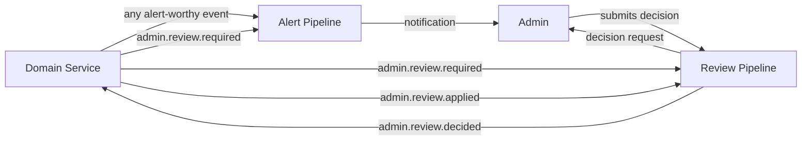
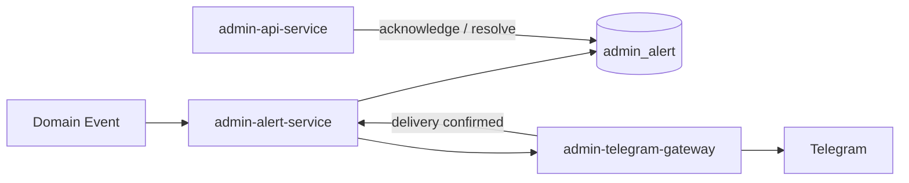
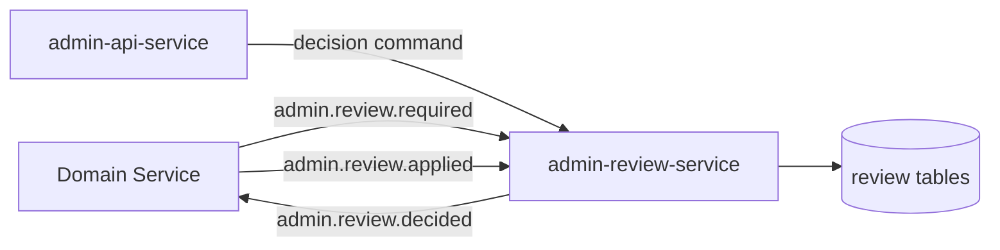
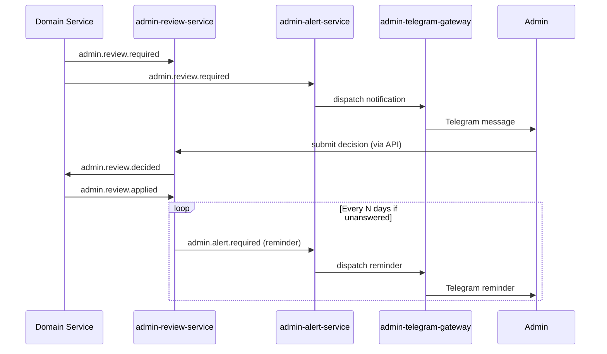

# Admin Pipelines Overview

The admin domain is split into two independent pipelines. Each has a
single, well-defined responsibility.

| Pipeline | Answers the question |
| --- | --- |
| **Alert** | *How does the admin get notified about important events?* |
| **Review** | *How is an ambiguous case presented, decided, and resolved?* |

They are connected — a review request also triggers an alert — but they
do not share state. Notification state and decision state are kept
separate by design.

---

## Why two pipelines?

A single "admin pipeline" that handled both notifications and decisions
would couple unrelated concerns. Alerts need to be fast, durable, and
high-volume. Reviews need to be careful, stateful, and traceable.

Keeping them separate means:

- alert delivery failures never block review decisions
- review expiration logic never affects alert throughput
- each service can evolve and scale independently

---

## How they work together

Most domain events only trigger the alert pipeline. Review-required
events fan out to both pipelines simultaneously.

The admin sees both the notification and the decision request. The alert
pipeline handles delivery. The review pipeline handles the decision
lifecycle.

---

## Alert Pipeline in brief

Converts domain events into persistent admin alerts and dispatches them
to external channels (Telegram).

Delivery is confirmed via a Kafka feedback loop from the gateway.
Low-severity alerts close automatically after delivery. High-severity
alerts (`error`, `critical`) stay open until the admin explicitly
acknowledges and resolves them.

See [Admin Alert Pipeline](./admin-alert-pipeline.md) for full detail.

---

## Review Pipeline in brief

Stores ambiguous cases, waits for the admin to pick an option, and
publishes the final decision back to the service that requested it.

The decision travels through an async command so no transport can
bypass validation. The owning domain service confirms application via a
feedback event, completing the lifecycle.

See [Admin Review Pipeline](./admin-review-pipeline.md) for full detail.

---

## Combined event flow

---

## Shared design principles

Both pipelines follow the same patterns:

- **Event-driven** — services communicate through Kafka topics, not
  direct calls
- **Delivery tracking** — every outbound action has a dedicated table
  row tracking its status
- **Feedback loops** — gateways and domain services confirm receipt,
  closing the loop back to the source service
- **Write isolation** — each service owns its own tables; read-only
  access is permitted for API aggregation
