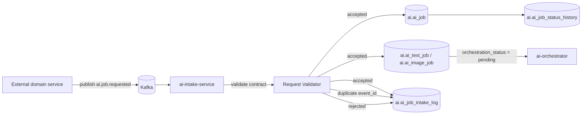
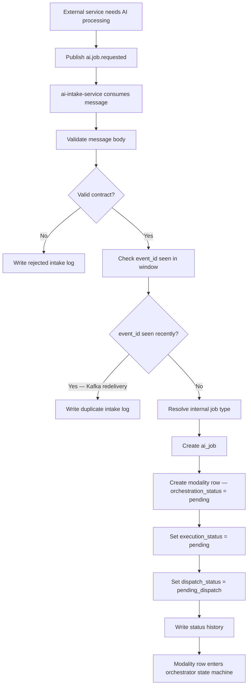
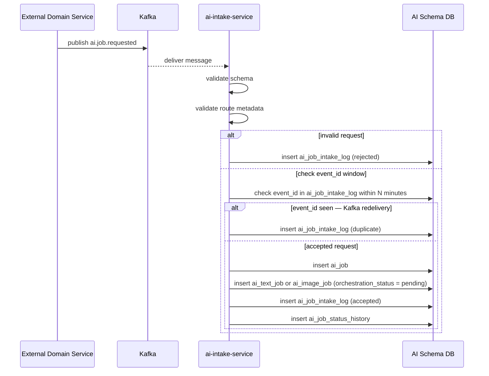
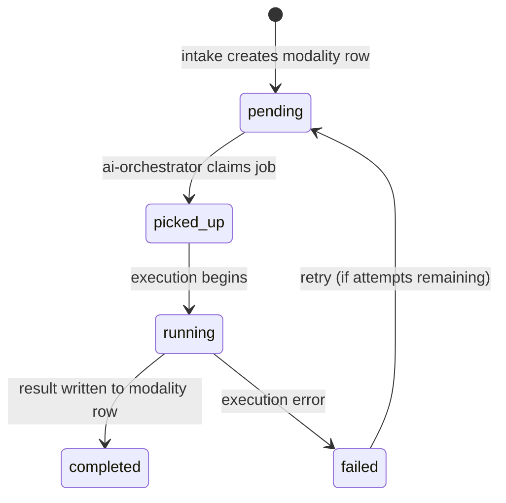
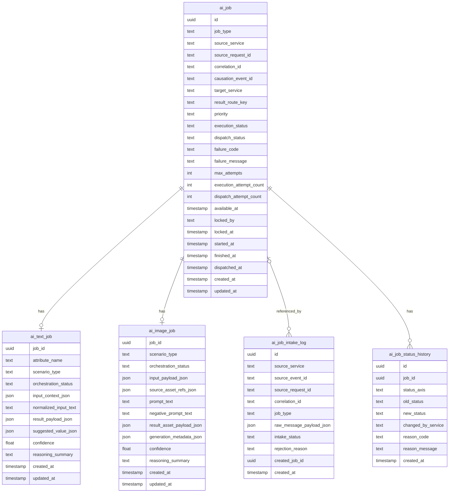

# AI Intake Pipeline

The `ai-intake-service` is the entry point into the AI domain.
It receives external Kafka messages from other domains, validates them against
shared contracts, performs intake checks, and creates internal AI jobs.

The service exists to protect AI-domain internals from direct writes by external
services.

> All database tables described in this document reside in the `ai` schema
> (e.g., `ai.ai_job`, `ai.ai_text_job`, `ai.ai_job_intake_log`).

## Responsibilities

The service:

- consumes external AI job request messages from Kafka
- validates message schema and required fields
- performs Kafka-level deduplication on `event_id`
- maps external request contracts into internal AI job records
- creates modality-specific job payload rows
- initializes execution and dispatch lifecycle state
- initializes orchestration state on modality tables
- records intake acceptance or rejection

The service does not:

- execute AI workflows
- call AI models
- perform reasoning loops
- dispatch final results back to requesting domains
- modify existing completed AI results

Those responsibilities belong to `ai-orchestrator` and
`ai-job-dispatcher-service`.

---

## High-Level Service Overview



---

## Pipeline Overview



---

## Detailed Sequence



---

## Request Validation Rules

Before a job is created, the service validates:

1. `job_type` is supported by the AI domain
2. `source_service` is on the allowed-callers list (see [Source Service Allowlist](#source-service-allowlist))
3. `source_request_id` is present and stable
4. `result_route_key` is present
5. modality-specific payload is structurally valid
6. required business context exists for the declared scenario

The service must reject malformed messages before any internal job row is
created.

---

## Deduplication and Idempotency

Deduplication operates at the Kafka infrastructure level only, not at the
business level.

The service checks `event_id` from the incoming message envelope against
`ai_job_intake_log` within a short rolling window (e.g., 10 minutes). If
`event_id` was already recorded, the message is a Kafka redelivery and is
discarded silently.

Possible outcomes:

- **accepted** — new `event_id`, valid request, internal job created
- **duplicate** — `event_id` already seen within the window (Kafka redelivery)
- **rejected** — invalid request or unsupported contract

`source_request_id` is stored on `ai_job` for traceability but is not used as
an idempotency key. An external service may legitimately resubmit the same
`source_request_id` with a new `event_id` to trigger fresh processing — for
example when the external context that `ai-orchestrator` will fetch has changed.
Each such submission results in a new `ai_job`.

---

## Job Materialization Strategy

The intake service creates the following rows in a single database transaction:

1. one row in `ai_job`
2. one row in exactly one modality subtype table:
   - `ai_text_job` — with `orchestration_status = pending`
   - `ai_image_job` — with `orchestration_status = pending`
3. one row in `ai_job_intake_log` (status: `accepted`)
4. one row in `ai_job_status_history` per initialized status axis

All writes are committed atomically. If any write fails, the transaction is
rolled back and the Kafka message is not acknowledged, triggering redelivery.

This keeps lifecycle data separate from modality-specific payload.

---

## Orchestrator Activation via State Machine

The `ai-orchestrator` does not poll `ai_job` directly. It discovers work
through the orchestration state machine embedded in the modality tables
(`ai_text_job`, `ai_image_job`).

Intake sets `orchestration_status = pending` on the modality row. The
orchestrator claims rows in `pending` state and transitions them forward.



The modality row is the unit of orchestrator work. `ai_job` tracks the
aggregate lifecycle across both execution and dispatch axes.

---

## Supported Intake Message Types

At minimum, the service supports:

- `ai.job.requested` with `job_type = text`
- `ai.job.requested` with `job_type = image`

Both requests use the same outer envelope but different typed payload bodies.

---

## Status Field Enum Values

### `ai_job.execution_status`

| Value | Set by | Meaning |
| --- | --- | --- |
| `pending` | ai-intake-service | job created, not yet picked up |
| `running` | ai-orchestrator | execution in progress |
| `completed` | ai-orchestrator | execution finished successfully |
| `failed` | ai-orchestrator | execution failed, no retries remaining |

### `ai_job.dispatch_status`

| Value | Set by | Meaning |
| --- | --- | --- |
| `pending_dispatch` | ai-intake-service | job not yet dispatched |
| `dispatched` | ai-job-dispatcher-service | result published outward |
| `dispatch_failed` | ai-job-dispatcher-service | dispatch error |

### `ai_job.priority`

| Value | Meaning |
|---|---|
| `low` | background processing |
| `normal` | standard queue |
| `high` | elevated priority |

### `ai_text_job.orchestration_status` / `ai_image_job.orchestration_status`

| Value | Set by | Meaning |
| --- | --- | --- |
| `pending` | ai-intake-service | waiting for orchestrator pickup |
| `picked_up` | ai-orchestrator | claimed by orchestrator instance |
| `running` | ai-orchestrator | execution in progress |
| `completed` | ai-orchestrator | result written to modality row |
| `failed` | ai-orchestrator | terminal failure |

### `ai_job_intake_log.intake_status`

| Value | Meaning |
|---|---|
| `accepted` | valid request, job created |
| `duplicate` | `event_id` seen within window — Kafka redelivery, no job created |
| `rejected` | invalid or unsupported request |

---

## Database Schema

> All tables reside in the `ai` schema.



---

## Data Model Notes

### `ai_job`

Central lifecycle row shared by all AI-domain services.

Key fields initialized by intake:

- `job_type`
- `source_service`
- `source_request_id`
- `correlation_id` — propagated from the incoming Kafka message envelope
- `causation_event_id` — set to the incoming `event_id` from the Kafka message
- `target_service`
- `result_route_key`
- `priority`
- `execution_status = pending`
- `dispatch_status = pending_dispatch`
- `available_at` — set to current timestamp at intake time;
  future-dated values are supported for delayed processing
- `max_attempts` — set from domain configuration defaults per `job_type`

### `ai_text_job`

Used for text-based workflows such as:

- attribute normalization
- candidate resolution
- structured extraction

Intake initializes `orchestration_status = pending`. The orchestrator
transitions this field forward through the state machine.

### `ai_image_job`

Used for image-oriented workflows such as:

- image generation
- cleanup
- background removal
- derived asset generation

Intake initializes `orchestration_status = pending`. The orchestrator
transitions this field forward through the state machine.

### `ai_job_intake_log`

Provides auditability for accepted, rejected, and duplicate external requests.

`created_job_id` is nullable — it is populated only for `accepted` requests.
Rejected and duplicate log entries carry no reference to an `ai_job` row.

### `ai_job_status_history`

Captures state transitions produced by intake. At intake time, one row is
written per initialized status axis (`execution_status`, `dispatch_status`).

---

## Intake State Contribution

Intake is responsible only for the initial lifecycle transitions on `ai_job`.

| Status axis | Initial value |
|---|---|
| `execution_status` | `pending` |
| `dispatch_status` | `pending_dispatch` |
| `orchestration_status` (modality) | `pending` |

Subsequent transitions on all three axes are owned by `ai-orchestrator` and
`ai-job-dispatcher-service`.

---

## Source Service Allowlist

The intake service maintains an allowlist of `source_service` identifiers
permitted to submit AI job requests. Requests from unknown services are rejected
with `intake_status = rejected`.

The allowlist is managed via service configuration. Adding a new permitted
caller requires a configuration change and redeployment of `ai-intake-service`.

---

## Error Handling and Dead Letter Queue

The intake service runs as an at-least-once Kafka consumer. Message processing
failures are handled as follows:

| Failure type | Behavior |
|---|---|
| Validation failure | Message is acknowledged; rejection written to `ai_job_intake_log` |
| DB write failure (transient) | Message is not acknowledged; redelivered by Kafka |
| DB write failure (persistent) | Message is routed to the dead letter topic after max retries |
| Duplicate detection | Message is acknowledged; duplicate log written |

The dead letter topic follows the convention `<original-topic>.dlq`
(e.g., `ai.job.requested.dlq`). Dead-lettered messages require manual
intervention and are not reprocessed automatically.

---

## Contract Versioning

The incoming Kafka message includes `event_version` to support future contract
evolution.

The intake service validates that `event_version` is a supported version. If
an unsupported version is received, the message is rejected with
`rejection_reason = unsupported_event_version`.

New contract versions require coordinated changes between the publishing domain
and `ai-intake-service`.

---

## Example External Request Contract

```json
{
  "event_id": "uuid",
  "event_type": "ai.job.requested",
  "event_version": 1,
  "occurred_at": "2026-03-14T18:00:00Z",
  "source_service": "catalog-data-enricher",
  "correlation_id": "uuid",
  "request": {
    "source_request_id": "uuid",
    "job_type": "text",
    "target_service": "catalog-data-enricher",
    "result_route_key": "catalog-enricher.attribute-result",
    "priority": "normal",
    "text_job": {
      "attribute_name": "characters",
      "scenario_type": "character_resolution",
      "input_context": {
        "raw_title": "Monster High Draculaura and Clawdeen...",
        "description": "..."
      }
    }
  }
}
```

> `target_service` may equal `source_service` when the requesting domain also
> consumes the AI result (request-response over Kafka).

---

## Ownership Boundaries

| Component | Responsibility |
|---|---|
| `ai-intake-service` | accepts external AI requests |
| `ai-intake-service` | validates and materializes internal jobs |
| `ai-intake-service` | writes intake audit records |
| `ai-orchestrator` | executes internal jobs via modality state machine |
| `ai-job-dispatcher-service` | publishes completed results outward |

---

## Key Design Principles

1. **External domains never write internal AI tables directly**
2. **One accepted external request becomes one internal AI job**
3. **Lifecycle state is separated from modality payload**
4. **Malformed requests are rejected before job creation**
5. **Deduplication is Kafka-level only** — same `event_id` within the rolling
   window is discarded; same `source_request_id` with a new `event_id`
   creates a new job
6. **Orchestrator activation is driven by state machine on modality tables**
7. **All intake writes are committed in a single database transaction**
