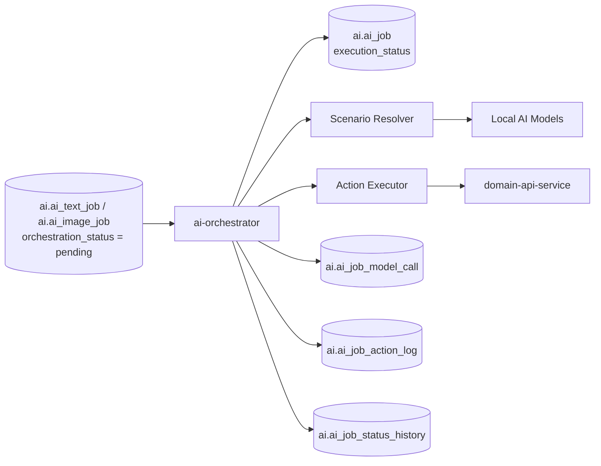
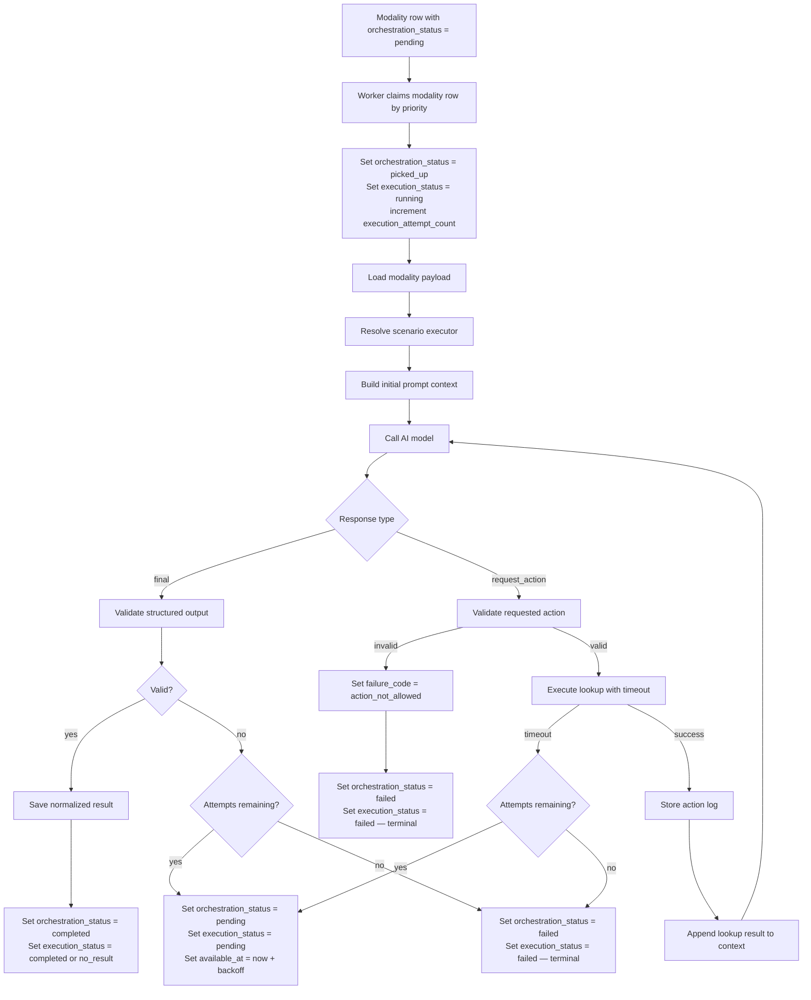
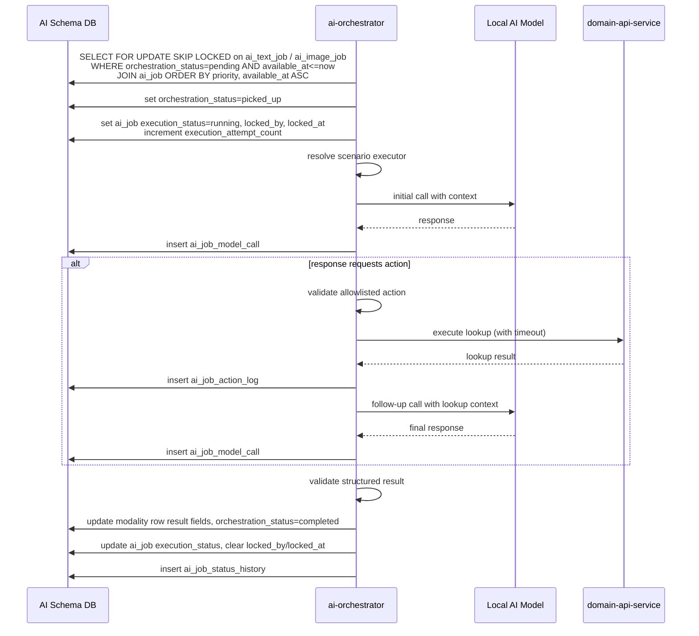
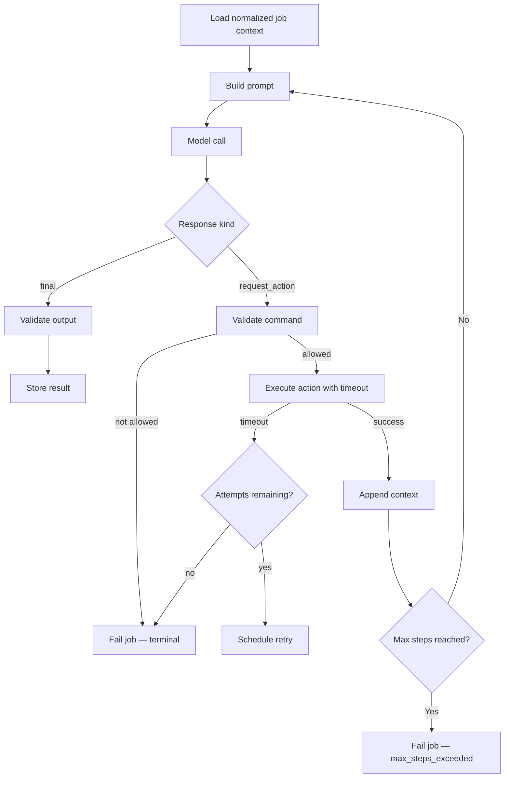
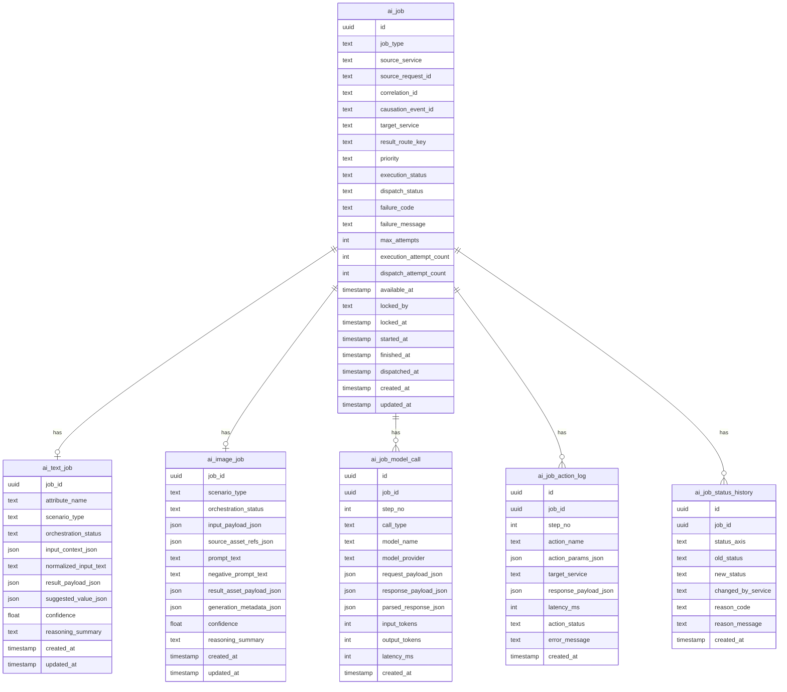
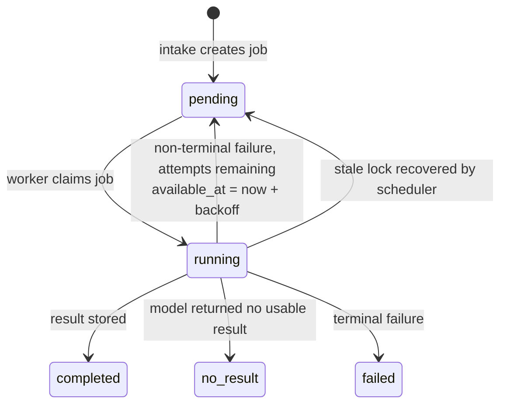

# AI Orchestrator Pipeline

The `ai-orchestrator` service is the execution engine of the AI domain.
It processes internal jobs created by `ai-intake-service`, executes the
appropriate AI workflow, performs controlled lookup actions when required, and
stores the final normalized result.

The service works only with internal AI-domain tables and does not know which
external domain originally requested the job.

## Responsibilities

The service:

- discovers pending work via `orchestration_status` on modality tables
- claims modality rows ordered by priority using `SELECT FOR UPDATE SKIP LOCKED`
- locks jobs for exclusive execution per worker instance
- resolves the scenario executor for the job
- calls local AI models
- performs bounded reasoning loops
- executes allowlisted external lookup actions through API services
- validates structured model outputs
- stores final normalized execution results
- updates execution lifecycle state
- logs all model calls and action steps
- retries failed jobs within configured attempt limits
- recovers stale locks from crashed worker instances

The service does not:

- consume external domain request topics directly
- publish final results back to requesting domains
- know target Kafka topics or outbound routing configuration
- decide merge policy in requesting domains

Those responsibilities belong to `ai-intake-service` and
`ai-job-dispatcher-service`.

---

## High-Level Service Overview



---

## Pipeline Overview



---

## Detailed Sequence



---

## Job Claiming

The orchestrator discovers work through `orchestration_status` on the modality
tables (`ai_text_job`, `ai_image_job`). It does not poll `ai_job` directly.
This is consistent with how `ai-intake-service` activates the orchestrator —
by setting `orchestration_status = pending` on the modality row at intake time.

Workers lock the modality row using `SELECT FOR UPDATE SKIP LOCKED` inside a
transaction. Priority and backoff scheduling are applied via a join to `ai_job`.

Claim query:

```sql
SELECT t.* FROM ai_text_job t
JOIN ai_job j ON j.id = t.job_id
WHERE t.orchestration_status = 'pending'
  AND j.available_at <= now()
ORDER BY
  CASE j.priority
    WHEN 'high'   THEN 1
    WHEN 'normal' THEN 2
    WHEN 'low'    THEN 3
  END,
  j.available_at ASC
LIMIT 1
FOR UPDATE OF t SKIP LOCKED;
```

The same query applies to `ai_image_job`. Each worker runs both queries and
picks from whichever returns first, or processes them in separate worker pools
per modality.

On successful claim the worker sets within the same transaction:

- `ai_text_job.orchestration_status = picked_up`
- `ai_job.execution_status = running`
- `ai_job.locked_by = <worker_instance_id>`
- `ai_job.locked_at = now()`
- `ai_job.execution_attempt_count = execution_attempt_count + 1`
- `ai_job.started_at = now()` (on first attempt only)

---

## Stale Lock Recovery

If a worker crashes mid-execution, the modality row remains in
`orchestration_status = picked_up` indefinitely. A scheduler within
`ai-orchestrator` detects and recovers stale locks via `ai_job.locked_at`.

Recovery rule:

```sql
UPDATE ai_text_job t
SET orchestration_status = 'pending'
FROM ai_job j
WHERE t.job_id = j.id
  AND t.orchestration_status IN ('picked_up', 'running')
  AND j.locked_at < now() - interval '15 minutes';

UPDATE ai_job
SET execution_status = 'pending',
    available_at     = now(),
    locked_by        = null,
    locked_at        = null
WHERE execution_status = 'running'
  AND locked_at < now() - interval '15 minutes';
```

The same applies to `ai_image_job`. Both updates run in the same transaction.

The 15-minute threshold must exceed the maximum expected job execution time
including all action round-trips. Recovered jobs re-enter the pending queue
and are claimed by the next available worker. The `execution_attempt_count`
was already incremented at claim time, so this counts as a used attempt.

---

## Retry Logic

On non-terminal failure, if `execution_attempt_count < max_attempts`, the
orchestrator reschedules the job for retry:

```text
-- modality row
orchestration_status = pending

-- ai_job
execution_status = pending
available_at     = now() + backoff_interval(execution_attempt_count)
locked_by        = null
locked_at        = null
failure_code     = null
failure_message  = null
```

Backoff is fixed at 60 seconds per retry. `ai_job_status_history` records
each transition including the failure reason before rescheduling.

### Terminal vs retryable failures

| `failure_code` | Retryable |
| --- | --- |
| `model_error` | Yes |
| `action_timeout` | Yes |
| `execution_timeout` | Yes |
| `max_steps_exceeded` | No — structural |
| `invalid_model_output` | No — structural |
| `action_not_allowed` | No — structural |

Structural failures will not succeed on retry and are moved directly to
`execution_status = failed` regardless of remaining attempts.

---

## Internal Reasoning Loop



---

## Execution Policies

The orchestrator enforces explicit execution limits:

- maximum reasoning steps per job
- maximum action calls per job — hard limit of 4; exceeding this sets
  `failure_code = max_steps_exceeded`
- maximum model call count per job
- maximum elapsed execution time per job
- per-scenario allowed model list
- per-scenario allowed action list

These limits prevent infinite loops, repeated low-value retries, and unbounded
resource usage.

---

## Action Executor

Each external lookup call is subject to a configurable per-action timeout.
The default timeout is 10 seconds.

| Outcome | Behavior |
| --- | --- |
| Success | Result appended to context, `ai_job_action_log` written |
| Timeout | `failure_code = action_timeout`, retry if attempts remaining |
| HTTP error | Same as timeout |
| Action not in allowlist | `failure_code = action_not_allowed`, terminal failure |

A failed action call counts as a full execution attempt against
`max_attempts`. The `ai_job_action_log` records the error in `error_message`
and `action_status = failed` regardless of whether the job is retried.

### Allowlisted action targets

| Target service | Actions | Scenarios |
| --- | --- | --- |
| `catalog-api-service` | catalog search queries | text (all scenarios) |
| `media-api-service` | `save_temp_image` | image (all scenarios) |

---

## Catalog Lookups via catalog-api-service

The orchestrator uses `catalog-api-service` as a read-only lookup target
during reasoning loops for text scenarios. The model requests a lookup when
it needs authoritative catalog data to resolve, validate, or enrich its
output.

`catalog-api-service` is a query-only service — the orchestrator never writes
to it. All calls go through the action executor and are logged in
`ai_job_action_log`.

### What the orchestrator can look up

| Information | Why it matters during reasoning |
| --- | --- |
| Characters by name | Resolve the correct canonical name and slug for a character mentioned in raw input |
| Pets by name | Determine if a pet is unique or already exists in the catalog |
| Releases by filters | Check whether the current item is a reissue of an existing release |
| Release types | Validate or select the correct `release_type` for the job being processed |
| Relationship types | Determine valid relationship labels between the current and existing releases |

### Request contract

All catalog lookups follow a consistent request envelope:

```json
{
  "query": {
    "filters": {},
    "page": { "limit": 10, "offset": 0 }
  },
  "context": { "locale": "en" }
}
```

Filters are route-specific. See [catalog-api-service](../../services/catalog/catalog-api-service.md)
for the full filter contracts per route.

### Standard response envelope

```json
{
  "status": "success",
  "request_id": "req_be60f3718556",
  "correlation_id": "req_be60f3718556",
  "trace_id": null,
  "data": {
    "items": [],
    "total": 0,
    "page": 1,
    "page_size": 10
  },
  "error": null,
  "meta": {
    "service": "catalog-api-service",
    "version": "v1",
    "timestamp": "2026-03-15T12:28:42Z"
  }
}
```

The orchestrator reads `data.items` from the response and appends the result
to the reasoning context before the next model call.

### Example — character lookup action

```json
{
  "status": "request_action",
  "is_final": false,
  "requested_action": {
    "action_name": "catalog_search_characters",
    "action_params": {
      "filters": { "search": "Draculaura" },
      "page": { "limit": 5, "offset": 0 },
      "context": { "locale": "en" }
    }
  }
}
```

### Example — reissue check action

```json
{
  "status": "request_action",
  "is_final": false,
  "requested_action": {
    "action_name": "catalog_search_releases",
    "action_params": {
      "filters": {
        "search": "Draculaura Gloom and Bloom",
        "year_from": 2012,
        "year_to": 2016,
        "is_reissue": false
      },
      "page": { "limit": 5, "offset": 0 },
      "context": { "locale": "en" }
    }
  }
}
```

---

## Structured Output Validation

The service validates both classes of model responses:

### Final result

- expected envelope fields exist
- payload conforms to scenario schema
- required typed values are present
- confidence is within accepted range if provided

### Action request

- `action_name` exists in the allowlist
- parameters match the action contract
- repeated useless action loops are prevented

Invalid responses set `failure_code = invalid_model_output` and move the job
to a terminal failure state.

---

## Database Schema

> All tables reside in the `ai` schema.



---

## Status Field Enum Values

### `ai_job.execution_status`

| Value | Set by | Meaning |
| --- | --- | --- |
| `pending` | ai-intake-service / ai-orchestrator (retry) | waiting to be claimed |
| `running` | ai-orchestrator | claimed and executing |
| `completed` | ai-orchestrator | result stored successfully |
| `no_result` | ai-orchestrator | model returned final response with no usable result |
| `failed` | ai-orchestrator | terminal failure, no retries remaining |
| `cancelled` | reserved | reserved for future external cancellation |

### `ai_job.failure_code`

| Value | Retryable | Meaning |
| --- | --- | --- |
| `model_error` | Yes | model returned an error response |
| `action_timeout` | Yes | external lookup did not respond within timeout |
| `execution_timeout` | Yes | job exceeded maximum elapsed execution time |
| `max_steps_exceeded` | No | reasoning loop hit step limit |
| `invalid_model_output` | No | structured output failed schema validation |
| `action_not_allowed` | No | model requested an action outside the allowlist |

### `ai_text_job.orchestration_status` / `ai_image_job.orchestration_status`

| Value | Set by | Meaning |
| --- | --- | --- |
| `pending` | ai-intake-service | waiting for orchestrator pickup |
| `picked_up` | ai-orchestrator | claimed by a worker instance |
| `running` | ai-orchestrator | execution in progress |
| `completed` | ai-orchestrator | result written to modality row |
| `failed` | ai-orchestrator | terminal failure |

### `ai_job_action_log.action_status`

| Value | Meaning |
| --- | --- |
| `success` | lookup completed and result appended to context |
| `failed` | lookup timed out or returned an error |
| `skipped` | action was in allowlist but result was empty |

### `no_result` vs `failed`

| Status | Meaning | Dispatcher behavior |
| --- | --- | --- |
| `completed` | valid result stored | dispatch result to requesting domain |
| `no_result` | model gave final response but result was empty or below confidence threshold | dispatch empty result so requesting domain is unblocked |
| `failed` | terminal execution error | dispatcher sends failure notification |

---

## Job State Machine



Dispatch transitions are handled by `ai-job-dispatcher-service`, not by the
orchestrator.

---

## Example Action Request Contract

```json
{
  "status": "request_action",
  "is_final": false,
  "requested_action": {
    "action_name": "lookup_characters_by_names",
    "action_params": {
      "character_names": [
        "Draculaura",
        "Clawdeen Wolf"
      ]
    }
  }
}
```

---

## Example Final Text Result

```json
{
  "status": "final",
  "is_final": true,
  "final_payload": {
    "characters": [
      {
        "name": "Draculaura",
        "slug": "draculaura"
      },
      {
        "name": "Clawdeen Wolf",
        "slug": "clawdeen-wolf"
      }
    ],
    "confidence": 0.96,
    "reasoning_summary": "Matched extracted names against catalog lookup results."
  }
}
```

---

## Example Image Action — Save to Temp Storage

Before returning a final result, the orchestrator calls `save_temp_image` as
an allowlisted action (image scenarios only). This action is handled by
`media-api-service`, which stores the generated bytes and returns a
`temp_path` reference.

```json
{
  "status": "request_action",
  "is_final": false,
  "requested_action": {
    "action_name": "save_temp_image",
    "action_params": {
      "image_bytes_base64": "<base64-encoded bytes>",
      "mime_type": "image/webp",
      "width": 1024,
      "height": 1024
    }
  }
}
```

`media-api-service` response (stored in `ai_job_action_log.response_payload_json`):

```json
{
  "temp_path": "temp/ai-orchestrator/job-uuid/front.webp",
  "expires_at": "2026-03-15T20:00:00Z"
}
```

## Example Final Image Result

After receiving the `temp_path`, the orchestrator returns a final response
referencing the temp path. No `storage_key` is produced at this stage —
permanent storage is handled downstream by `ai-job-dispatcher-service`.

```json
{
  "status": "final",
  "is_final": true,
  "final_payload": {
    "assets": [
      {
        "temp_path": "temp/ai-orchestrator/job-uuid/front.webp",
        "expires_at": "2026-03-15T20:00:00Z",
        "width": 1024,
        "height": 1024,
        "mime_type": "image/webp"
      }
    ],
    "generation_metadata": {
      "model": "local-image-model",
      "seed": 112233
    }
  }
}
```

---

## Ownership Boundaries

| Component | Responsibility |
| --- | --- |
| `ai-intake-service` | creates internal AI jobs |
| `ai-orchestrator` | claims and executes internal AI jobs |
| `ai-orchestrator` | manages retry and backoff |
| `ai-orchestrator` | recovers stale locks |
| `ai-orchestrator` | validates model outputs |
| `ai-orchestrator` | stores normalized result payloads |
| `ai-orchestrator` | calls `media-api-service` to save generated images to temp storage |
| `media-api-service` | manages temp and permanent media file lifecycle |
| `ai-job-dispatcher-service` | promotes temp images to permanent storage via `media-api-service` |
| `ai-job-dispatcher-service` | publishes completed results outward |

---

## Key Design Principles

1. **The orchestrator knows only internal AI-domain records**
2. **Execution is separate from intake and dispatch**
3. **Job claiming uses database-level locking — no external coordinator needed**
4. **Priority ordering is enforced at claim time, not at intake time**
5. **Model outputs are always validated before persistence**
6. **Reasoning loops are bounded by explicit policy**
7. **All model calls and actions are audit-logged**
8. **Stale locks are recovered automatically — crashed workers do not lose jobs**
9. **Structural failures are terminal — retries are reserved for transient errors**
10. **The orchestrator never writes to permanent storage** — saving a generated
    image via `media-api-service` temp upload is the only storage action allowed
