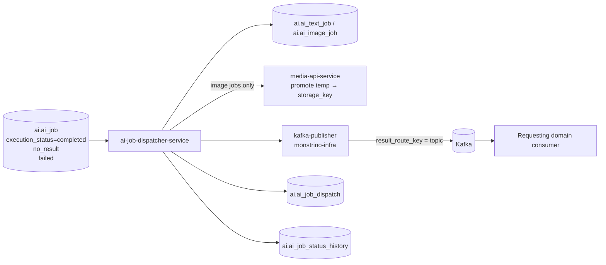
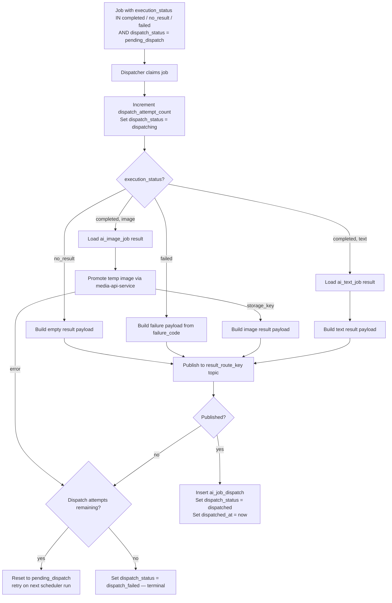
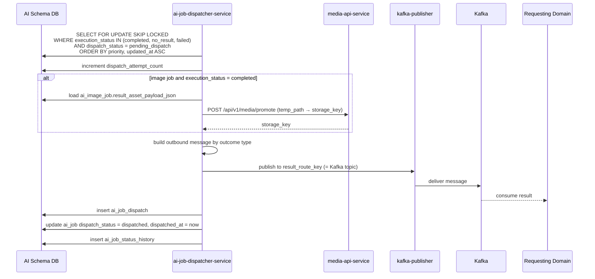
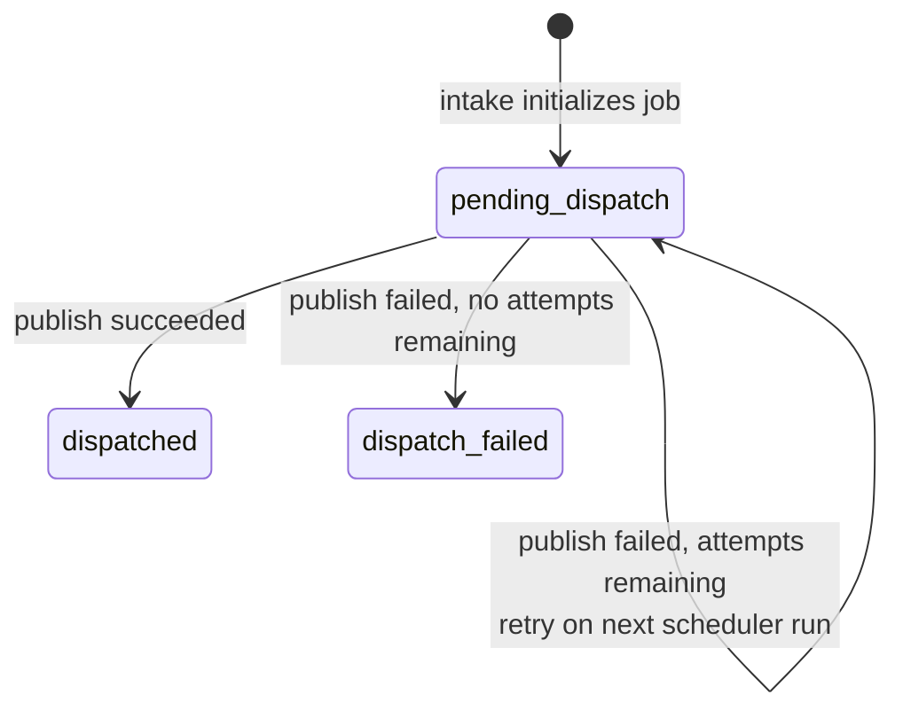
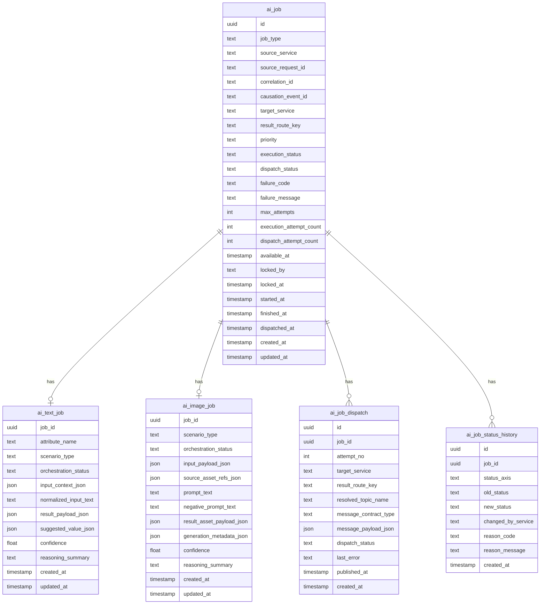

# AI Job Dispatcher Pipeline

The `ai-job-dispatcher-service` is the outbound integration layer of the AI
domain. It takes completed internal AI jobs, promotes image assets to permanent
storage when required, builds the correct outbound message contract, and
publishes the result back to the requesting domain via Kafka.

The service is the only AI-domain component that knows about requesting
services and outbound Kafka routing.

## Responsibilities

The service:

- claims eligible jobs using `SELECT FOR UPDATE SKIP LOCKED`
- handles all terminal execution outcomes: `completed`, `no_result`, `failed`
- promotes temp images to permanent storage via `media-api-service`
  (image jobs only)
- resolves the outbound Kafka topic from `result_route_key`
- builds the correct outbound message contract per job type and outcome
- publishes result messages via `kafka-publisher` from `monstrino-infra`
- sets `finished_at` on `ai_job` after successful dispatch
- retries failed dispatch attempts within configured attempt limits
- records dispatch logs and dispatch status transitions

The service does not:

- consume external request topics for job creation
- execute AI workflows
- call models or perform reasoning loops
- modify requesting-domain data directly

Those responsibilities belong to `ai-intake-service`, `ai-orchestrator`, and
requesting domain services.

---

## High-Level Service Overview



---

## Pipeline Overview



---

## Detailed Sequence



---

## Route Resolution

The dispatcher does not maintain a routing table. The `result_route_key`
field on `ai_job` is the Kafka topic name. The external service that submitted
the job is responsible for providing the correct topic.

From the intake request contract:

```json
{
  "request": {
    "target_service": "catalog-data-enricher",
    "result_route_key": "catalog-enricher.attribute-result"
  }
}
```

The dispatcher reads `result_route_key` and passes it directly to
`kafka-publisher` from `monstrino-infra` as the publish target. No routing
table or domain-specific client is needed — the topic is dynamic and owned
by the requesting domain, not by the dispatcher.

```text
ai_job.result_route_key = "catalog-enricher.attribute-result"
        ↓
kafka_publisher.publish(
    topic=job.result_route_key,
    payload=outbound_message
)
```

A domain-specific Kafka client would be wrong here because the dispatcher
publishes to topics it does not own. `kafka-publisher` is a generic
infrastructure-level publisher that accepts any topic at runtime.

---

## Image Promotion Step

For image jobs with `execution_status = completed`, the dispatcher reads
`result_asset_payload_json` from `ai_image_job`, extracts `temp_path`, and
promotes the file to permanent storage via `media-api-service` before building
the outbound message.

```text
ai_image_job.result_asset_payload_json.assets[].temp_path
        ↓
POST /api/v1/media/promote → storage_key
        ↓
outbound message.result.assets[].storage_key
```

If promotion fails, the dispatch attempt is counted against
`dispatch_attempt_count`. If attempts are exhausted the job moves to
`dispatch_failed`. The temp file remains until its TTL expires.

---

## Dispatch Claiming

The dispatcher uses `SELECT FOR UPDATE SKIP LOCKED` to prevent two
dispatcher instances from processing the same job.

```sql
SELECT * FROM ai_job
WHERE execution_status IN ('completed', 'no_result', 'failed')
  AND dispatch_status = 'pending_dispatch'
ORDER BY
  CASE priority
    WHEN 'high'   THEN 1
    WHEN 'normal' THEN 2
    WHEN 'low'    THEN 3
  END,
  updated_at ASC
LIMIT 1
FOR UPDATE SKIP LOCKED;
```

After claiming the dispatcher increments `dispatch_attempt_count` and begins
the dispatch sequence within the same transaction.

---

## Retry Logic

On non-terminal dispatch failure (Kafka unavailable, media promotion error),
if `dispatch_attempt_count` is below the configured maximum (default 3), the
dispatcher resets the job for retry on the next scheduler run:

```text
dispatch_status = pending_dispatch
```

No timestamp-based backoff is applied — the dispatcher retries on its next
poll cycle. The maximum attempt count is a service configuration value, not
a database field.

After the maximum is exhausted the job moves to
`dispatch_status = dispatch_failed` (terminal) and requires manual
intervention.

---

## Dispatcher Output Types

The outbound event type is determined by job modality and execution outcome:

| `job_type` | `execution_status` | `event_type` |
| --- | --- | --- |
| `text` | `completed` | `ai.text.result.completed` |
| `image` | `completed` | `ai.image.result.completed` |
| `text` or `image` | `no_result` | `ai.job.result.no_result` |
| `text` or `image` | `failed` | `ai.job.result.failed` |

---

## Status Field Enum Values

### `ai_job.dispatch_status`

| Value | Set by | Meaning |
| --- | --- | --- |
| `pending_dispatch` | ai-intake-service | job not yet dispatched |
| `dispatched` | ai-job-dispatcher-service | result published to Kafka |
| `dispatch_failed` | ai-job-dispatcher-service | all dispatch attempts exhausted |

### `ai_job_dispatch.dispatch_status`

One row is inserted per dispatch attempt. The row-level status reflects
the outcome of that specific attempt:

| Value | Meaning |
| --- | --- |
| `dispatched` | publish succeeded |
| `failed` | publish failed on this attempt |

---

## Dispatch State Machine



---

## Database Schema

> All tables reside in the `ai` schema.



---

## Data Model Notes

### `ai_job` — dispatcher-relevant fields

| Field | Purpose |
| --- | --- |
| `result_route_key` | Kafka topic to publish to (used directly by `kafka-publisher`) |
| `target_service` | Identifies the requesting domain in outbound message envelope |
| `execution_status` | Determines which outbound message type to build |
| `dispatch_status` | Tracks dispatch lifecycle |
| `dispatch_attempt_count` | Current number of dispatch attempts made |
| `dispatched_at` | Timestamp of successful publish |
| `finished_at` | Set by dispatcher after `dispatched_at` — marks job as fully complete across both execution and dispatch axes |

### `ai_job_dispatch`

One row per dispatch attempt. Stores the exact payload published on each try
for replay analysis, transport debugging, and downstream troubleshooting.
`attempt_no` matches `dispatch_attempt_count` at the time of the attempt.

---

## Example Outbound Message: Text Result

```json
{
  "event_id": "uuid",
  "event_type": "ai.text.result.completed",
  "event_version": 1,
  "occurred_at": "2026-03-15T18:20:00Z",
  "source_service": "ai-job-dispatcher-service",
  "correlation_id": "uuid",
  "result": {
    "source_request_id": "uuid",
    "job_id": "uuid",
    "attribute_name": "characters",
    "scenario_type": "character_resolution",
    "payload": {
      "characters": [
        { "name": "Draculaura", "slug": "draculaura" }
      ]
    },
    "confidence": 0.96,
    "reasoning_summary": "Matched extracted names against catalog lookup results."
  }
}
```

---

## Example Outbound Message: Image Result

The dispatcher promotes the temp image first, then includes the permanent
`storage_key` in the outbound message.

```json
{
  "event_id": "uuid",
  "event_type": "ai.image.result.completed",
  "event_version": 1,
  "occurred_at": "2026-03-15T18:22:00Z",
  "source_service": "ai-job-dispatcher-service",
  "correlation_id": "uuid",
  "result": {
    "source_request_id": "uuid",
    "job_id": "uuid",
    "scenario_type": "image_generation",
    "assets": [
      {
        "storage_key": "media/catalog/release-123/front.webp",
        "width": 1024,
        "height": 1024,
        "mime_type": "image/webp"
      }
    ],
    "generation_metadata": {
      "model": "local-image-model",
      "seed": 112233
    }
  }
}
```

---

## Example Outbound Message: No Result

```json
{
  "event_id": "uuid",
  "event_type": "ai.job.result.no_result",
  "event_version": 1,
  "occurred_at": "2026-03-15T18:23:00Z",
  "source_service": "ai-job-dispatcher-service",
  "correlation_id": "uuid",
  "result": {
    "source_request_id": "uuid",
    "job_id": "uuid",
    "job_type": "text"
  }
}
```

---

## Example Outbound Message: Failed Result

```json
{
  "event_id": "uuid",
  "event_type": "ai.job.result.failed",
  "event_version": 1,
  "occurred_at": "2026-03-15T18:25:00Z",
  "source_service": "ai-job-dispatcher-service",
  "correlation_id": "uuid",
  "result": {
    "source_request_id": "uuid",
    "job_id": "uuid",
    "job_type": "text",
    "failure_code": "invalid_model_output",
    "failure_message": "The model returned an invalid structured payload."
  }
}
```

---

## Ownership Boundaries

| Component | Responsibility |
| --- | --- |
| `ai-intake-service` | creates internal jobs, sets `result_route_key` |
| `ai-orchestrator` | produces normalized internal AI results |
| `media-api-service` | promotes temp images to permanent storage |
| `ai-job-dispatcher-service` | claims and dispatches all terminal execution outcomes |
| `ai-job-dispatcher-service` | publishes to `result_route_key` via `kafka-publisher` |
| Requesting domain service | consumes AI result and applies its own domain logic |

---

## Key Design Principles

1. **Only the dispatcher publishes outbound AI results**
2. **`result_route_key` is the Kafka topic — no routing table needed**
3. **All three terminal outcomes are dispatched: `completed`, `no_result`, `failed`**
4. **Image promotion happens inside the dispatcher — orchestrator never holds
   a permanent storage key**
5. **Outbound transport history is persisted per attempt for debugging and
   replay**
6. **Requesting domains remain owners of their own final write decisions**
