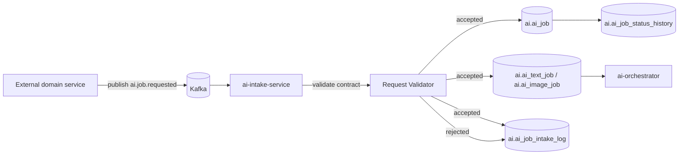
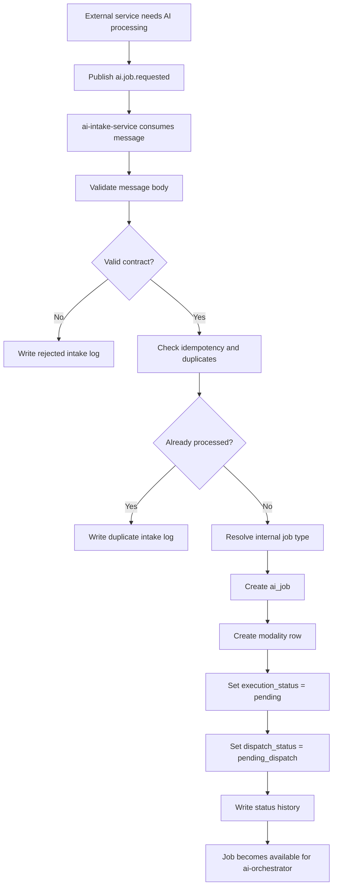
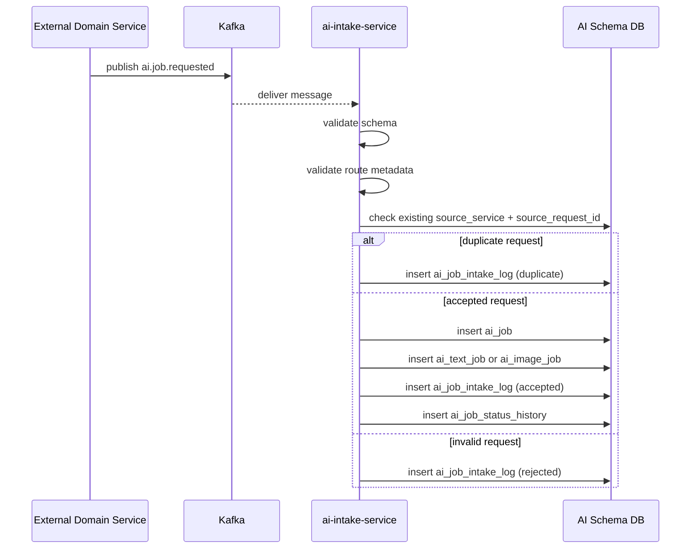
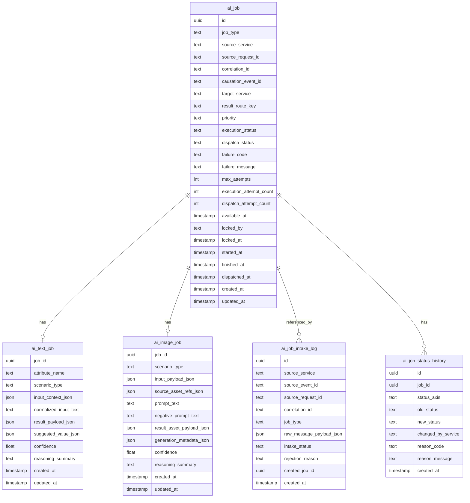
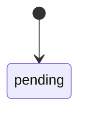

# AI Intake Pipeline

The `ai-intake-service` is the entry point into the AI domain.
It receives external Kafka messages from other domains, validates them against
shared contracts, performs intake checks, and creates internal AI jobs.

The service exists to protect AI-domain internals from direct writes by external
services.

## Responsibilities

The service:

- consumes external AI job request messages from Kafka
- validates message schema and required fields
- performs deduplication and idempotency checks
- maps external request contracts into internal AI job records
- creates modality-specific job payload rows
- initializes execution and dispatch lifecycle state
- records intake acceptance or rejection

The service does not:

- execute AI workflows
- call AI models
- perform reasoning loops
- dispatch final results back to requesting domains
- modify existing completed AI results

Those responsibilities belong to `ai-orchestrator` and
`ai-job-dispatcher-service`.

---

## High-Level Service Overview



---

## Pipeline Overview



---

## Detailed Sequence



---

## Request Validation Rules

Before a job is created, the service validates:

1. `job_type` is supported by the AI domain
2. `source_service` is allowed to submit the request
3. `source_request_id` is present and stable
4. `result_route_key` is present
5. modality-specific payload is structurally valid
6. required business context exists for the declared scenario

The service should reject malformed messages before any internal job row is
created.

---

## Deduplication and Idempotency

The service should treat `(source_service, source_request_id)` as the external
idempotency pair for AI job creation.

Possible outcomes:

- **accepted** — first valid request, internal job created
- **duplicate** — equivalent request already materialized
- **rejected** — invalid request or unsupported contract

This protects the AI domain from duplicate Kafka deliveries and repeated source
publishes.

---

## Job Materialization Strategy

The intake service creates:

- one row in `ai_job`
- one row in exactly one subtype table:
  - `ai_text_job`
  - `ai_image_job`

This keeps lifecycle data separate from modality-specific payload.

---

## Supported Intake Message Types

At minimum, the service supports:

- `ai.job.requested` with `job_type = text`
- `ai.job.requested` with `job_type = image`

Both requests use the same outer envelope but different typed payload bodies.

---

## Database Schema



---

## Data Model Notes

### `ai_job`

Central lifecycle row shared by all AI-domain services.

Key fields initialized by intake:

- `job_type`
- `source_service`
- `source_request_id`
- `target_service`
- `result_route_key`
- `execution_status = pending`
- `dispatch_status = pending_dispatch`
- `available_at`

### `ai_text_job`

Used for text-based workflows such as:

- attribute normalization
- candidate resolution
- structured extraction

### `ai_image_job`

Used for image-oriented workflows such as:

- image generation
- cleanup
- background removal
- derived asset generation

### `ai_job_intake_log`

Provides auditability for accepted, rejected, and duplicate external requests.

### `ai_job_status_history`

Captures state transitions produced by intake.

---

## Intake State Contribution

The intake service is responsible only for the initial lifecycle transition.



Execution and dispatch transitions happen in later services.

---

## Example External Request Contract

```json
{
  "event_id": "uuid",
  "event_type": "ai.job.requested",
  "event_version": 1,
  "occurred_at": "2026-03-14T18:00:00Z",
  "source_service": "catalog-data-enricher",
  "correlation_id": "uuid",
  "request": {
    "source_request_id": "uuid",
    "job_type": "text",
    "target_service": "catalog-data-enricher",
    "result_route_key": "catalog-enricher.attribute-result",
    "priority": "normal",
    "text_job": {
      "attribute_name": "characters",
      "scenario_type": "character_resolution",
      "input_context": {
        "raw_title": "Monster High Draculaura and Clawdeen...",
        "description": "..."
      }
    }
  }
}
```

---

## Ownership Boundaries

| Component | Responsibility |
|---|---|
| `ai-intake-service` | accepts external AI requests |
| `ai-intake-service` | validates and materializes internal jobs |
| `ai-intake-service` | writes intake audit records |
| `ai-orchestrator` | executes internal jobs |
| `ai-job-dispatcher-service` | publishes completed results outward |

---

## Key Design Principles

1. **External domains never write internal AI tables directly**
2. **One accepted external request becomes one internal AI job**
3. **Lifecycle state is separated from modality payload**
4. **Malformed requests are rejected before job creation**
5. **Idempotency is enforced at intake time**
