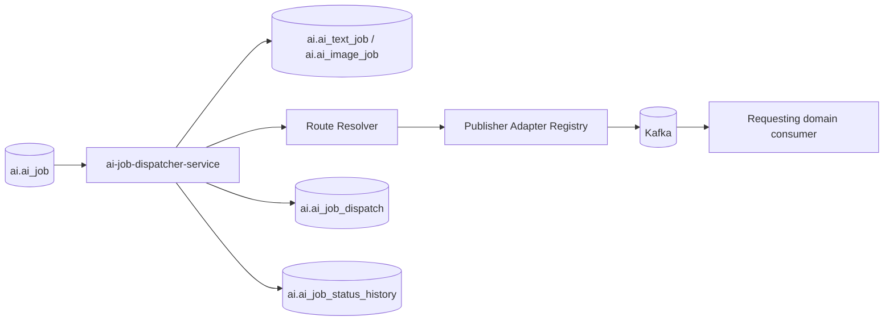
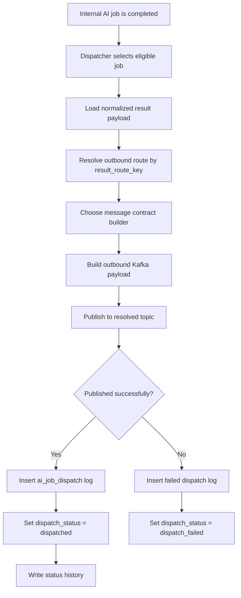
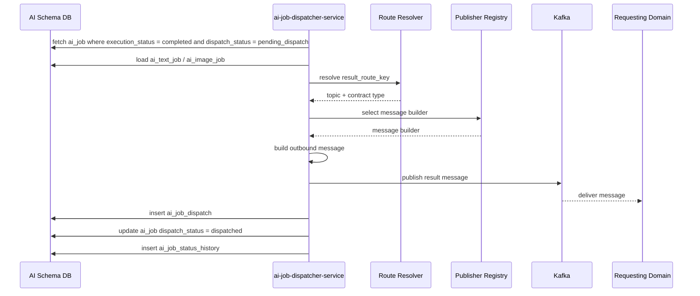
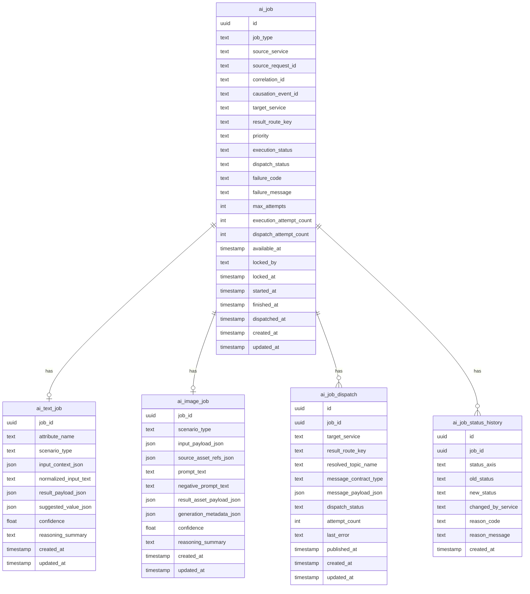
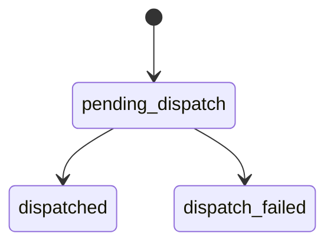

# AI Job Dispatcher Pipeline

The `ai-job-dispatcher-service` is the outbound integration layer of the AI
domain.
It takes completed internal AI jobs, resolves the external routing target,
builds the correct outbound message contract, and publishes the result back to
the requesting domain.

The service is the only AI-domain component that needs knowledge of requesting
services and outbound Kafka routing.

## Responsibilities

The service:

- fetches completed undispatched AI jobs
- loads internal execution results
- resolves outbound route configuration from `result_route_key`
- selects the proper outbound message builder
- publishes Kafka result messages
- retries failed dispatch attempts
- records dispatch logs and dispatch status transitions

The service does not:

- consume external request topics for job creation
- execute AI workflows
- call models or perform reasoning loops
- modify requesting-domain data directly

Those responsibilities belong to `ai-intake-service`, `ai-orchestrator`, and
requesting domain services.

---

## High-Level Service Overview



---

## Pipeline Overview



---

## Detailed Sequence



---

## Route Resolution Model

The dispatcher should not hardcode topic names in business logic.
Instead, it should resolve routing using infrastructure-level configuration.

Recommended flow:

1. load `result_route_key` from `ai_job`
2. resolve route metadata in infrastructure
3. determine:
   - target topic
   - outbound contract type
   - publisher adapter
4. publish with the correct typed message body

This keeps business records stable even if topic names change.

---

## Dispatcher Output Types

The service may publish different outbound messages depending on:

- job modality (`text`, `image`)
- result status (`completed`, `failed`, `no_result`)
- target contract type

Examples:

- `ai.text.result.completed`
- `ai.image.result.completed`
- `ai.job.result.failed`

---

## Database Schema



---

## Data Model Notes

### `ai_job`

The dispatcher uses:

- `target_service`
- `result_route_key`
- `execution_status`
- `dispatch_status`
- `dispatch_attempt_count`
- `dispatched_at`

### `ai_job_dispatch`

Stores dispatch attempt history and the exact outbound payload published for each
attempt.

This is important for:

- replay analysis
- transport debugging
- downstream troubleshooting
- operational retries

### `ai_job_status_history`

Captures dispatch state transitions separately from execution transitions.

---

## Dispatch State Machine



---

## Example Outbound Message: Text Result Completed

```json
{
  "event_id": "uuid",
  "event_type": "ai.text.result.completed",
  "event_version": 1,
  "occurred_at": "2026-03-14T18:20:00Z",
  "source_service": "ai-job-dispatcher-service",
  "correlation_id": "uuid",
  "result": {
    "source_request_id": "uuid",
    "job_id": "uuid",
    "attribute_name": "characters",
    "scenario_type": "character_resolution",
    "payload": {
      "characters": [
        {
          "name": "Draculaura",
          "slug": "draculaura"
        }
      ]
    },
    "confidence": 0.96,
    "reasoning_summary": "Matched extracted names against catalog lookup results."
  }
}
```

---

## Example Outbound Message: Image Result Completed

```json
{
  "event_id": "uuid",
  "event_type": "ai.image.result.completed",
  "event_version": 1,
  "occurred_at": "2026-03-14T18:22:00Z",
  "source_service": "ai-job-dispatcher-service",
  "correlation_id": "uuid",
  "result": {
    "source_request_id": "uuid",
    "job_id": "uuid",
    "scenario_type": "image_generation",
    "assets": [
      {
        "storage_key": "generated/release-123/front.webp",
        "width": 1024,
        "height": 1024,
        "mime_type": "image/webp"
      }
    ],
    "generation_metadata": {
      "model": "local-image-model",
      "seed": 112233
    }
  }
}
```

---

## Example Outbound Message: Failed Result

```json
{
  "event_id": "uuid",
  "event_type": "ai.job.result.failed",
  "event_version": 1,
  "occurred_at": "2026-03-14T18:25:00Z",
  "source_service": "ai-job-dispatcher-service",
  "correlation_id": "uuid",
  "result": {
    "source_request_id": "uuid",
    "job_id": "uuid",
    "job_type": "text",
    "failure_code": "invalid_model_response",
    "failure_message": "The model returned an invalid structured payload."
  }
}
```

---

## Ownership Boundaries

| Component | Responsibility |
|---|---|
| `ai-intake-service` | creates internal jobs from external requests |
| `ai-orchestrator` | produces normalized internal AI results |
| `ai-job-dispatcher-service` | knows outbound services and routing |
| `ai-job-dispatcher-service` | publishes result contracts to Kafka |
| Requesting domain service | consumes AI result and applies its own domain logic |

---

## Key Design Principles

1. **Only the dispatcher knows outbound service integration details**
2. **The orchestrator is completely isolated from external routing**
3. **Outbound transport history is persisted for debugging and retries**
4. **Routing is resolved by route key, not by hardcoded business logic**
5. **Requesting domains remain owners of their own final write decisions**
