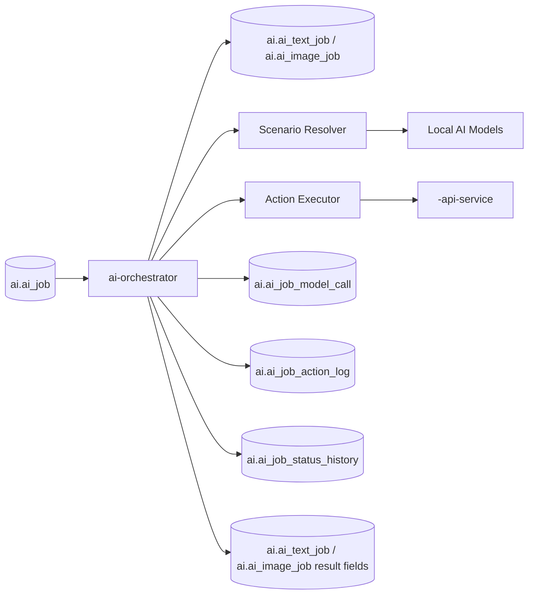
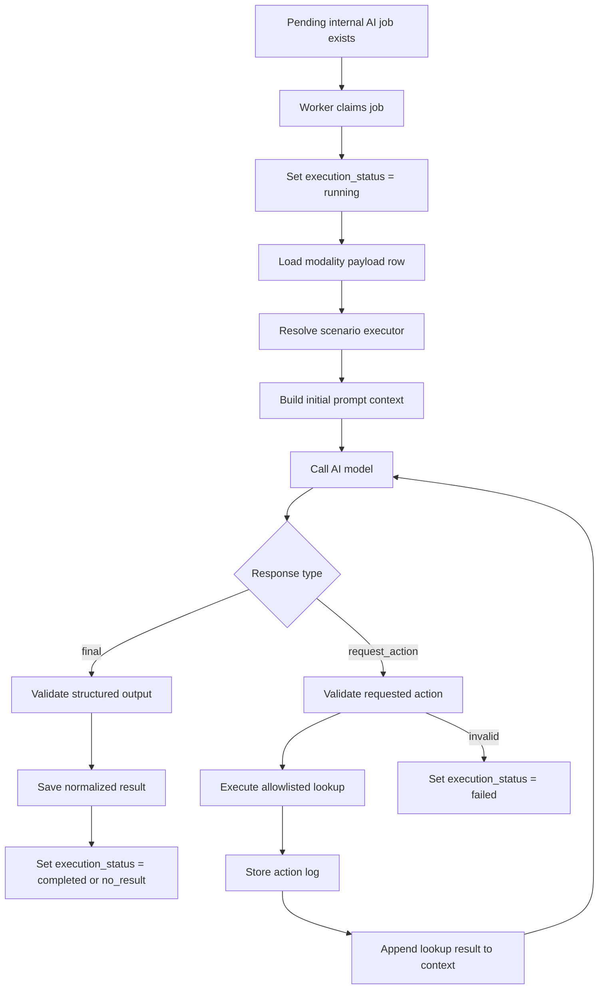
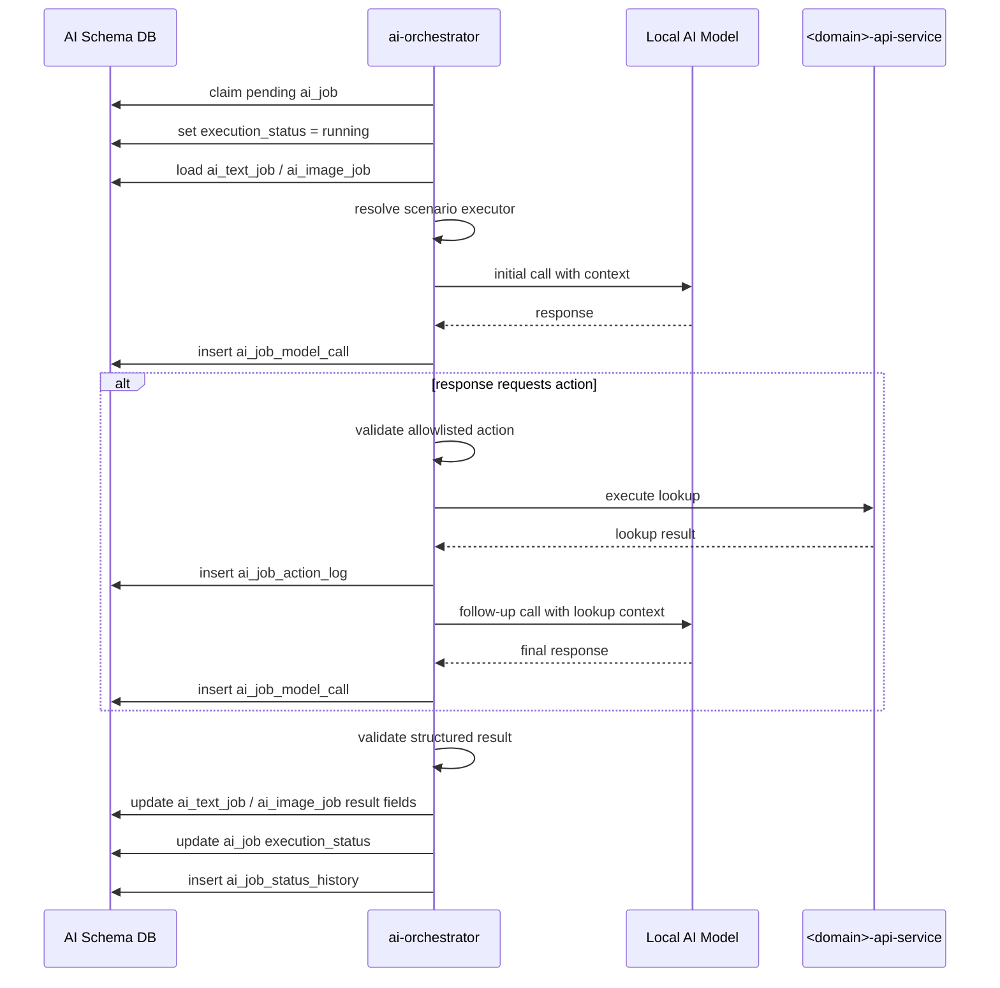
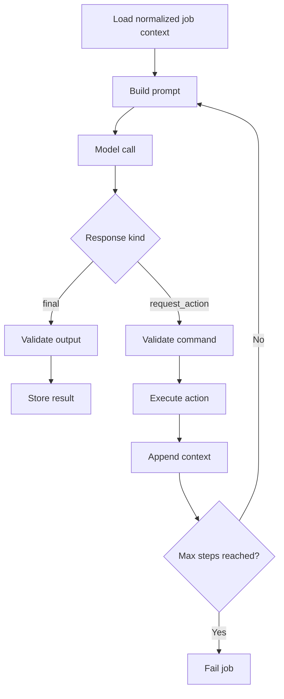
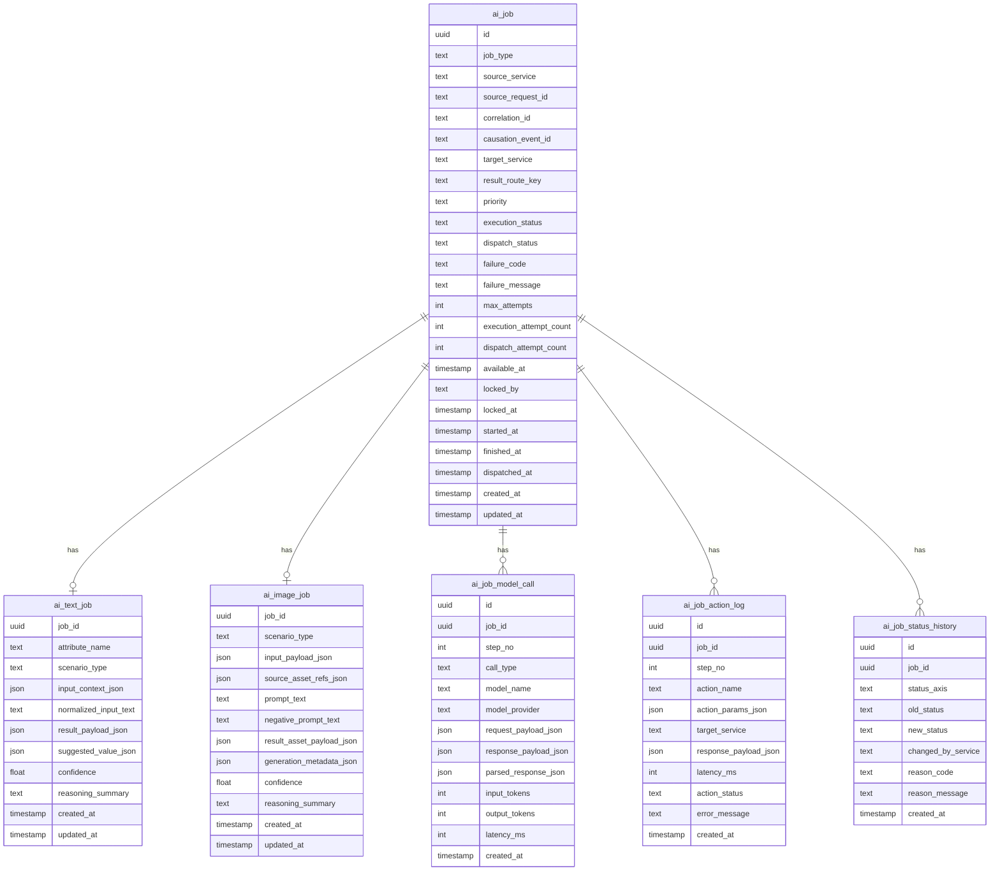
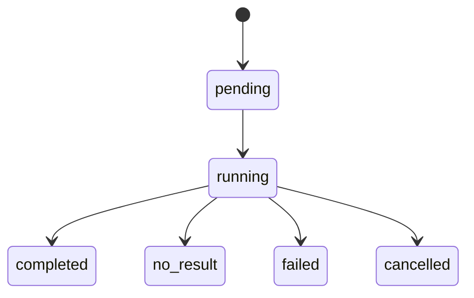

# AI Orchestrator Pipeline

The `ai-orchestrator` service is the execution engine of the AI domain.
It processes internal jobs created by `ai-intake-service`, executes the
appropriate AI workflow, performs controlled lookup actions when required, and
stores the final normalized result.

The service works only with internal AI-domain tables and does not know which
external domain originally requested the job.

## Responsibilities

The service:

- fetches internal pending jobs
- locks jobs for exclusive execution
- resolves the scenario executor for the job
- calls local AI models
- performs bounded reasoning loops
- executes allowlisted external lookup actions through API services
- validates structured model outputs
- stores final normalized execution results
- updates execution lifecycle state
- logs all model calls and action steps

The service does not:

- consume external domain request topics directly
- publish final results back to requesting domains
- know target Kafka topics or outbound routing configuration
- decide merge policy in requesting domains

Those responsibilities belong to `ai-intake-service` and
`ai-job-dispatcher-service`.

---

## High-Level Service Overview



---

## Pipeline Overview



---

## Detailed Sequence



---

## Internal Reasoning Loop



---

## Execution Policies

The orchestrator should enforce explicit execution limits, including:

- maximum reasoning steps per job
- maximum action calls per job
- maximum model call count per job
- maximum elapsed execution time per job
- per-scenario allowed model list
- per-scenario allowed action list

These limits prevent infinite loops, repeated low-value retries, and unbounded
resource usage.

---

## Structured Output Validation

The service must validate both classes of model responses:

### Final result

- expected envelope fields exist
- payload conforms to scenario schema
- required typed values are present
- confidence is within accepted range if provided

### Action request

- `action_name` exists in the allowlist
- parameters match the action contract
- repeated useless action loops are prevented

Invalid responses should move the job to a terminal failure state.

---

## Database Schema



---

## Job State Machine



Dispatch transitions are handled by `ai-job-dispatcher-service`, not by the
orchestrator.

---

## Example Action Request Contract

```json
{
  "status": "request_action",
  "is_final": false,
  "requested_action": {
    "action_name": "lookup_characters_by_names",
    "action_params": {
      "character_names": [
        "Draculaura",
        "Clawdeen Wolf"
      ]
    }
  }
}
```

---

## Example Final Text Result

```json
{
  "status": "final",
  "is_final": true,
  "final_payload": {
    "characters": [
      {
        "name": "Draculaura",
        "slug": "draculaura"
      },
      {
        "name": "Clawdeen Wolf",
        "slug": "clawdeen-wolf"
      }
    ],
    "confidence": 0.96,
    "reasoning_summary": "Matched extracted names against catalog lookup results."
  }
}
```

---

## Example Final Image Result

```json
{
  "status": "final",
  "is_final": true,
  "final_payload": {
    "assets": [
      {
        "storage_key": "generated/release-123/front.webp",
        "width": 1024,
        "height": 1024,
        "mime_type": "image/webp"
      }
    ],
    "generation_metadata": {
      "model": "local-image-model",
      "seed": 112233
    }
  }
}
```

---

## Ownership Boundaries

| Component | Responsibility |
|---|---|
| `ai-intake-service` | creates internal AI jobs |
| `ai-orchestrator` | executes internal AI jobs |
| `ai-orchestrator` | validates model outputs |
| `ai-orchestrator` | stores normalized result payloads |
| `ai-job-dispatcher-service` | publishes completed results outward |

---

## Key Design Principles

1. **The orchestrator knows only internal AI-domain records**
2. **Execution is separate from intake and dispatch**
3. **Model outputs are always validated before persistence**
4. **Reasoning loops are bounded by explicit policy**
5. **All model calls and actions are audit-logged**
