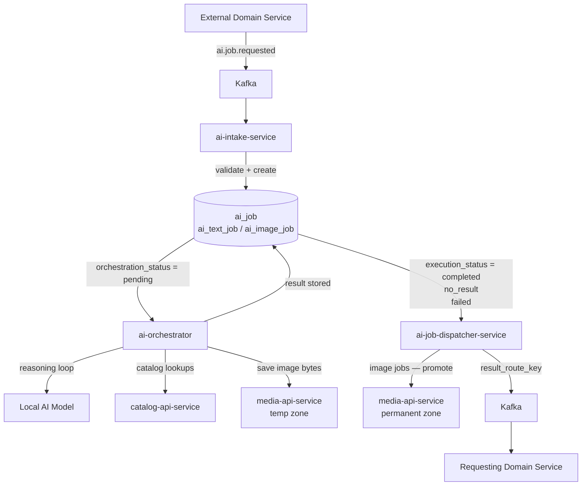
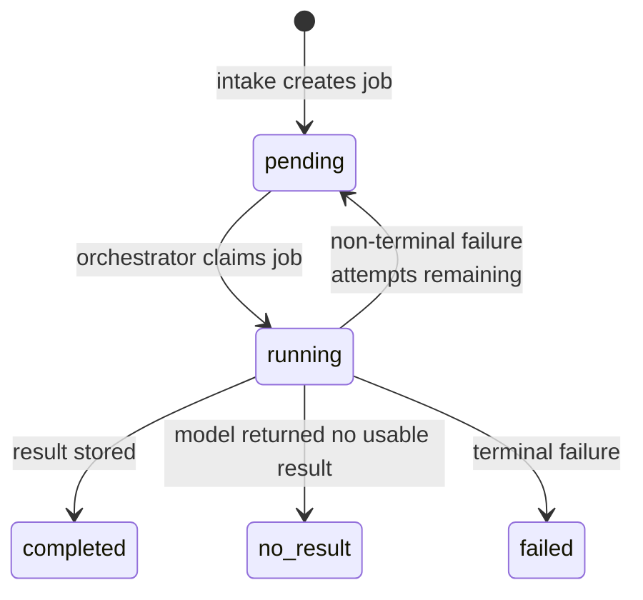
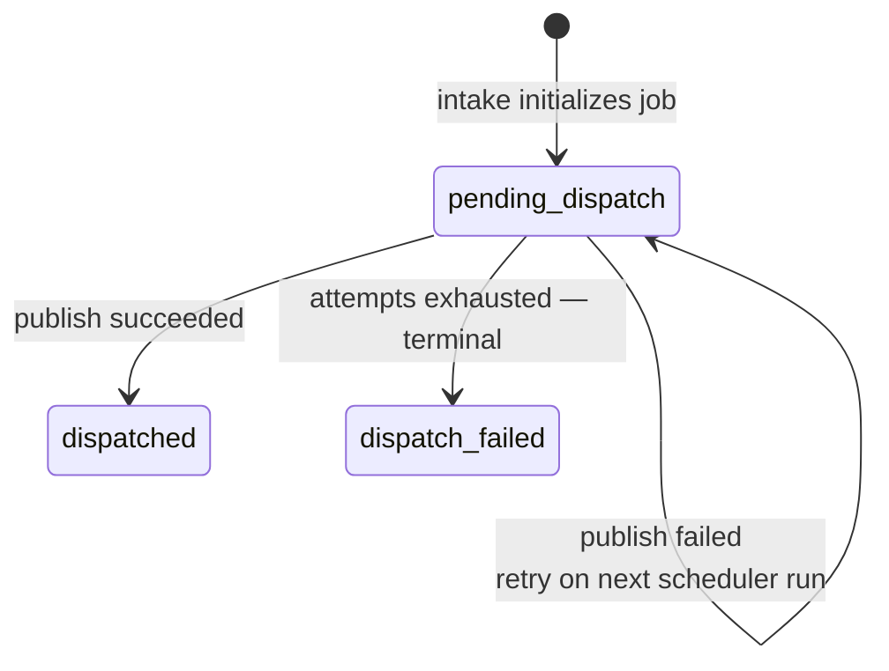

# AI Pipelines Overview

The AI domain processes internal AI jobs through three separate services.
Each service owns one phase of the lifecycle and has no knowledge of the
phases before or after it.

---

## Services at a Glance

| Service | Role |
| --- | --- |
| `ai-intake-service` | Accepts external AI job requests, validates them, and creates internal job records |
| `ai-orchestrator` | Claims pending jobs, runs reasoning loops against local AI models, stores results |
| `ai-job-dispatcher-service` | Takes completed jobs, promotes image assets, and publishes results back to requesting domains |

---

## End-to-End Flow

---

## Job Lifecycle

A single `ai_job` row tracks two independent status axes.

### Execution axis — owned by `ai-orchestrator`

### Dispatch axis — owned by `ai-job-dispatcher-service`

`dispatched_at` and `finished_at` are set by the dispatcher after successful
publish. `finished_at` marks the job as fully complete across both axes.

---

## Kafka Topics

| Topic | Producer | Consumer | Notes |
| --- | --- | --- | --- |
| `ai.job.requested` | External domain service | `ai-intake-service` | Entry point into the AI domain |
| `ai.job.requested.dlq` | `ai-intake-service` | Manual | Dead-letter after persistent DB failure |
| `{result_route_key}` | `ai-job-dispatcher-service` | Requesting domain service | Topic name comes from `ai_job.result_route_key` set at intake time |

The orchestrator and dispatcher do not consume Kafka topics — they poll the
database directly. Only `ai-intake-service` is a Kafka consumer.

---

## Deduplication

`ai-intake-service` deduplicates on `event_id` from the Kafka message envelope
within a rolling window. This guards against Kafka at-least-once redeliveries.

`source_request_id` is **not** used as a dedup key. An external service may
resubmit the same `source_request_id` with a new `event_id` to trigger fresh
processing — for example when external context that the orchestrator fetches
has changed. Each submission creates a new `ai_job`.

---

## Job Claiming

Both `ai-orchestrator` and `ai-job-dispatcher-service` claim work from the
database using `SELECT FOR UPDATE SKIP LOCKED`. No external coordinator is
needed.

The orchestrator discovers work via `orchestration_status = pending` on the
modality tables (`ai_text_job`, `ai_image_job`) — not by polling `ai_job`
directly. Priority and backoff are applied via a join to `ai_job`.

The dispatcher polls `ai_job` directly for jobs where `execution_status IN
(completed, no_result, failed)` and `dispatch_status = pending_dispatch`,
ordered by priority.

---

## Retry Policies

| Service | Retryable failures | Max attempts | Backoff |
| --- | --- | --- | --- |
| `ai-orchestrator` | `model_error`, `action_timeout`, `execution_timeout` | `ai_job.max_attempts` | 60 s fixed |
| `ai-job-dispatcher-service` | Kafka unavailable, media promotion error | 3 (service config) | None — next poll |

Structural orchestrator failures (`invalid_model_output`, `action_not_allowed`,
`max_steps_exceeded`) are **terminal** — they are not retried regardless of
remaining attempts.

The reasoning loop allows a maximum of **4 action calls** per job. Exceeding
this sets `failure_code = max_steps_exceeded`.

---

## External Service Calls

The orchestrator may call two external services as allowlisted actions during
reasoning loops:

| Service | Purpose | Job types |
| --- | --- | --- |
| `catalog-api-service` | Look up characters, pets, releases, release types, relationship types | Text |
| `media-api-service` | Save generated image bytes to temp storage, return `temp_path` | Image |

The dispatcher calls `media-api-service` to promote `temp_path` to permanent
storage before publishing the outbound result.

---

## Detailed Documentation

- [01 — AI Intake Pipeline](./01-ai-intake-pipeline.md)
- [02 — AI Orchestrator Pipeline](./02-ai-orchestrator-pipeline.md)
- [03 — AI Job Dispatcher Pipeline](./03-ai-job-dispatcher-pipeline.md)
