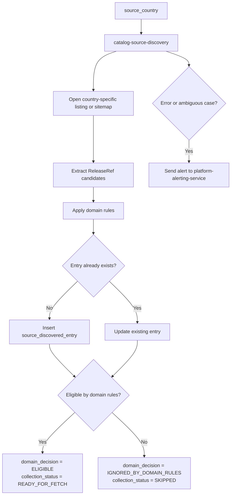

# Source Discovery

## Responsibility

`catalog-source-discovery` scans country-specific source roots, extracts
candidate entry references, applies domain rules, and persists the result
as `catalog.source_discovered_entry`.

## Inputs

- `core.source`
- `core.geo_country`
- `core.source_country`
- country-specific listing pages
- collection pages
- sitemaps
- discovery-oriented source APIs

## Outputs

- inserted or updated `catalog.source_discovered_entry`
- optional alert sent to `platform-alerting-service` if the run fails or
  a case requires manual review

## What Discovery Does

- selects a `source_country`
- opens country-specific discovery roots
- extracts lightweight candidate references
- builds a minimal `ReleaseRef` for each found candidate
- deduplicates by the upstream identity of the entry
- evaluates domain rules
- stores the entry whether eligible or ignored
- marks eligible entries as ready for fetch
- marks out-of-scope entries as ignored so they are not re-evaluated
  every run

## What Discovery Does Not Do

- it does not create canonical releases
- it does not run the importer
- it does not fetch every discovered page as its primary responsibility
- it does not create `ingest_item` directly

## Domain Rules in Discovery

Discovery is responsible not only for finding links, but also for making
the first domain eligibility decision.

For Monstrino, not every Monster High branded item belongs to the
supported catalog scope.

Eligible examples:

- dolls
- supported doll-related release categories

Ignored examples:

- notebooks
- jewelry
- plush toys
- stickers
- other branded merchandise outside supported release scope

Ignored entries are still stored as `source_discovered_entry` records.
This prevents the system from checking the same out-of-scope link again
on every discovery run.

## Stage Diagram



---

## Data Models

### `ReleaseRef`

`ReleaseRef` is a lightweight discovery model. It is not canonical catalog
data and not a full parsed content object.

```python
from pydantic import BaseModel
from uuid import UUID


class ReleaseRef(BaseModel):
    source_country_id: UUID
    external_id: str
    url: str
    title: str | None = None
    language: str | None = None
    region: str | None = None
    raw_type_hint: str | None = None
    metadata: dict | None = None
```

### `SourceDiscoveredEntry`

```python
from datetime import datetime
from pydantic import BaseModel
from uuid import UUID


class SourceDiscoveredEntry(BaseModel):
    id: UUID
    source_country_id: UUID
    external_id: str
    url: str
    title: str | None = None
    metadata_json: dict | None = None

    discovery_status: str
    collection_status: str

    domain_decision: str
    decision_reason: str | None = None

    first_discovered_at: datetime
    last_seen_at: datetime

    collection_attempt_count: int = 0
    claimed_by: str | None = None
    claimed_at: datetime | None = None

    last_error_code: str | None = None
    last_error_message: str | None = None
```

Suggested `domain_decision` values:

- `ELIGIBLE`
- `IGNORED_BY_DOMAIN_RULES`
- `REJECTED_INVALID_ENTRY`
- `REQUIRES_REVIEW`

Suggested uniqueness rule:

- unique by `(source_country_id, external_id)`
