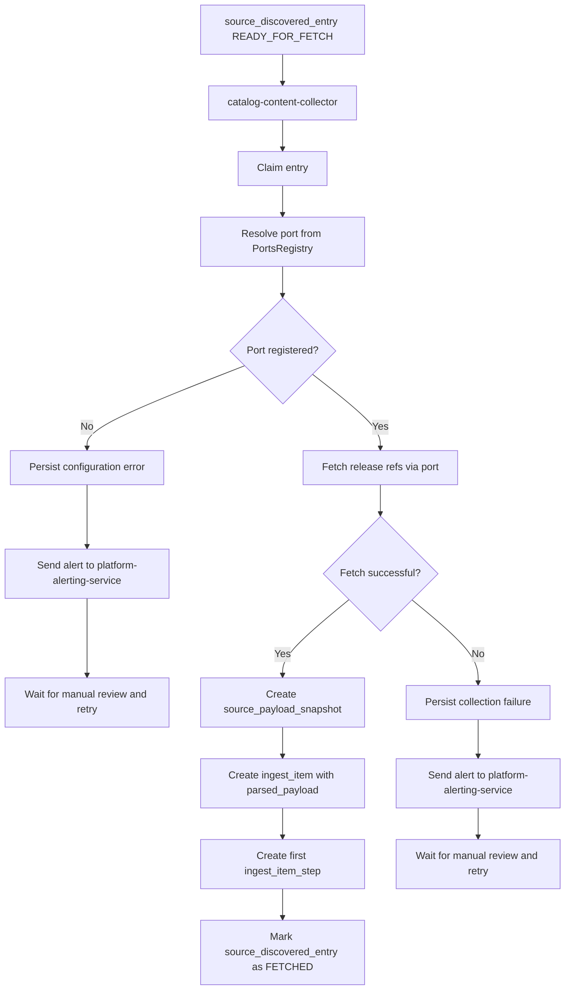
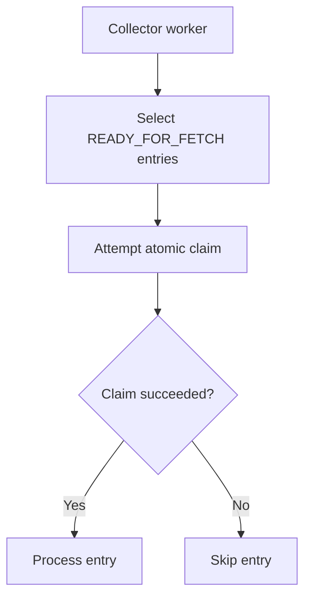
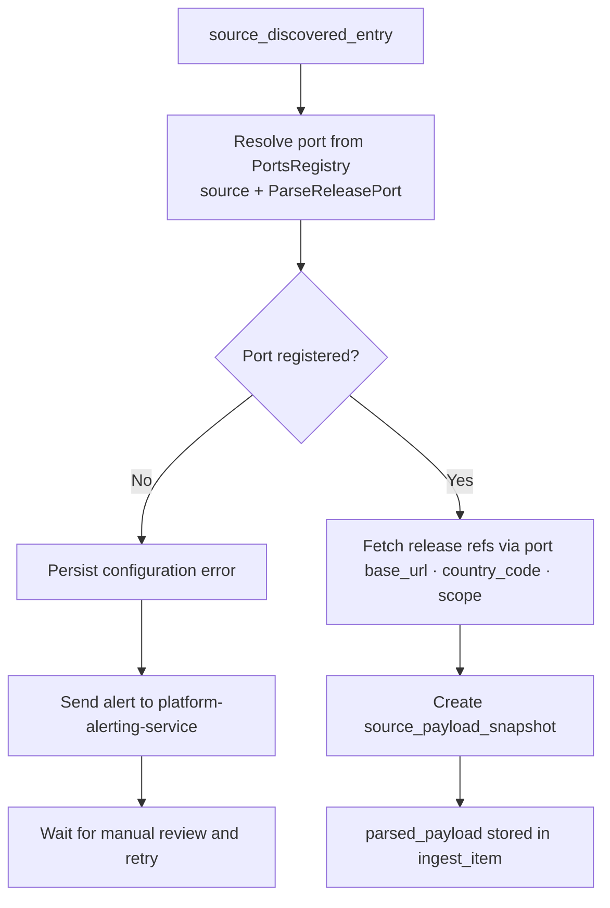

# Content Collection

## Responsibility

`catalog-content-collector` reads eligible discovered entries, claims
them, fetches the real source payload, stores a payload snapshot, creates
an ingest item, and starts downstream processing.

## Inputs

- `catalog.source_discovered_entry`
- `collection_status = READY_FOR_FETCH`
- `domain_decision = ELIGIBLE`

## Outputs

- `catalog.source_payload_snapshot`
- `catalog.ingest_item`
- initial `catalog.ingest_item_step`
- optional alert sent to `platform-alerting-service` if the operation
  fails

## What Collector Does

- selects discovered entries ready for fetch
- claims them atomically
- resolves the source-specific port from `PortsRegistry`
- fetches release refs via the resolved port
- stores a reproducible payload snapshot
- creates a downstream ingest work unit with the `parsed_payload`
- creates the first ingest step that marks fetch completion

## What Collector Does Not Do

- it does not discover new links
- it does not decide source inventory
- it does not own source-country traversal logic

## Stage Diagram



---

## Claiming and Concurrency

To avoid duplicate collection by multiple workers, discovered entries
must be claimed atomically before fetch.

Typical claim-related fields:

- `collection_status`
- `claimed_by`
- `claimed_at`
- `collection_attempt_count`

### Claiming Flow



---

## Source-Specific Parsing

Before fetching any payload, the collector resolves a source-specific
port from `PortsRegistry`. The port is responsible for fetching release
refs from the source. Only after a successful fetch is the
`source_payload_snapshot` stored and the `parsed_payload` created.

### Ports Registry

`PortsRegistry` maps each `(source, port_type)` pair to a concrete
adapter implementation. Adapters are registered at application startup.
Each source — for example `MATTEL_CREATIONS` — is bound to a
`ParseReleasePort` implementation that knows how to fetch and parse
release references for that specific source.

At runtime the collector looks up the correct port by passing the entry's
`source` and the expected port type. If no adapter is registered for the
pair, the collector treats it as a configuration error: the failure is
persisted and an alert is sent to `platform-alerting-service` for manual
review.

### Resolution Flow



### Registered Sources

| Source | Port Type |
| --- | --- |
| `MATTEL_SHOP` | `ParseReleasePort` |
| `MATTEL_CREATIONS` | `ParseReleasePort` |

### Parsed Payload Model

Each port collects the fetched data into a `ReleaseParsedContentRef`
instance. This object is serialized and stored as
`ingest_item.parsed_payload`. It is a normalized intermediate
representation — it does not yet contain enriched or AI-resolved
attributes.

```python
class ReleaseParsedContentRef:
    # Required identifiers
    title:       str
    external_id: str
    url:         str

    # Metadata
    mpn:            Optional[str] = None
    type:           Optional[str] = None
    subtype:        Optional[list[str]] = None
    language:       Optional[str] = None
    region:         Optional[str] = None
    gtin:           Optional[str] = None

    # Content data
    description:            Optional[str] = None
    text_from_box:          Optional[str] = None
    content_description:    Optional[str] = None
    year:                   Optional[int] = None
    year_raw:               Optional[str] = None
    gender:                 Optional[list[str]] = None
    characters:             Optional[list[str]] = None
    pets:                   Optional[list[str]] = None
    series:                 Optional[list[str]] = None
    exclusive_vendor:       Optional[list[str]] = None
    reissue_of:             Optional[list[str]] = None
    content_type:           Optional[list[str]] = None
    pack_type:              Optional[list[str]] = None
    tier_type:              Optional[str] = None

    # Images
    primary_image_url:  Optional[str] = None
    images:             Optional[list[str]] = None
    images_url:         Optional[str] = None

    # Raw and extended data
    raw_payload:    Optional[dict] = None
    extra:          Optional[dict] = None
```

---

## Persistence Contract with Discovery

The preferred communication model between `catalog-source-discovery` and
`catalog-content-collector` is persisted state, not direct synchronous
service-to-service orchestration.

### Preferred Contract

- discovery persists `source_discovered_entry`
- collector reads eligible entries from the database
- collector claims them explicitly
- collector creates downstream work objects after successful fetch

This gives the pipeline:

- weaker coupling
- better observability
- easier recovery
- a durable operational contract

### Event Bus Position

An event bus may be added later as a notification layer, but not as the
sole source of truth.

If introduced, the event should act as a signal that a persisted
discovered entry is ready for fetch, rather than replacing the persistence
contract itself.

---

## Data Models

### `SourcePayloadSnapshot`

```python
from datetime import datetime
from pydantic import BaseModel
from typing import Optional
from uuid import UUID


class SourcePayloadSnapshot(BaseModel):
    id:                         UUID
    source_discovered_entry_id: UUID

    fetched_at:                 datetime
    http_status:                Optional[int] = None
    content_type:               Optional[str] = None

    payload_storage_ref:        str
    content_fingerprint:        Optional[str] = None

    response_headers_json:      Optional[dict] = None
    fetch_error_code:           Optional[str] = None
    fetch_error_message:        Optional[str] = None
```

### `IngestItem`

```python
from datetime import datetime
from pydantic import BaseModel
from typing import Optional
from uuid import UUID


class IngestItem(BaseModel):
    id:                         UUID
    source_discovered_entry_id: UUID
    source_payload_snapshot_id: UUID

    pipeline_status:            str
    created_at:                 datetime

    canonical_entity_type:      Optional[str] = "release"
    priority:                   Optional[int] = None

    parsed_payload:             Optional[dict] = None
    enriched_payload:           Optional[dict] = None
    result_model:               Optional[dict] = None
```

### `IngestItemStep`

```python
from datetime import datetime
from pydantic import BaseModel
from typing import Optional
from uuid import UUID


class IngestItemStep(BaseModel):
    id:              UUID
    ingest_item_id:  UUID

    step_type:       str
    status:          str

    started_at:      Optional[datetime] = None
    finished_at:     Optional[datetime] = None

    attempt_no:      int = 1
    error_code:      Optional[str] = None
    error_message:   Optional[str] = None

    input_ref_json:  Optional[dict] = None
    output_ref_json: Optional[dict] = None
```

### `ReleaseParsedContentRef`

```python
from typing import Optional


class ReleaseParsedContentRef:
    # Required identifiers
    title:       str
    external_id: str
    url:         str

    # Metadata
    mpn:            Optional[str] = None
    type:           Optional[str] = None
    subtype:        Optional[list[str]] = None
    language:       Optional[str] = None
    region:         Optional[str] = None
    gtin:           Optional[str] = None

    # Content data
    description:            Optional[str] = None
    text_from_box:          Optional[str] = None
    content_description:    Optional[str] = None
    year:                   Optional[int] = None
    year_raw:               Optional[str] = None
    gender:                 Optional[list[str]] = None
    characters:             Optional[list[str]] = None
    pets:                   Optional[list[str]] = None
    series:                 Optional[list[str]] = None
    exclusive_vendor:       Optional[list[str]] = None
    reissue_of:             Optional[list[str]] = None
    content_type:           Optional[list[str]] = None
    pack_type:              Optional[list[str]] = None
    tier_type:              Optional[str] = None

    # Images
    primary_image_url:  Optional[str] = None
    images:             Optional[list[str]] = None
    images_url:         Optional[str] = None

    # Raw and extended data
    raw_payload:    Optional[dict] = None
    extra:          Optional[dict] = None
```
