# Catalog Data Enricher

## Overview

The `catalog-data-enricher` service is responsible for improving parsed
catalog records before they enter the canonical domain model.

It does not directly read catalog records as a queue. Instead, it
receives work through `ingest_item_step` orchestration records created
by the ingestion pipeline.

During execution the service:

1. claims the `ingest_item_step` and marks it as running enrichment
2. reads `ingest_item.parsed_payload` and deserializes it into a
   `ReleaseParsedContentRef` model
3. plans which attributes of the model require enrichment
4. for each attribute — attempts resolution via built-in scripts first
5. for attributes that scripts cannot resolve — publishes `ai.job.requested`
   to Kafka; the AI pipeline handles execution independently and returns the
   result via Kafka topic `catalog-enricher.attribute-result`
6. evaluates candidate results from scripts or AI
7. writes accepted values back into the in-memory `ReleaseParsedContentRef`
8. after all attributes are processed — persists the final model to
   `ingest_item.enriched_payload`
9. stores execution history and decision logs
10. marks the `ingest_item_step` as completed and advances to the next stage

Script-based resolution runs first and is the preferred path. When a script
cannot resolve an attribute, the enricher publishes `ai.job.requested` to
Kafka and later consumes the result from the
`catalog-enricher.attribute-result` topic. The enricher and the AI pipeline
share no database tables — all coordination is via Kafka.

The AI pipeline is documented in [AI Pipeline](./04-ai-orchestrator.md).

---

## High-Level Architecture

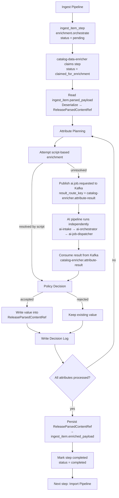

---

## Service Responsibilities

The `catalog-data-enricher` service:

- orchestrates attribute enrichment for catalog items
- attempts attribute resolution via built-in scripts before delegating to AI
- publishes `ai.job.requested` to Kafka for unresolved attributes and
  consumes results from `catalog-enricher.attribute-result`
- does not call AI services directly — all coordination is via Kafka;
  no shared tables exist between the catalog pipeline and the AI domain
- validates and evaluates candidate values from AI
- updates the canonical working snapshot of the item
- records execution attempts and decision outcomes
- prepares the item for downstream import

---

## Stage Entry

Enrichment begins when the ingestion pipeline creates a step record.

Example:

```text
step_type = enrichment.orchestrate
status = pending
```

Workers in `catalog-data-enricher` poll for these steps. Once selected,
the step is claimed and its status advances through the enrichment
lifecycle. The `ingest_item_step` does not advance to the next pipeline
stage until all attributes of the item have been fully processed.

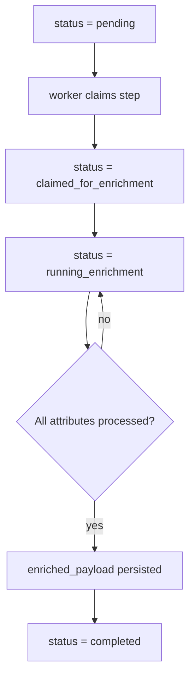

---

## End-to-End Enrichment Flow

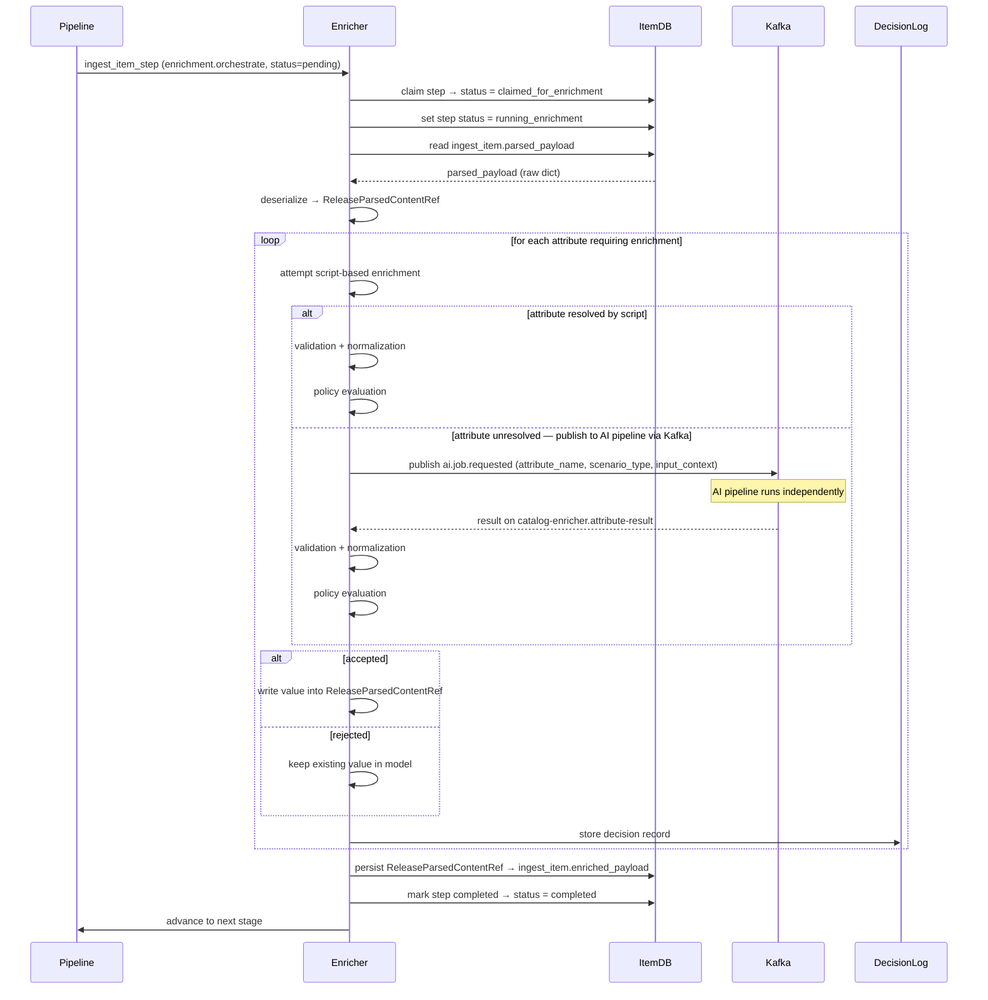

---

## Attribute Planning Phase

Before executing enrichment jobs, the service decides which attributes
require enrichment.

Typical attributes include:

- characters
- pet_title
- series
- content_type
- pack_type
- tier_type

Planning logic evaluates:

- attribute missing
- weak structure
- policy restrictions
- previous enrichment attempts
- confidence requirements

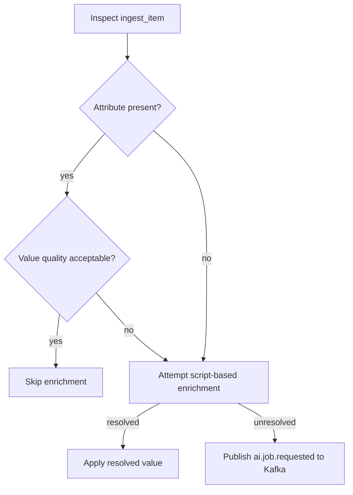

---

## Attribute AI Job Submission

Each unresolved attribute triggers a Kafka message `ai.job.requested`. The
enricher publishes the message with the attribute context and continues
processing other attributes. No database record is created in the AI domain
at this point — `ai-intake-service` handles that after consuming the message.

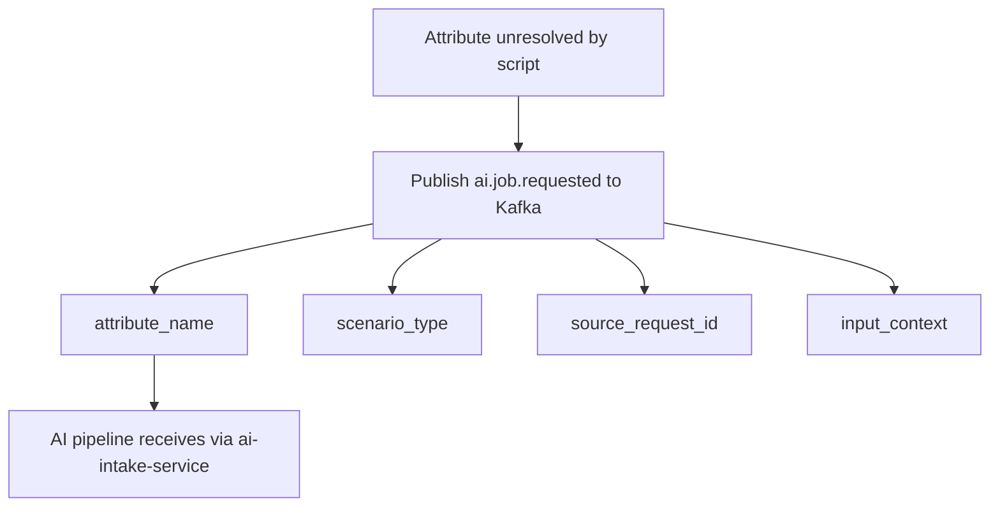

Example message fields set by the enricher:

```text
attribute_name    = characters
scenario_type     = character_resolution
source_request_id = <uuid>   ← used to match the inbound result
result_route_key  = catalog-enricher.attribute-result
```

---

## Script-Based Enrichment

Before publishing to Kafka and delegating to the AI pipeline,
the service attempts to resolve each attribute using built-in scripts.

Scripts can handle cases where the answer is deterministic or can be
reliably derived from structured source data without AI involvement.

Examples of what scripts may resolve:

- extracting a year from a structured product title or MPN
- mapping a known type string to a canonical `content_type` value
- normalizing a `region` or `language` field from source metadata
- identifying a known exclusive vendor from a source URL pattern

If a script successfully resolves the attribute, the result enters the
same validation and policy pipeline as an AI candidate — it is not
written directly without evaluation.

If the script cannot resolve the attribute — because the data is
ambiguous, absent, or requires semantic interpretation — the enricher
publishes `ai.job.requested` to Kafka and continues processing other
attributes while the AI pipeline runs independently.

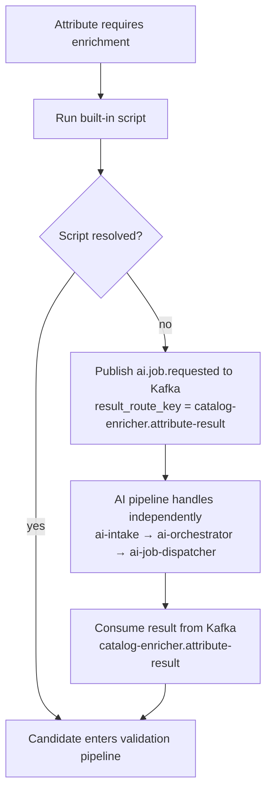

---

## Interaction With the AI Pipeline

The enricher does not call AI services directly and shares no database tables
with the AI domain. All interaction is via Kafka.

When a script cannot resolve an attribute, the enricher publishes
`ai.job.requested` to Kafka and continues processing other attributes.
Three dedicated AI services handle the rest — `ai-intake-service` validates
and creates the internal job, `ai-orchestrator` executes the scenario, and
`ai-job-dispatcher-service` publishes the result back to
`catalog-enricher.attribute-result`. The enricher consumes from this topic
and identifies the matching attribute by `source_request_id`.

Named AI scenarios used for catalog enrichment:

| `scenario_type` | Attribute |
| --- | --- |
| `character_resolution` | `characters` |
| `pet_resolution` | `pets` |
| `series_classification` | `series` |
| `content_type_classification` | `content_type` |
| `pack_type_classification` | `pack_type` |
| `tier_type_classification` | `tier_type` |

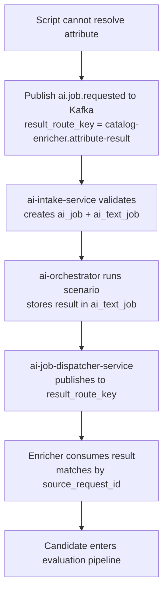

The full AI pipeline internals are documented in
[AI Pipeline](./04-ai-orchestrator.md).

---

## Candidate Evaluation Pipeline

No candidate value — whether produced by a built-in script or by AI —
is accepted automatically. Every candidate passes through the same
controlled evaluation pipeline.

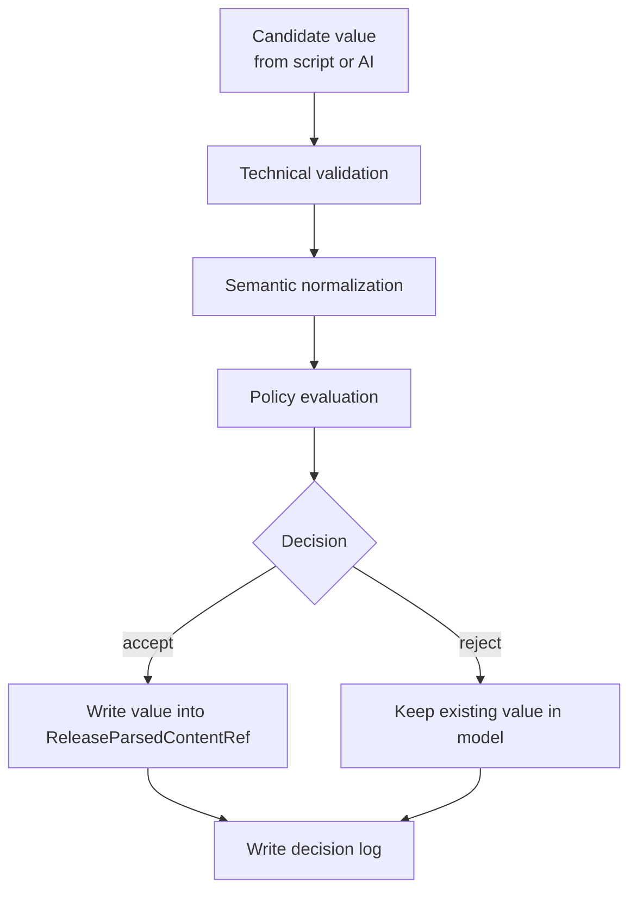

---

## Working Model and Persistence

The enricher does not operate directly on the database row during
attribute processing. Instead it works on an in-memory
`ReleaseParsedContentRef` model that is loaded once at the start.

### Loading

The service reads `ingest_item.parsed_payload` — the raw structured dict
produced by the collector — and deserializes it into a
`ReleaseParsedContentRef` instance. This becomes the working model for
the entire enrichment session.

### Per-Attribute Updates

When a candidate value is accepted for an attribute, it is written into
the in-memory `ReleaseParsedContentRef`. No database write happens at
this point. The model accumulates all resolved attribute values as
processing continues.

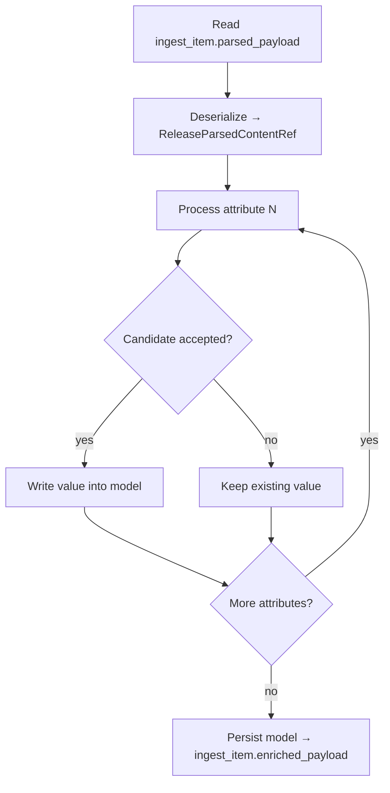

### Persistence

After all attributes have been processed, the final state of the
`ReleaseParsedContentRef` model is serialized and saved to
`ingest_item.enriched_payload`.

This is the single write to the database for the enriched state.
Downstream services read only `enriched_payload` — they do not interact
with `parsed_payload` directly.

---

## Decision Logging

Every evaluated attribute generates a decision record.

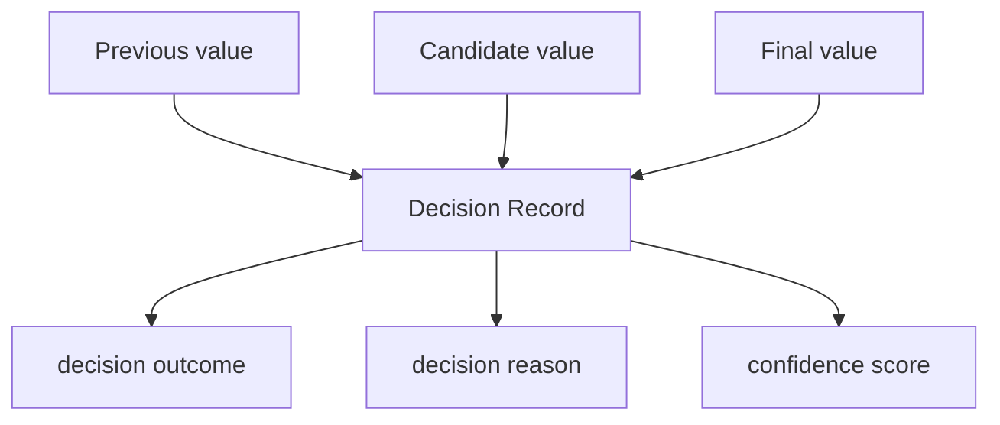

This allows the platform to audit and explain enrichment behavior.

---

## Failure Handling

### Enrichment step failures

If the enrichment step itself fails (crash, timeout, unhandled exception),
the `ingest_item_step` remains in its current status. The pipeline alerting
model applies — the failure is persisted and an alert is sent for operator
review before manual retry.

### AI pipeline failures

If the AI pipeline returns `ai.job.result.failed` or `ai.job.result.no_result`
for an attribute, the enricher treats the attribute as unresolved:

- `no_result` — model completed normally but produced no usable value; the
  enricher keeps the existing value and logs the outcome
- `failed` — terminal AI execution error; the enricher logs the failure and
  flags the step for administrator review

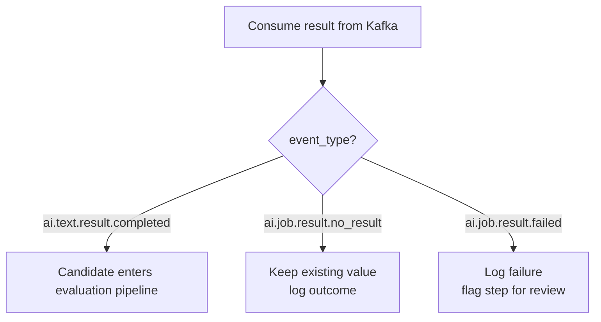

AI-side retry logic (backoff, attempt limits, structural vs transient
failures) is handled entirely within the AI pipeline and is transparent
to the enricher.

---

## Stage Finalization

The `ingest_item_step` does not advance to the next stage until every
attribute of the `ReleaseParsedContentRef` has been fully processed —
either resolved, skipped, or failed with a logged outcome.

Only after all attributes are settled does the enricher:

1. persist the final model to `ingest_item.enriched_payload`
2. mark the current `ingest_item_step` as `completed`
3. create the next step for the import pipeline

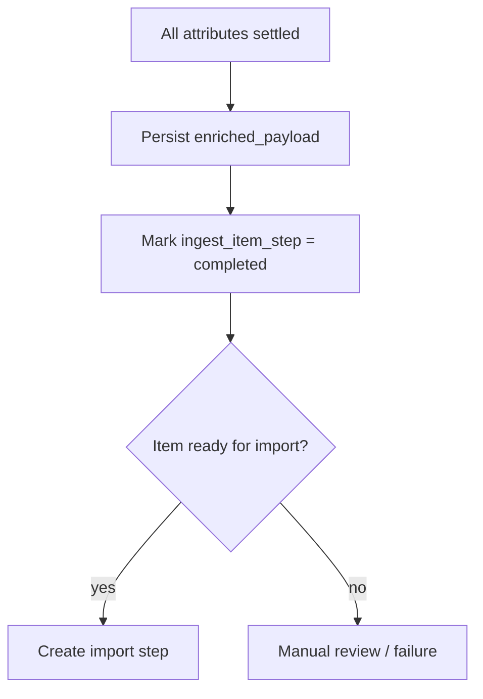

Successful items proceed to the catalog import pipeline.

---

## Summary

The `catalog-data-enricher` pipeline:

- claims `ingest_item_step` and advances its status through the enrichment
  lifecycle
- reads `ingest_item.parsed_payload` and deserializes it into a
  `ReleaseParsedContentRef` working model
- processes each attribute — via built-in scripts first; for unresolved
  attributes publishes `ai.job.requested` to Kafka and consumes the result
  from `catalog-enricher.attribute-result`
- evaluates all candidate values through the same validation and policy
  pipeline
- accumulates resolved values in-memory until all attributes are settled
- persists the final model to `ingest_item.enriched_payload` only after
  all attributes are processed
- marks `ingest_item_step` as completed and creates the next step for
  the import pipeline
- stores full execution and decision history

The `ingest_item_step` advances to the next stage only when the entire
attribute processing loop is complete. No partial writes to
`enriched_payload` happen during processing.

Script-based resolution is the preferred path. AI Orchestrator is the
fallback for attributes that require semantic interpretation or that
scripts cannot reliably handle.
