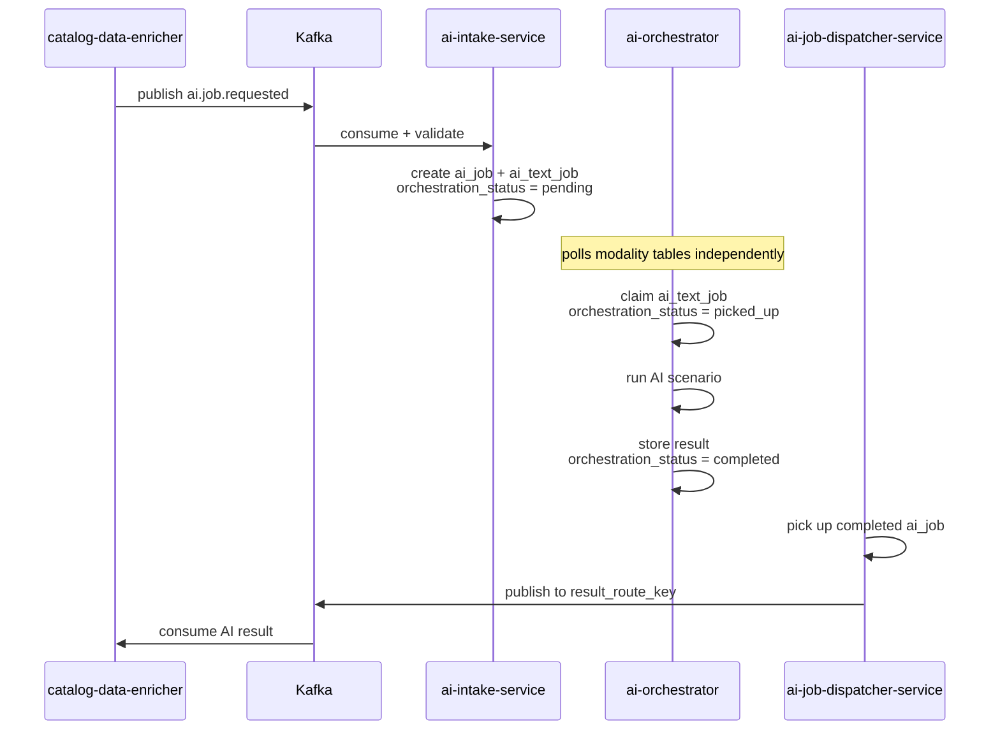
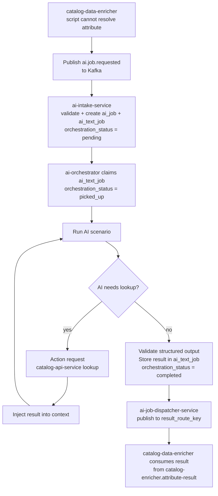
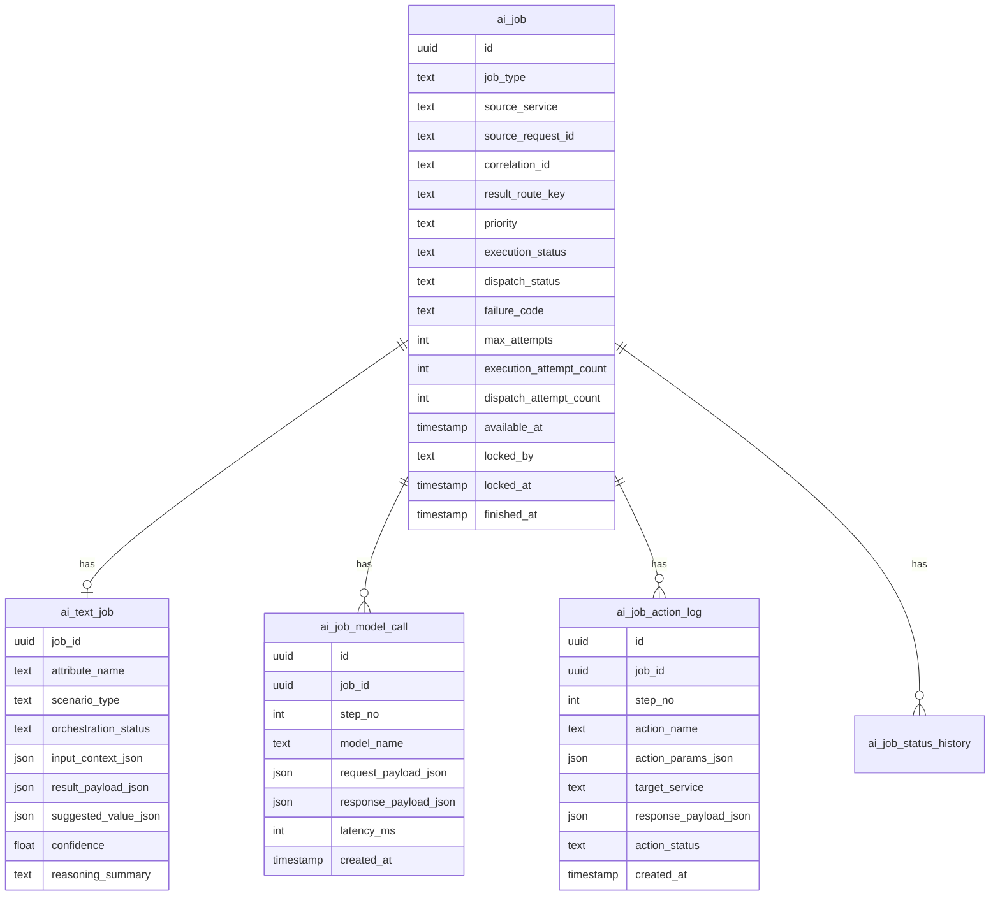
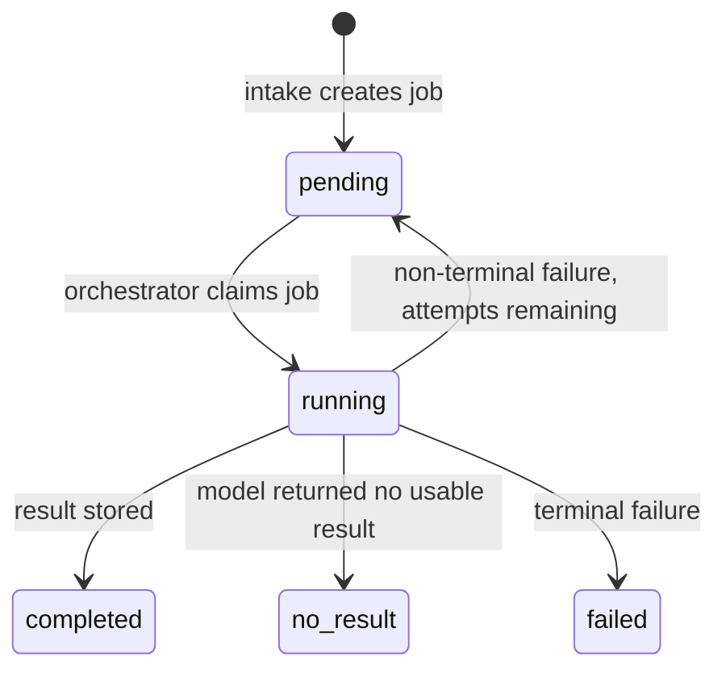
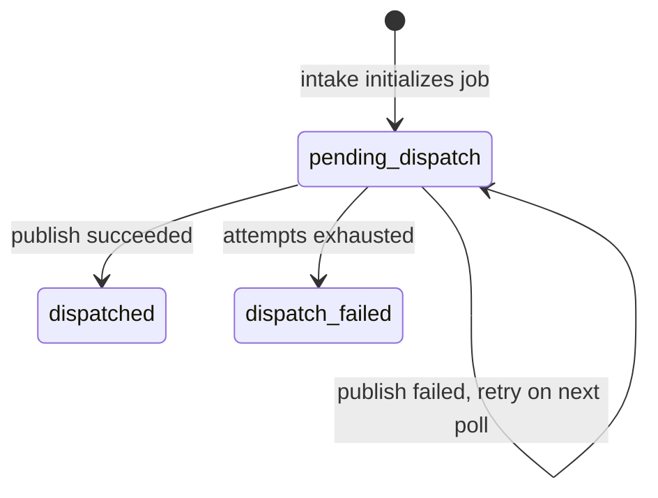
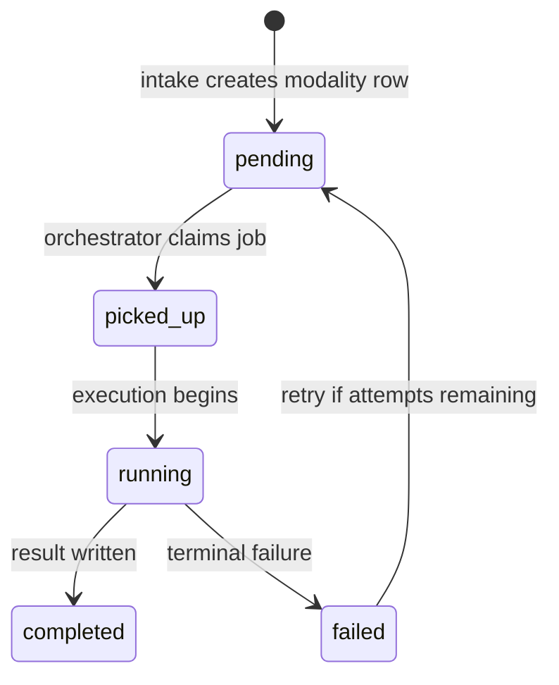

# AI Pipeline

The AI pipeline is triggered by `catalog-data-enricher` when built-in scripts
cannot resolve an attribute. It runs as three independent services — intake,
execution, and dispatch — fully decoupled from the catalog pipeline via Kafka.

`catalog-data-enricher` never calls AI services directly. It publishes a Kafka
message and later consumes the result.

---

## Position in the Catalog Ingest Pipeline



---

## How the AI Pipeline is Triggered

When `catalog-data-enricher` cannot resolve an attribute via scripts, it
publishes `ai.job.requested` to Kafka and continues processing other
attributes. The AI pipeline handles the rest independently.

```json
{
  "event_id": "uuid",
  "event_type": "ai.job.requested",
  "event_version": 1,
  "occurred_at": "2026-03-15T10:00:00Z",
  "source_service": "catalog-data-enricher",
  "correlation_id": "uuid",
  "request": {
    "source_request_id": "uuid",
    "job_type": "text",
    "target_service": "catalog-data-enricher",
    "result_route_key": "catalog-enricher.attribute-result",
    "priority": "normal",
    "text_job": {
      "attribute_name": "characters",
      "scenario_type": "character_resolution",
      "input_context": {
        "title": "Dawn of the Dance 3-Pack",
        "description": "This Walmart exclusive features Draculaura...",
        "year": 2011,
        "existing_characters": []
      }
    }
  }
}
```

The enricher matches the inbound result to the pending attribute by
`source_request_id` when consuming from `catalog-enricher.attribute-result`.

---

## Three Services

| Service | Role |
| --- | --- |
| `ai-intake-service` | Consumes `ai.job.requested` from Kafka, validates, deduplicates on `event_id`, creates `ai_job` and modality row in the `ai` schema |
| `ai-orchestrator` | Claims pending jobs via `orchestration_status` on modality tables, runs named AI scenarios, manages reasoning loops, stores normalized results |
| `ai-job-dispatcher-service` | Claims completed jobs, publishes result back to `result_route_key` via Kafka |

---

## Pipeline Overview



---

## Kafka Topics

| Topic | Direction | Notes |
| --- | --- | --- |
| `ai.job.requested` | `catalog-data-enricher` → `ai-intake-service` | Entry point into the AI pipeline |
| `ai.job.requested.dlq` | `ai-intake-service` → manual | Dead-letter after persistent intake failure |
| `catalog-enricher.attribute-result` | `ai-job-dispatcher-service` → `catalog-data-enricher` | Set as `result_route_key` at intake time |

---

## Database Schema

All AI-pipeline tables reside in the `ai` schema. The catalog pipeline has
no shared tables with the AI domain — all coordination is via Kafka.



---

## Job State Machine

A single `ai_job` row tracks two independent status axes.

### Execution axis — `ai_job.execution_status`



### Dispatch axis — `ai_job.dispatch_status`



### Orchestration axis — `ai_text_job.orchestration_status`



---

## Action Request Contract

When the model needs additional information during reasoning, it returns a
structured action request. The orchestrator validates it against the
per-scenario allowlist, executes the lookup, and continues the reasoning loop.

```json
{
  "status": "request_action",
  "is_final": false,
  "requested_action": {
    "action_name": "catalog_search_characters",
    "action_params": {
      "filters": { "search": "Draculaura" },
      "page": { "limit": 5, "offset": 0 },
      "context": { "locale": "en" }
    }
  }
}
```

### Allowlisted action targets

| Target service | Actions | Scenarios |
| --- | --- | --- |
| `catalog-api-service` | catalog search queries | text (all scenarios) |
| `media-api-service` | `save_temp_image` | image (all scenarios) |

A maximum of **4 action calls** are allowed per job. Exceeding this sets
`failure_code = max_steps_exceeded`.

---

## Retry and Failure

| `failure_code` | Retryable | Meaning |
| --- | --- | --- |
| `model_error` | Yes | model returned an error response |
| `action_timeout` | Yes | external lookup did not respond within timeout |
| `execution_timeout` | Yes | job exceeded maximum elapsed execution time |
| `max_steps_exceeded` | No | reasoning loop hit the 4-action limit |
| `invalid_model_output` | No | structured output failed schema validation |
| `action_not_allowed` | No | model requested an action outside the allowlist |

Retryable failures retry with 60 s fixed backoff up to `ai_job.max_attempts`.
Structural failures are terminal and do not retry regardless of remaining
attempts.

---

## Outbound Result Contract

`ai-job-dispatcher-service` publishes to `result_route_key` after the job
reaches a terminal execution state. `catalog-data-enricher` consumes from this
topic and identifies the matching attribute by `source_request_id`.

```json
{
  "event_id": "uuid",
  "event_type": "ai.text.result.completed",
  "event_version": 1,
  "source_service": "ai-job-dispatcher-service",
  "correlation_id": "uuid",
  "result": {
    "source_request_id": "uuid",
    "job_id": "uuid",
    "attribute_name": "characters",
    "scenario_type": "character_resolution",
    "payload": {
      "characters": [
        { "name": "Draculaura", "slug": "draculaura" },
        { "name": "Clawdeen Wolf", "slug": "clawdeen-wolf" },
        { "name": "Frankie Stein", "slug": "frankie-stein" }
      ]
    },
    "confidence": 0.96,
    "reasoning_summary": "Matched extracted names against catalog lookup results."
  }
}
```

All three terminal execution outcomes are dispatched back to the enricher:

| `execution_status` | `event_type` | Enricher behavior |
| --- | --- | --- |
| `completed` | `ai.text.result.completed` | Candidate enters evaluation pipeline |
| `no_result` | `ai.job.result.no_result` | Enricher keeps existing value |
| `failed` | `ai.job.result.failed` | Logged, step flagged for review |

---

## Responsibility Boundaries

| Component | Responsibility |
| --- | --- |
| `catalog-data-enricher` | decides when AI enrichment is needed |
| `catalog-data-enricher` | publishes `ai.job.requested` to Kafka |
| `catalog-data-enricher` | consumes result and applies evaluation pipeline |
| `catalog-data-enricher` | applies final merge decision |
| `ai-intake-service` | validates and materializes internal AI jobs |
| `ai-orchestrator` | executes AI scenarios, manages reasoning loops |
| `ai-orchestrator` | performs controlled external lookups |
| `ai-job-dispatcher-service` | publishes results back to requesting domains |
| `catalog-api-service` | provides domain lookup data during reasoning |

---

## Key Design Principles

1. **`catalog-data-enricher` never calls AI services directly** — all
   communication is via Kafka; no shared tables between the catalog pipeline
   and the AI domain
2. **One AI job per attribute per ingest item** — each unresolved attribute
   becomes one `ai_job`
3. **Three separate services, each owning one lifecycle phase** — intake,
   execution, and dispatch are independent
4. **All AI calls and actions are audit-logged** in `ai_job_model_call` and
   `ai_job_action_log`
5. **Structural failures are terminal** — retries are reserved for transient
   errors only
6. **Final merge decision happens in `catalog-data-enricher`** — the AI
   pipeline only produces suggestions
