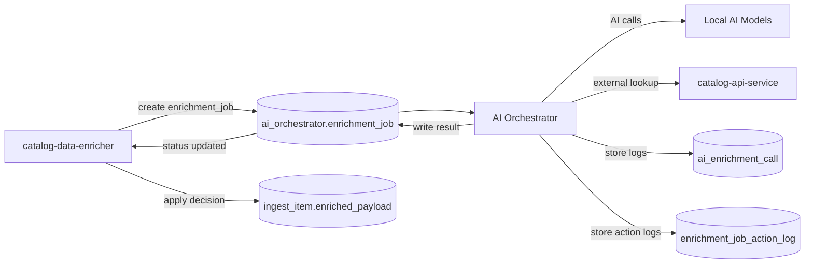
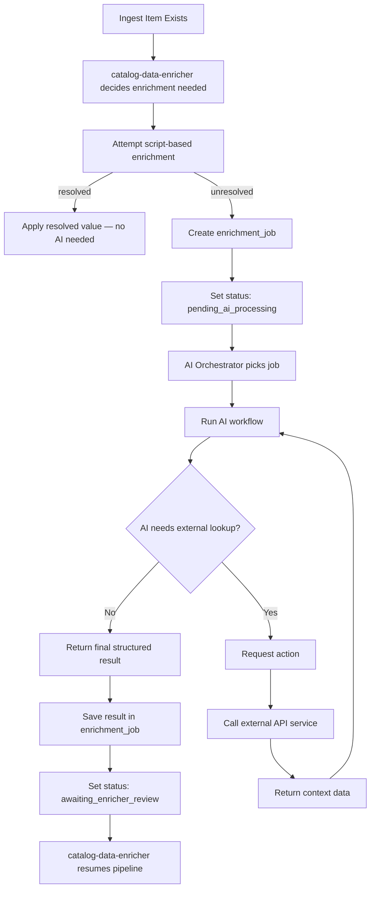
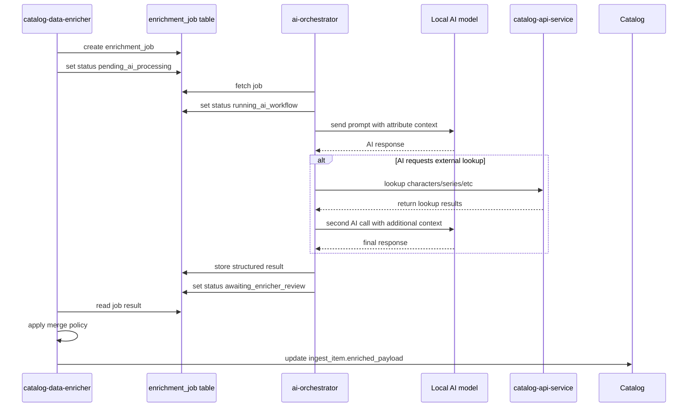
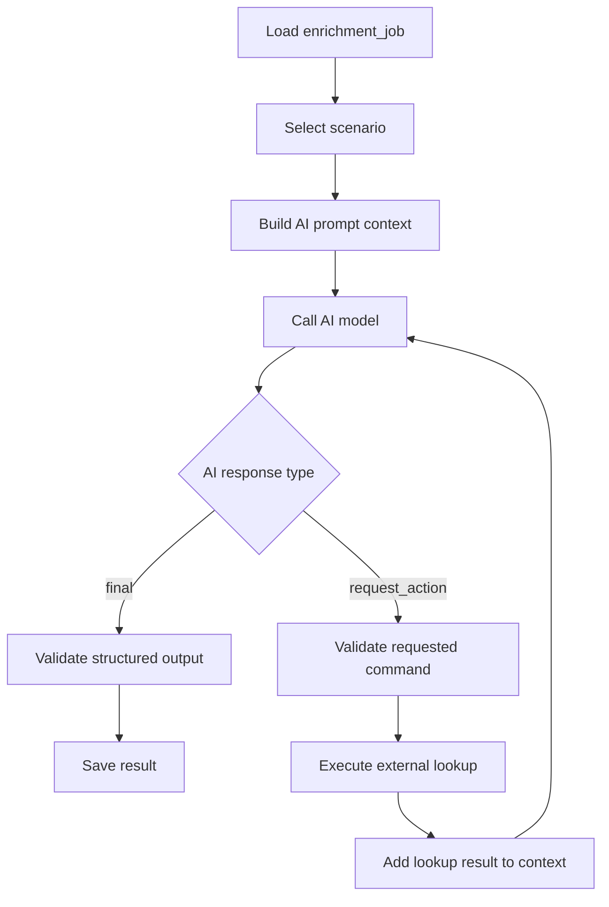
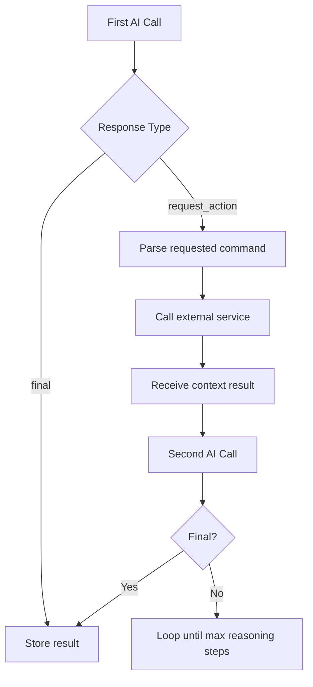
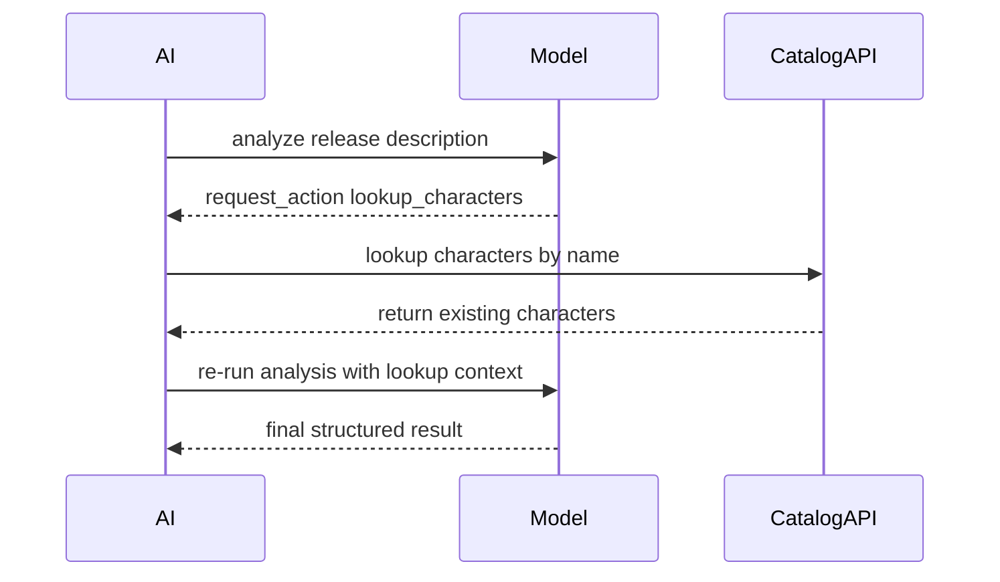
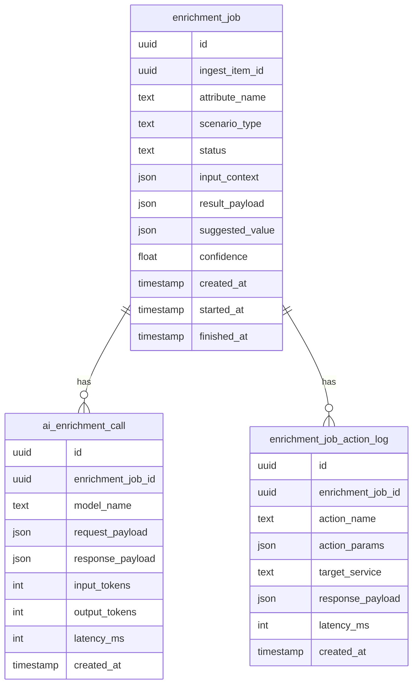
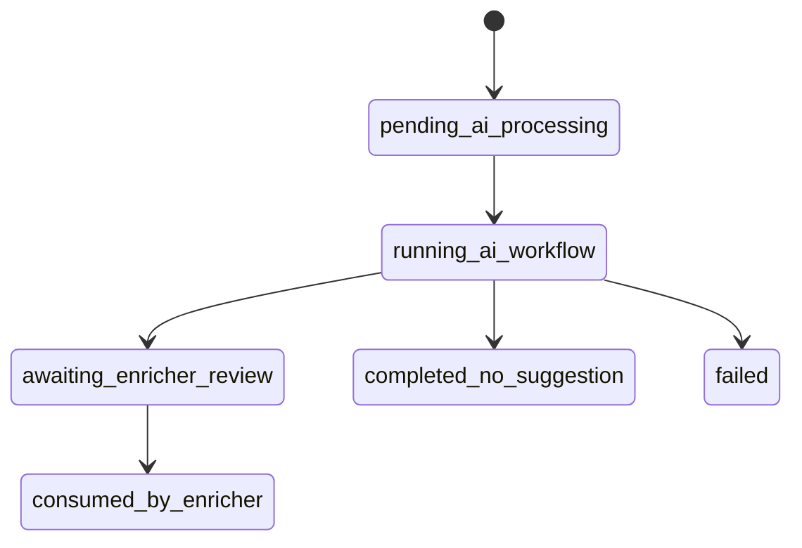

# AI Orchestrator

The `ai-orchestrator` service executes AI-based enrichment for individual
catalog attributes. It is invoked only when `catalog-data-enricher`
cannot resolve an attribute through its own built-in scripts.

Each job processes one attribute of one ingest item and returns a
structured suggestion that downstream services may accept or reject.

The service:

- executes AI workflows
- logs every AI request and response
- performs optional multi-step reasoning loops
- requests additional data from other services when required
- produces a final structured suggestion for an attribute

The service does not:

- modify catalog data directly
- access foreign database tables
- decide final merge policy for ingest data
- attempt script-based resolution of attributes

Those responsibilities belong to `catalog-data-enricher`.

---

## High-Level Service Overview



---

## Pipeline Overview



---

## Detailed Sequence



---

## Internal AI Workflow



---

## Multi-Step AI Reasoning Loop



---

## External Lookup Example

AI identifies potential characters but requires validation.



---

## Database Schema

The AI Orchestrator owns its own database schema.



---

## Job State Machine



---

## Action Request Contract

When the model requires additional information it returns:

```json
{
  "status": "request_action",
  "is_final": false,
  "requested_action": {
    "command_name": "lookup_characters_by_names",
    "command_params": {
      "character_names": [
        "Draculaura",
        "Clawdeen Wolf"
      ]
    }
  }
}
```

The orchestrator then:

1. validates the command against the allowlist
2. calls the corresponding API service
3. adds the result to the AI context
4. executes the next reasoning step

---

## Final AI Result Example

```json
{
  "status": "final",
  "is_final": true,
  "final_payload": {
    "characters": [
      {
        "name": "Draculaura",
        "slug": "draculaura"
      },
      {
        "name": "Clawdeen Wolf",
        "slug": "clawdeen-wolf"
      }
    ],
    "confidence": 0.96
  }
}
```

The result is saved in `ai_orchestrator.enrichment_job.result_payload`
and the job status becomes `awaiting_enricher_review`.

---

## Responsibility Boundaries

| Component | Responsibility |
|---|---|
| `catalog-data-enricher` | decides when enrichment is needed |
| `catalog-data-enricher` | applies final merge decision |
| `ai-orchestrator` | executes AI workflow |
| `ai-orchestrator` | logs AI calls |
| `ai-orchestrator` | performs controlled external lookups |
| `catalog-api-service` | provides domain lookup data |

---

## Key Design Principles

1. **One job = one attribute**
2. **AI Orchestrator owns only its domain**
3. **External data only through API services**
4. **Every AI call is logged**
5. **Multi-step reasoning supported but limited**
6. **Final merge decision happens outside the service**
