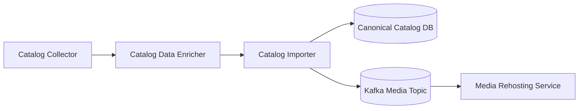
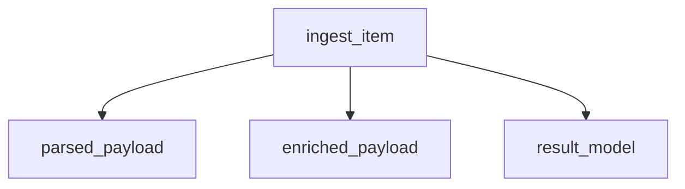
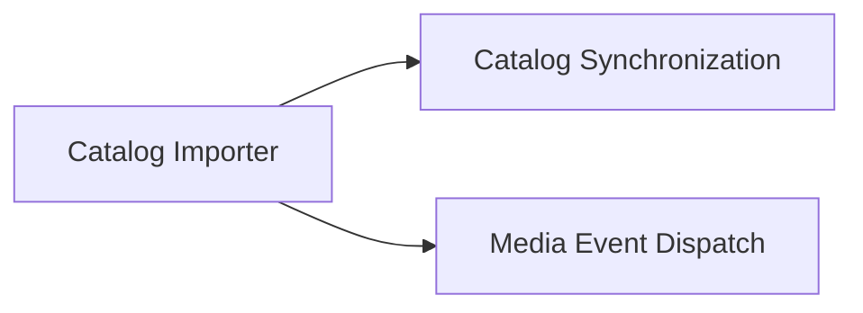
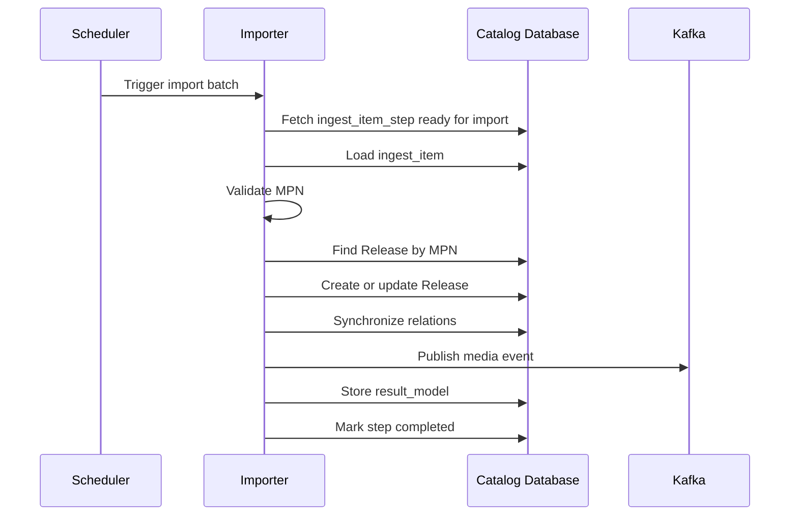
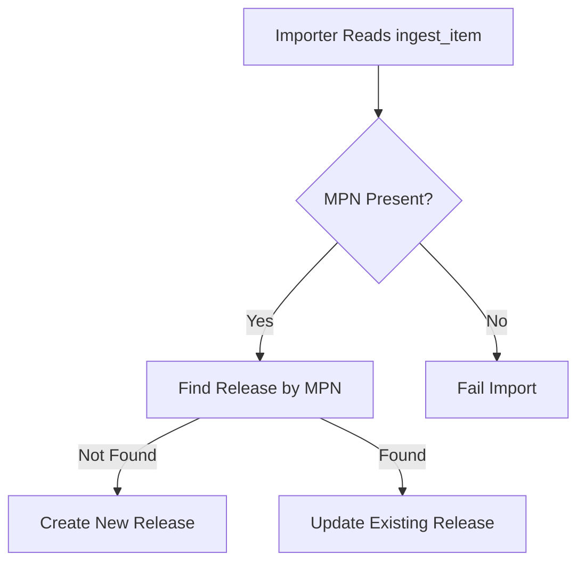
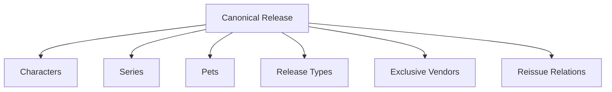
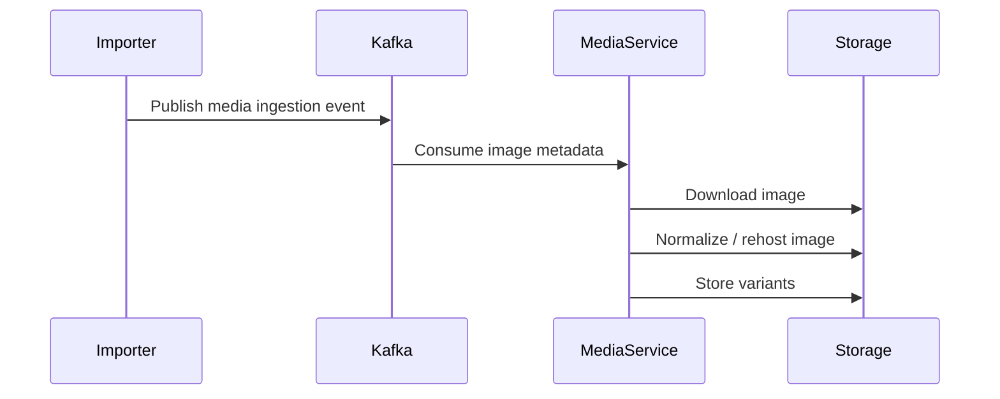
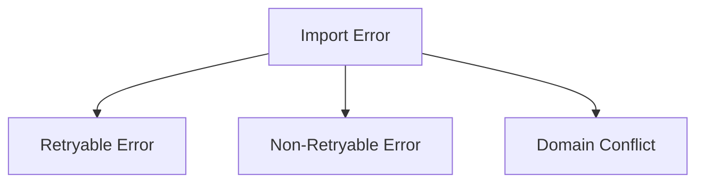

# Catalog Importer

The `catalog-importer` stage converts an enriched `ingest_item` into
canonical catalog entities and publishes media processing events.

The importer acts as the authoritative write boundary between the
ingestion pipeline and the canonical catalog domain.

The primary business identifier used during import is **MPN**, which
uniquely identifies each release.

---

## High-Level Architecture



The importer consumes enriched ingest items, synchronizes canonical
catalog data, and triggers the downstream media pipeline.

---

## Core Concepts

The importer works with three primary objects.



### `parsed_payload`

Original data parsed from external sources.

### `enriched_payload`

Normalized and improved version produced by the enrichment stage.

### `result_model`

Result of catalog import including:

- canonical release ID
- import mode (created / updated)
- synchronized relations
- media event payload summary

---

## Service Responsibility

The catalog importer performs two responsibilities.



### Catalog Synchronization

Creates or updates canonical releases and relations.

### Media Event Dispatch

Publishes image metadata events for downstream media processing.

---

## Import Processing Flow



This sequence ensures that the catalog state is synchronized and media
ingestion is triggered in a controlled manner.

---

## MPN Identity Resolution

The importer uses MPN as the primary business key.



This guarantees deterministic matching and avoids fuzzy duplicate
detection.

---

## Domain Synchronization

Once the canonical release target is determined, the importer
synchronizes domain relationships.



Each relation is resolved through dedicated synchronization services.

---

## Media Processing Flow

Image processing is handled by a separate media pipeline.



This architecture keeps catalog synchronization independent from media
processing workloads.

---

## Import Result Model

After the importer finishes processing, the result is stored inside
`ingest_item.result_model`.

Example structure:

```json
{
  "mode": "created",
  "canonical_release_id": "uuid",
  "mpn": "HXH12",
  "relations_synced": [
    "characters",
    "series",
    "pets"
  ],
  "media_events_emitted": 3,
  "warnings": []
}
```

This provides traceability and debugging visibility across the pipeline.

---

## Failure Handling

Failures are categorized into three groups.



Retryable errors may be retried automatically, while domain conflicts
require manual review.

---

## Final Output

After successful execution the importer produces:

- canonical `Release`
- release-character relations
- release-series relations
- release-pet relations
- release type classifications
- exclusive vendor links
- reissue relations
- media ingestion events
- import result model

---

## Summary

The `catalog-importer` stage transforms enriched ingestion data into
normalized catalog state.

Key characteristics:

- deterministic identity resolution using MPN
- idempotent canonical synchronization
- resolver-based domain relation synchronization
- Kafka-driven media processing pipeline
- full traceability through `result_model` snapshots
