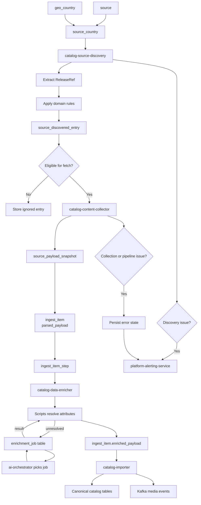
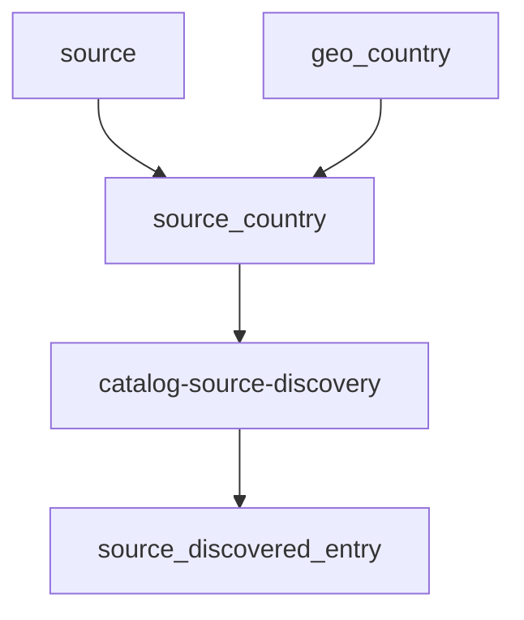
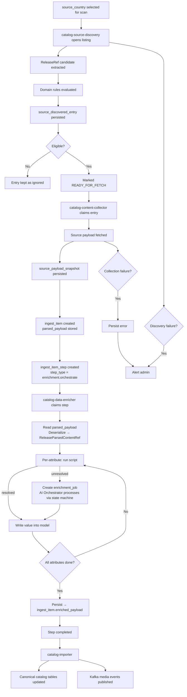
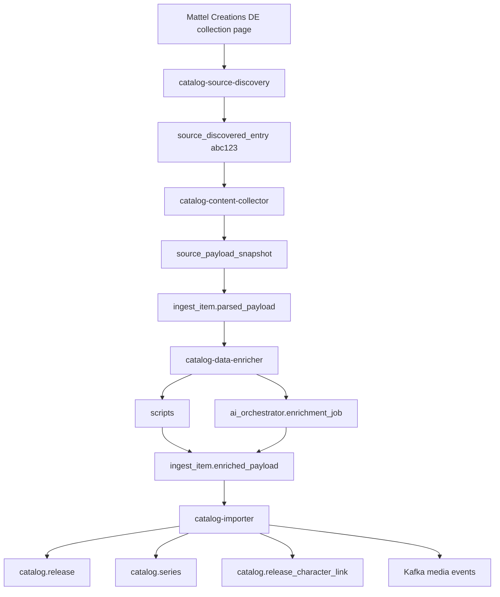
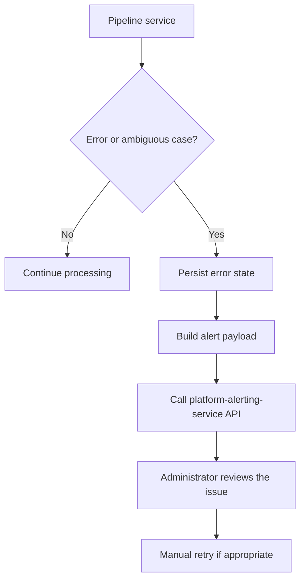

# Catalog Ingest Pipeline

## Overview

The redesigned catalog ingest pipeline no longer treats `parsed_release`
as the central object of the ingestion model.

Instead, the pipeline models the lifecycle of external source data
explicitly:

1. discover candidate source entries for a specific `source_country`
2. apply domain rules to decide whether the entry should be processed
   further
3. persist the discovered entry regardless of whether it is eligible
   or ignored
4. fetch the real source payload for eligible entries
5. store a reproducible payload snapshot
6. create an ingest work unit with the parsed payload
7. enrich the parsed payload — via built-in scripts first, AI
   Orchestrator as fallback for unresolved attributes — and persist the
   enriched result
8. import enriched data into canonical catalog tables
9. trigger downstream media processing

This makes the pipeline easier to reason about, easier to operate, and
more scalable than a model where one intermediate parsed table is expected
to represent the entire lifecycle.

## High-Level Pipeline



## Why the Pipeline Was Redesigned

The older `parsed_release` model mixed together several responsibilities
that are better modeled separately:

- a link or entry discovered on an upstream source
- a lightweight external reference for that entry
- raw fetched content from the source
- a work unit that should move through the pipeline
- the status of downstream processing

That design made the pipeline harder to scale and harder to explain
operationally.

The redesigned model separates the lifecycle into explicit objects:

- `source_discovered_entry` — something was found on a country-specific
  source surface
- `source_payload_snapshot` — real source content was fetched and stored
- `ingest_item` — a concrete unit of downstream work carrying
  `parsed_payload` (from the collector) and `enriched_payload` (written
  by the enricher after all attributes are processed)
- `ingest_item_step` — the work unit progressed through explicit
  processing stages with tracked status transitions
- `ai_orchestrator.enrichment_job` — a delegated AI enrichment task for
  one attribute, coordinated entirely through its own state machine
- canonical catalog tables — the final normalized catalog state

## Core Architectural Principle

A discovered URL is not yet an ingest item.

A fetched payload is not yet canonical catalog data.

The catalog pipeline moves through explicit lifecycle objects. Each object
exists for a distinct operational reason and should not be collapsed into
a single parsed-layer table.

---

## Source Geography Model

The pipeline does not discover catalog entries directly from `source`.
It works through `source_country`.

### Why `source_country` is Required

A single upstream source can expose different country-specific surfaces,
URLs, and content behavior. For catalog ingestion, country context matters
because the pipeline needs:

- country-specific source roots
- country-specific availability of products
- country-specific source URLs
- country-specific locale assumptions
- country-specific content that should still be interpreted in a
  normalized English-oriented internal process

Because of this, discovery must reference `source_country`, not only
`source`.

### Related Tables

#### `source`

Represents the upstream system itself.

Example:

- `mattel-creations`
- `mattel-shop`
- `amazon`

#### `geo_country`

Represents supported countries.

Example:

- `DE`
- `GB`
- `US`

#### `source_country`

Represents a source bound to a country-specific discovery surface.

Example:

- `(mattel-creations, DE)`
- `(mattel-creations, GB)`
- `(mattel-shop, US)`

### Geography Model Diagram



---

## Core Pipeline Objects

### `source_discovered_entry`

Represents a candidate object discovered on a country-specific source
surface. It is not yet a fetched payload and not yet an ingest work unit.

Responsibilities:

- store the discovered reference
- identify the upstream entry by `external_id`
- keep the country-specific source context
- store the result of domain-rule evaluation
- indicate whether the entry is eligible for fetch
- keep enough state so the same ignored entry is not re-evaluated every
  run

### `source_payload_snapshot`

Represents the real payload fetched from a discovered entry.

Responsibilities:

- capture source content at fetch time
- provide reproducible pipeline input
- decouple downstream processing from unstable upstream sources
- support replay and debugging without requiring a fresh source request

### `ingest_item`

Represents an official downstream work unit inside the catalog pipeline.

Responsibilities:

- bind a discovered entry to a fetched snapshot
- carry `parsed_payload` — the structured data produced by the collector,
  deserialized as `ReleaseParsedContentRef`
- carry `enriched_payload` — the final enriched state of the same model,
  written by `catalog-data-enricher` after all attributes are processed
- become the execution object used by downstream services

### `ingest_item_step`

Represents one explicit stage in the downstream lifecycle of an ingest
item.

Responsibilities:

- record progression through the pipeline
- store execution state for each step with explicit status transitions
- preserve operational observability
- support manual retry and replay decisions

Enrichment step status progression:

- `pending` — step created, waiting for a worker
- `claimed_for_enrichment` — worker claimed the step
- `running_enrichment` — attribute processing loop is active
- `completed` — all attributes processed, `enriched_payload` persisted,
  next step created

---

## End-to-End Lifecycle

The diagram below shows the complete vertical lifecycle from
country-specific discovery to canonical catalog update.



---

## Real Example — Mattel Creations Germany

### Discovery Phase

Assume the pipeline is scanning a Germany-specific source surface for
`mattel-creations`.

Relevant upstream identity:

- `source = mattel-creations`
- `geo_country = DE`
- `source_country = (mattel-creations, DE)`

The discovery service opens a country-specific discovery root such as:

```text
https://creations.mattel.com/de-de/collections/monster-high
```

It finds a product link such as:

```text
https://creations.mattel.com/de-de/products/monster-high-draculaura-doll-abc123
```

It extracts a lightweight reference:

```python
ReleaseRef(
    source_country_id="<uuid>",
    external_id="abc123",
    url="https://creations.mattel.com/de-de/products/monster-high-draculaura-doll-abc123",
    title="Monster High Draculaura Doll",
    region="DE",
    language="en"
)
```

Then domain rules are applied.

If the item is a supported doll release:

- persist as `ELIGIBLE`
- mark `collection_status = READY_FOR_FETCH`

If the item is a notebook or sticker set:

- persist as `IGNORED_BY_DOMAIN_RULES`
- do not send to collector

### Collection Phase

The collector reads the eligible discovered entry and fetches the source
page.

It stores the payload snapshot:

```text
catalog.source_payload_snapshot
- source_discovered_entry_id = ...
- fetched_at = 2026-03-11T20:15:00Z
- content_type = text/html
- payload_storage_ref = s3://bucket/catalog/mattel-creations/de/abc123/2026-03-11.html
- content_fingerprint = sha256:...
```

Then it creates:

```text
catalog.ingest_item
- source_discovered_entry_id = ...
- source_payload_snapshot_id = ...
- pipeline_status = PENDING
- parsed_payload = { ...ReleaseParsedContentRef... }
```

And the initial step for the enrichment stage:

```text
catalog.ingest_item_step
- ingest_item_id = ...
- step_type = enrichment.orchestrate
- status = pending
```

### Enrichment Phase

`catalog-data-enricher` claims the step and reads `ingest_item.parsed_payload`,
deserializing it into a `ReleaseParsedContentRef` model.

For each attribute the enricher first attempts resolution via built-in
scripts. If the script cannot resolve the attribute, it creates an
`enrichment_job` record in `ai_orchestrator.enrichment_job` with
`status = pending_ai_processing`. The AI Orchestrator independently picks
up the job, runs the AI workflow, and writes the result back to the table.
The enricher reads the result and evaluates it through the same validation
and policy pipeline as script-resolved values.

After all attributes are settled, the enricher persists the final model
to `ingest_item.enriched_payload` and marks the step as `completed`.

### Import Phase

`catalog-importer` reads `ingest_item.enriched_payload` and synchronizes
canonical catalog tables using MPN as the primary business key:

- `catalog.release`
- `catalog.series`
- `catalog.release_character_link`
- `catalog.release_images`

It also publishes media ingestion events to Kafka for downstream media
processing.

### Example Diagram



---

## Alerting Model

The pipeline integrates with `platform-alerting-service` through an API
call.

Alerts are sent when:

- discovery fails for a `source_country`
- discovery hits an ambiguous case that requires review
- content collection fails
- downstream processing fails
- the system enters a state that should be inspected before retry

### Alert Payload Expectations

An alert should contain enough context for operator triage.

Suggested fields:

- domain
- service name
- source identifier
- source country identifier
- external id
- discovered entry id
- ingest item id if one already exists
- severity
- error code
- error message
- suggested operator action

### Alerting Flow



---

## Retry Model

### Manual Retry by Default

The current pipeline does not run automatic retries by default.

This is intentional. At the current stage of the system, most failures
are treated as operationally significant rather than harmless transient
errors.

The baseline failure model is therefore:

1. persist the failure state
2. send an alert to `platform-alerting-service`
3. wait for operator inspection
4. retry manually only after review

This applies to discovery failures, collection failures, and downstream
ingest-step failures unless explicitly handled otherwise in the future.

### Why Automatic Retry Is Not the Baseline

In the current operating model, a failure is likely to indicate one of
the following:

- source structure changed
- source URL became invalid
- parser assumptions are wrong
- content no longer matches expected release shape
- a service introduced a real processing bug

Blind retry would often hide the problem rather than solve it.

Automatic retry may be introduced later for carefully classified transient
failure categories, but it is not part of the baseline architecture
described here.

---

## Postgres Schema Placement

The catalog pipeline tables belong in the `catalog` schema.

This is acceptable because they are part of the same bounded context as
the canonical catalog model.

### Recommended Catalog Schema Structure

#### Operational ingestion tables

- `catalog.source_discovered_entry`
- `catalog.source_payload_snapshot`
- `catalog.ingest_item`
- `catalog.ingest_item_step`

#### Canonical catalog tables

- `catalog.release`
- `catalog.series`
- `catalog.character`
- `catalog.release_series_link`
- `catalog.release_character_link`
- `catalog.release_images`
- other canonical catalog tables

Keeping both layers in the same schema does not mean that raw and
canonical data are mixed. It means that the full lifecycle belongs to the
same domain schema while remaining separated by table responsibility.

The `ingest` schema should be reserved only for truly shared technical
infrastructure if such infrastructure exists later, for example:

- outbox events
- worker leases
- global scheduler bookkeeping
- dead-letter infrastructure

---

## Invariants

The following rules should hold in the redesigned pipeline:

- a discovered entry is identified by a country-specific upstream identity
- a discovered entry may be eligible, ignored, rejected, or require review
- ignored entries are still persisted
- a payload snapshot always belongs to exactly one discovered entry
- an ingest item must reference a concrete payload snapshot
- `ingest_item.enriched_payload` is written exactly once — after all
  attributes of the enrichment session are settled
- `catalog-data-enricher` does not call AI Orchestrator directly — all
  coordination happens through the `enrichment_job` table state machine
- the `ingest_item_step` for enrichment does not advance to the next stage
  until every attribute has been processed
- `catalog-importer` reads only `enriched_payload` — it does not interact
  with `parsed_payload` directly
- canonical catalog entities must not depend directly on unstable source
  URLs
- operator-visible failures should result in an alert rather than silent
  infinite retry

---

## Non-Goals

The pipeline explicitly does not treat the following as goals:

- making discovery responsible for canonical import
- using snapshots as business entities
- treating ignored source links as disposable data
- using `parsed_release` as a central parsed-layer abstraction
- hiding operational failures behind automatic retry behavior

---

## Final Architectural Summary

The redesigned catalog ingest pipeline should be understood as a lifecycle
model, not as a parsed-layer table replacement.

The flow is:

1. `source_country` is selected for discovery
2. `catalog-source-discovery` extracts candidate `ReleaseRef` references
3. domain rules decide whether the entry belongs to supported catalog
   scope
4. the result is persisted in `catalog.source_discovered_entry`
5. eligible entries are marked `READY_FOR_FETCH`
6. `catalog-content-collector` fetches the real payload via the
   `PortsRegistry` port for the source
7. the raw payload is stored in `catalog.source_payload_snapshot`
8. a work unit is created in `catalog.ingest_item` with `parsed_payload`
   containing the structured `ReleaseParsedContentRef`
9. an `ingest_item_step` is created for the enrichment stage
10. `catalog-data-enricher` claims the step and deserializes
    `parsed_payload` into a `ReleaseParsedContentRef` working model
11. for each attribute the enricher runs built-in scripts first; if
    unresolved it creates an `enrichment_job` record — the AI Orchestrator
    picks it up via the state machine independently and writes the result
    back
12. after all attributes are settled the enricher persists the final model
    to `ingest_item.enriched_payload` and marks the step as `completed`
13. `catalog-importer` reads `enriched_payload`, resolves the canonical
    release by MPN, synchronizes domain relations, and publishes media
    events to Kafka
14. failures at any stage generate alerts and are reviewed manually before
    retry

This is the target architecture that replaces the old
`parsed_release`-centered model and makes the catalog pipeline more
explicit, more professional, and better prepared for future domain growth.
