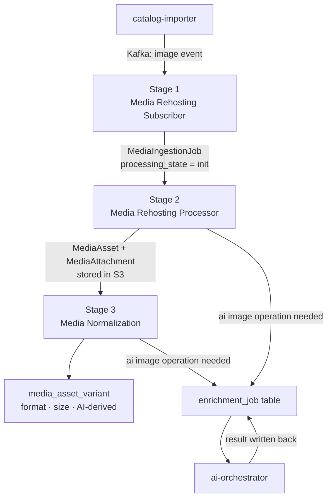
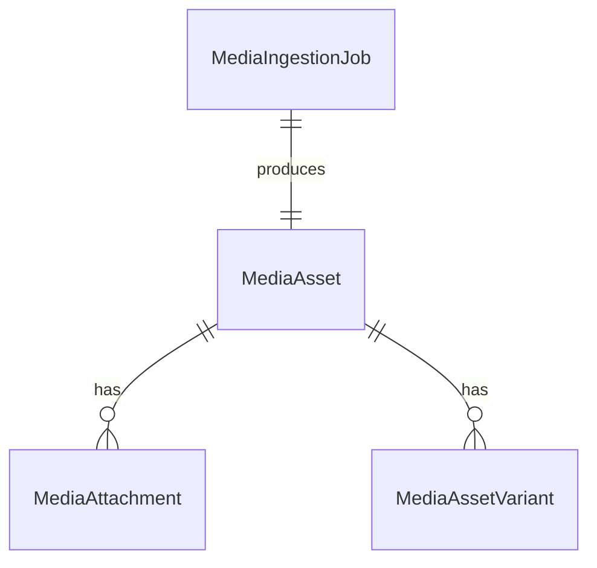

# Media Ingest Pipeline

## Overview

The media ingest pipeline turns externally discovered image URLs into deduplicated, normalized media assets that can be safely stored, referenced, and served by the platform.

It is triggered downstream of catalog ingestion — image references originate from catalog processing and are published as Kafka events. The media pipeline picks them up and handles everything from downloading the raw image through to producing delivery-ready variants.

The pipeline is intentionally separated from catalog ingestion so that:

- heavy image processing does not block catalog work
- media-specific retry logic can evolve independently
- image storage and transformation rules stay reusable across future domains

## What Enters and What Exits

| Enters | Exits |
|---|---|
| Image URL events from Kafka (produced by catalog-importer) | `MediaIngestionJob` records |
| `MediaIngestionJob` records | `MediaAsset` + `MediaAttachment` stored in S3 |
| `MediaAsset` records | `MediaAssetVariant` — sized, formatted, AI-derived |

## High-Level Pipeline

## Stages

| Stage | Service | Trigger | Output |
|---|---|---|---|
| 1 — Media Rehosting Subscriber | `media-rehosting-subscriber` | Kafka topic | `MediaIngestionJob` |
| 2 — Media Rehosting Processor | `media-rehosting-processor` | Scheduler | `MediaAsset` · `MediaAttachment` · S3 upload |
| 3 — Media Normalization | `media-normalization` | Scheduler | `media_asset_variant` |

## Dependency on Catalog Ingest

The media pipeline does not discover image URLs on its own. Image references are emitted by `catalog-importer` at the end of the catalog ingest pipeline as Kafka events. The media pipeline subscribes to those events as its entry point.

## Core Domain Model

- `MediaAsset` — canonical stored image, deduplicated by `sha256`
- `MediaAttachment` — ownership mapping to a platform entity (`release`, `character`, `pet`)
- `MediaAssetVariant` — derived representation: format (WEBP, JPG), size, or AI-processed variant

## Related Pages

- [Media Ingestion Pipeline](./02-media-ingestion-pipeline.md) — detailed stage-by-stage breakdown
