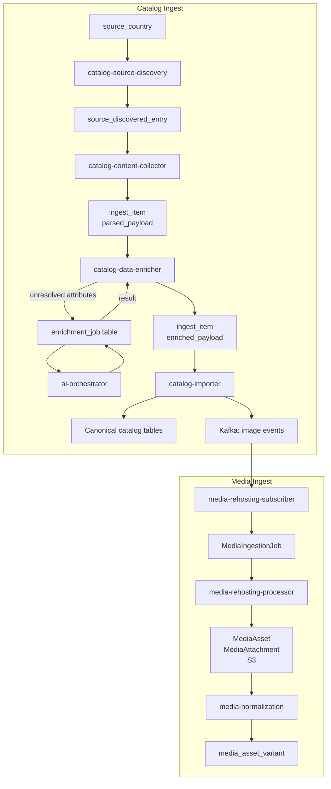

# Data Ingestion Overview

## What Data Ingestion Means for This Platform

Data ingestion is the process of bringing external product and media information into the platform's canonical domain model.

The platform does not receive data in a push-based or API-first way. Instead, it actively discovers, fetches, enriches, and normalizes content from upstream sources — then stores the result in canonical tables used by all downstream services.

Ingestion is split into two independent pipelines that run in sequence:

1. **Catalog ingestion** — discovers, collects, enriches, and imports product release data
2. **Media ingestion** — takes image references produced by catalog ingestion and turns them into stored, normalized, delivery-ready assets

## How the Two Pipelines Relate

Catalog ingestion runs first. At the end of the catalog pipeline, `catalog-importer` publishes Kafka events containing image URLs. Media ingestion subscribes to those events as its entry point.

Neither pipeline blocks the other — they are intentionally decoupled so that heavy image processing never delays catalog work.

## Catalog Ingest

Transforms external source pages into canonical catalog records.

**Stages:**

| Stage | Service | Output |
|---|---|---|
| 1 — Discovery | `catalog-source-discovery` | `source_discovered_entry` |
| 2 — Collection | `catalog-content-collector` | `source_payload_snapshot` · `ingest_item` |
| 3 — Enrichment | `catalog-data-enricher` | `ingest_item.enriched_payload` |
| 4 — AI Enrichment | `ai-orchestrator` | enriched attribute values via `enrichment_job` |
| 5 — Import | `catalog-importer` | canonical catalog tables · Kafka media events |

→ [Catalog Ingest Overview](./catalog-ingest/overview.md)

## Media Ingest

Turns image URLs from catalog into deduplicated, normalized, delivery-ready assets.

**Stages:**

| Stage | Service | Output |
|---|---|---|
| 1 — Subscriber | `media-rehosting-subscriber` | `MediaIngestionJob` |
| 2 — Processor | `media-rehosting-processor` | `MediaAsset` · `MediaAttachment` · S3 upload |
| 3 — Normalization | `media-normalization` | `media_asset_variant` |

→ [Media Ingest Overview](./media-ingest/overview.md)
