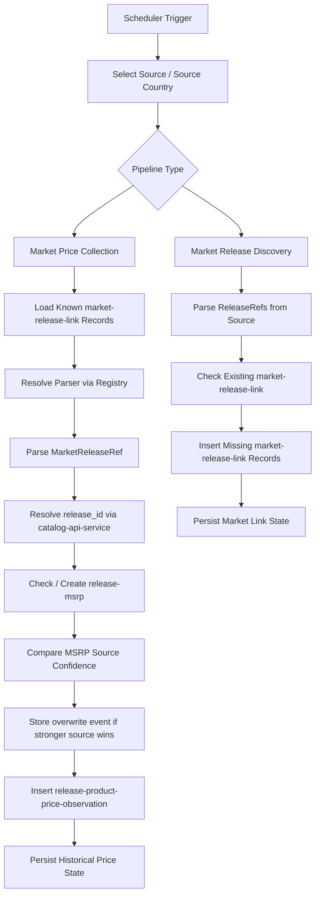

# Market Ingestion Pipeline

The market ingestion pipeline is responsible for collecting commercial pricing information for releases across official stores and retail sources.

Its purpose is not limited to a single scraping action. Instead, it defines the full market data flow for Monstrino:

- discovering new release entries in commercial sources
- creating and maintaining `market-release-link` records
- collecting price observations for known release links on a scheduled basis
- preserving historical price records across different observation dates
- initializing and maintaining MSRP data for releases
- selecting the most trustworthy MSRP source based on source confidence rules

In the future, this pipeline will also evolve to capture broader commercial availability metadata such as shipping support, shipping cost, taxes, and other purchase-related signals.

---

## Pipeline Scope

The market ingestion area is implemented as an umbrella flow with two dedicated sub-pipelines:

| Sub-pipeline | Responsibility |
|---|---|
| **Market Release Discovery** | scan sources for new release entries; create persistent market links |
| **Market Price Collection** | revisit known market links; store recurring historical price observations |

This separation is intentional.

Discovery is responsible for finding new market-facing release entries and creating persistent links to them.
Price collection is responsible for repeatedly revisiting known market links and storing time-based observations.

This means the market ingestion domain is documented at three levels:

- this page: overall market ingestion architecture
- [Market Release Discovery Pipeline](./market-release-discovery-pipeline)
- [Market Price Collection Pipeline](./market-price-collection-pipeline)

---

## Goals

| Goal | Description |
|---|---|
| Primary price collection | collect market price data for releases |
| Continuous discovery | find new retail release references |
| Persistent source links | maintain durable source-specific release links |
| Historical observations | store full time-series price history |
| MSRP initialization | create MSRP records when a trusted commercial price first appears |
| MSRP trust comparison | overwrite MSRP ownership only when a stronger source wins |
| Future extensibility | prepare for market analytics and availability tracking |

---

## Source Landscape

The first target sources are official and high-trust retail channels:

- Mattel Creations
- Mattel Shop
- other official marketplace websites
- toy store websites

:::note Source model is country-aware
Monstrino uses separate source reference records for:

- the **logical source** itself
- the **country-specific commercial presence** of that source

This is represented through `source` and `source_country`.

For example:
- `mattel_shop` exists once as a logical source
- the same source may have many `source_country` entries
- each entry may expose different prices, product availability, tax rules, and delivery behavior

This allows the market ingestion pipeline to treat the same commercial platform as multiple operational market endpoints.
:::

---

## High-Level Flow

---

## Architecture Overview

The market ingestion pipeline is scheduler-driven and implemented through separate services with per-source runtime isolation:

| Aspect | Design |
|---|---|
| Triggering | scheduler-driven |
| Source isolation | each source runs in its own Kubernetes pod |
| Country support | a single pod may handle multiple country triggers for the same source |
| Parser resolution | registry-based — `PortsRegistry` maps source name + port type → adapter |

The source integration layer is **registry-based**.

A central `PortsRegistry` maps:
- source name
- port type
- parser implementation

This allows the pipeline to resolve the correct adapter implementation without hardcoding source-specific logic into orchestration code.

:::tip Registry pattern benefit
The orchestration layer stays stable as new sources are added. Source-specific logic is fully isolated inside adapters.
:::

---

## Triggering Model

### Market Release Discovery

- runs on scheduler
- processes available release references for a source
- a single service can contain multiple scheduler triggers for different countries
- different sources are deployed as separate Kubernetes pods

### Market Price Collection

- runs on scheduler
- processes all known market links for a source/country combination
- one trigger can process an unlimited number of records
- one source runs in one Kubernetes pod, but that pod may work with multiple countries for the same source

---

## Sub-Pipeline 1: Market Release Discovery

### Purpose

Discovers new commercial release references in retail sources and creates persistent source-specific market links for future processing.

### Discovery Stages

1. Scheduler trigger starts the discovery flow
2. Source-specific collector is selected
3. Parser collects `ReleaseRef` entries from the source
4. Parsing strategy depends on `source_tech_type` — supported patterns: XML, API, HTML
5. Use case checks whether each discovered release already exists in `release-market-link`
6. If the release link does not exist, a new record is created

### Output

The main output of discovery is the creation of new persistent `market-release-link` records.

These records become the input set for the price collection pipeline.

---

## Sub-Pipeline 2: Market Price Collection

### Purpose

Revisits known market links and captures time-based commercial observations for releases.

Its result is not just the current price, but a growing historical record of commercial state over time.

### Collection Stages

1. `market-price-collector` starts for a specific source context
2. A `ProcessJob` loads all known records for the source and its country
3. For each record, an asynchronous use case is launched
4. The job resolves the correct parser from the registry using `SourceName`
5. The parser extracts market data into a `MarketReleaseRef` model
6. `MarketReleaseRef.mpn` is sent to `catalog-api-service` to resolve canonical `release_id`
7. The pipeline checks whether the release already has an MSRP record
8. If no MSRP exists, a new `release-msrp` record is created
9. If MSRP already exists, source trust is compared via `release-msrp-source.confidence`
10. If the incoming source is more trustworthy, an overwrite event is stored in a dedicated event table
11. The parsed market observation is inserted into `release-product-price-observation`

---

## Extracted Market Data

The pipeline is designed to extract at least the following market fields:

| Field | Notes |
|---|---|
| `price` | current commercial price |
| `availability` | availability state on site |
| `shipping` | shipping information |
| `tax` | tax information |
| `mpn` | manufacturer part number for release resolution |

These fields may not always be available from every source, but they define the intended market ingestion contract.

---

## MSRP Handling and Source Trust

One of the most important responsibilities of the market ingestion pipeline is MSRP initialization and maintenance.

### MSRP Creation

If the pipeline encounters the first trustworthy commercial price for a release, it creates a `release-msrp` record.

### MSRP Overwrite Rules

:::note Trust model — lower confidence value = stronger trust
| Source | Confidence value |
|---|---|
| Official Mattel source | `1` |
| Fan-maintained or secondary source | `100` |

If the incoming source is **more trusted** (lower confidence value) than the existing MSRP source:
- MSRP source ownership may be replaced
- an explicit overwrite event is stored for traceability

This makes MSRP state **auditable** and avoids silent source replacement.
:::

---

## Data Persistence Strategy

The pipeline persists data into market-specific tables that support both current state and historical analysis.

| Outcome | Description |
|---|---|
| `market-release-link` created | new commercial source entry discovered |
| `release-product-price-observation` inserted | point-in-time price record |
| `release-msrp` created | first trusted price for a release |
| MSRP overwrite event recorded | source trust ownership changed |

:::warning Append-only model
Each observation cycle creates a **new record** — it does not update an existing row.

- price history is retained
- unchanged prices are still stored as new observations
- the system can later reconstruct price timelines without inferring gaps

This is a deliberate design choice.
:::

---

## Identity and Deduplication

The pipeline identifies an already-known source listing using:

- `source_country_id`
- `external_id`

Together, these fields define the uniqueness boundary for source-specific commercial entries.

:::note Why this level of uniqueness?
- the same product may appear in different countries
- the same source can expose different commercial records across countries
- country-specific links must not collapse into a single global record

Multiple different market listings may still refer to the same canonical release — that relationship is handled by release resolution, not source listing deduplication.
:::

---

## Release Linking

Release linking happens after market parsing and before final persistence.

The linking flow:

1. parse market-facing product information
2. extract MPN
3. request canonical `release_id` from `catalog-api-service`
4. connect the market observation to the canonical catalog release

:::warning
The market ingestion layer does **not** define release identity by itself.

Market sources are noisy and unstable. Canonical release identity belongs to the catalog domain.
:::

---

## Registry-Based Source Resolution

Source parser selection is implemented through a central registry that maps:

- source
- port type
- adapter implementation

This allows different pipeline stages to request a parser implementation **by contract** rather than by hardcoded dependency.

---

## Boundaries

| In scope | Out of scope |
|---|---|
| discovering market-facing release entries | canonical release creation |
| maintaining market-release links | catalog domain modeling |
| collecting commercial observations | AI enrichment |
| initializing MSRP | media ingestion or normalization |
| comparing MSRP source trust | public API delivery |
| storing historical market records | analytics and reporting logic |

---

## Observability

For enterprise-grade operations, the pipeline should expose metrics and logs for:

- scheduler trigger executions
- source and country runs
- parsed release references
- newly created market-release-link records
- processed market links
- successful release resolutions
- inserted price observations
- MSRP creations and overwrite events
- source-level parsing failures
- processing throughput per source
- duration per collection cycle

---

## Future Evolution

The current pipeline focuses on primary market sources. A planned future direction is expansion toward second-hand market sources.

That evolution may introduce:

- second-hand marketplace adapters
- seller-specific commercial records
- different trust policies for non-official sources
- more complex price normalization rules
- separation between MSRP-oriented and resale-oriented pricing streams

---

## Design Summary

The market ingestion pipeline is designed around several core principles:

- scheduler-driven execution
- source and country awareness
- adapter-based parser resolution
- explicit separation of discovery and collection
- canonical release resolution through catalog services
- append-only historical market observations
- trust-based MSRP ownership
- future extensibility toward richer market analytics

---

## Related Pages

- [Pipelines Overview](../overview)
- [Market Release Discovery Pipeline](./market-release-discovery-pipeline)
- [Market Price Collection Pipeline](./market-price-collection-pipeline)
- [API Overview](../../api/00-overview)
- [Market Model](../../models/06-market-model)
