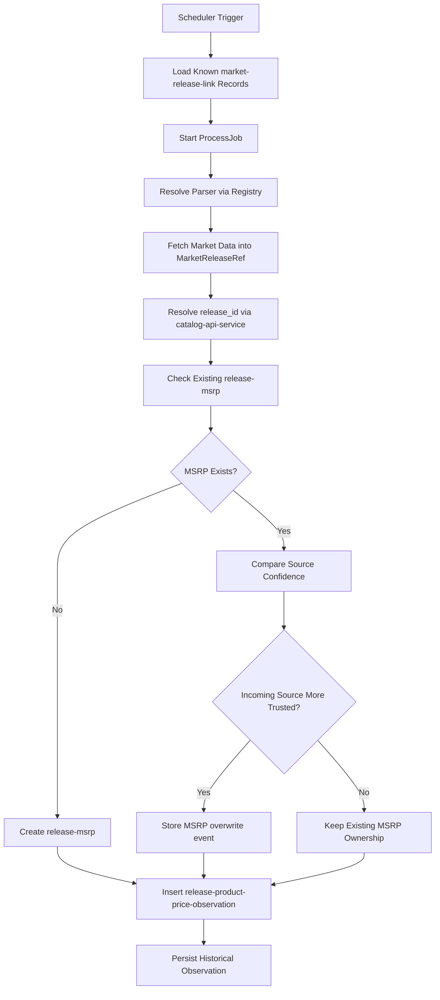

# Market Price Collection Pipeline

The market price collection pipeline is responsible for revisiting known market-facing release links and storing recurring commercial observations over time.

It is the **historical pricing engine** of the Monstrino market layer.

:::note Scope
This pipeline is not about discovering new market entries.

Its job is to repeatedly collect market state for already-known links and preserve that state as explicit historical records.
:::

---

## Purpose

The price collection pipeline builds a **durable, source-aware, time-based pricing history** for releases.

| Goal | Description |
|---|---|
| Recurring price data | re-collect commercial state on a schedule |
| Append-only history | preserve each observation as an explicit record |
| Time series | build a timeline rather than a single mutable current state |
| MSRP initialization | create MSRP when a release receives its first trusted source price |
| Trust-based ownership | handle MSRP overwrite when a stronger source appears |

---

## Pipeline Role Inside Market Ingestion

Within the broader market ingestion architecture, price collection is the **recurring observation stage**.

| Responsibility | In scope |
|---|---|
| Loading known `market-release-link` records | ✓ |
| Requesting source-specific market data | ✓ |
| Resolving canonical release identity via catalog API | ✓ |
| Storing price observations | ✓ |
| Creating MSRP when missing | ✓ |
| Comparing MSRP source trust | ✓ |
| Storing MSRP overwrite events | ✓ |

| Responsibility | Out of scope |
|---|---|
| Initial source discovery | ✗ |
| Creation of source inventory | ✗ |
| Catalog release creation | ✗ |
| AI enrichment | ✗ |
| Media processing | ✗ |
| Public delivery shaping | ✗ |

---

## Trigger Model

The pipeline is scheduler-driven.

| Property | Value |
|---|---|
| Trigger type | scheduler |
| Records per run | unlimited per trigger |
| Grouping | by source and source_country |
| Pod deployment | one source per Kubernetes pod |
| Country support | a single pod may process multiple country contexts for the same source |

---

## High-Level Collection Flow

---

## Processing Stages

### 1. Scheduler starts the source run
A scheduler trigger starts the collection flow for a specific source context.

### 2. Known links are loaded
A `ProcessJob` loads all known market links for the source and its country context.

### 3. Records are processed asynchronously
For each loaded market link, a dedicated use case is started asynchronously.

This allows the collector to handle an unbounded number of source entries in a single triggered run.

### 4. Parser is resolved from the registry
The job uses source identity to obtain the correct parser implementation from the registry layer.

### 5. Market data is extracted
The source parser returns commercial source state in a market DTO such as `MarketReleaseRef`.

### 6. Canonical release is resolved
Using `MarketReleaseRef.mpn`, the collector requests the canonical `release_id` from `catalog-api-service`.

This ensures the market layer links observations to the catalog domain rather than defining release identity on its own.

### 7. MSRP state is checked
- If the release has **no MSRP record** → create one
- If MSRP **already exists** → evaluate whether the incoming source should replace the existing MSRP owner

### 8. Observation is inserted
The parsed market state is stored in `release-product-price-observation` as a new historical record.

---

## Extracted Market Fields

| Field | Notes |
|---|---|
| `price` | commercial price value |
| `availability` | site availability state |
| `shipping` | shipping information |
| `tax` | tax information |
| `mpn` | for canonical release resolution |

Different sources may expose different subsets of these fields, but this defines the long-term collection target.

---

## Historical Observation Strategy

:::warning Append-only model
The price collection pipeline uses an explicit **append-only** observation model.

Rules:
- every parsing cycle creates a **new** observation record
- unchanged prices are still stored
- current state is **not** represented by a single frequently-overwritten row
- price timelines are reconstructed from explicit historical observations
:::

### Why unchanged prices are stored

Storing unchanged observations allows the system to answer questions such as:

- when was a price last confirmed?
- how long was a price stable?
- which sources were observed successfully at a given point in time?
- what did the market layer know on a specific date?

Without storing unchanged observations, this kind of historical reasoning becomes weaker and more inferential.

---

## MSRP Initialization and Ownership

### Creating MSRP

If the pipeline encounters a valid source price for a release that does not yet have MSRP, it creates a new `release-msrp` record.

### Comparing Source Trust

MSRP ownership is compared using `release-msrp-source.confidence`.

:::note Trust model — lower confidence value = stronger trust
| Source | Confidence value |
|---|---|
| Official Mattel source | `1` |
| Fan-maintained source | `100` |
:::

### Overwrite Handling

If the incoming source is more trusted than the current MSRP source:

1. MSRP ownership may be replaced
2. an explicit overwrite event is stored in a dedicated event table

This makes source changes **traceable** and prevents silent MSRP ownership shifts.

---

## Release Resolution

The price collection pipeline depends on the catalog domain for canonical release identity.

The linking flow:

1. source parser extracts market product data
2. the pipeline obtains `mpn`
3. `catalog-api-service` resolves the canonical `release_id`
4. the observation is linked to the resolved release

:::warning
This separation protects the market layer from becoming a second catalog authority.
:::

---

## Registry-Based Adapter Resolution

Like the discovery pipeline, the price collection pipeline uses the `PortsRegistry` pattern.

| Benefit | Description |
|---|---|
| Clean orchestration | collection logic remains source-agnostic |
| Source isolation | parser behavior is fully contained in adapters |
| Extensibility | new sources require only a new adapter registration |
| Architectural compliance | follows clean architecture port/adapter boundaries |

---

## Identity and Deduplication

The pipeline processes known market links that were previously discovered.

At the source entry level, uniqueness is derived from:

- `source_country_id`
- `external_id`

This preserves the commercial identity of each storefront entry and allows the same logical source to expose different country-specific listings.

---

## Persistence Outcomes

| Outcome | When |
|---|---|
| `release-product-price-observation` inserted | every successful parse cycle |
| `release-msrp` created | release has no MSRP yet |
| MSRP overwrite event recorded | incoming source is more trusted than current MSRP source |

---

## Observability

For enterprise-grade operations, the pipeline should expose visibility into:

- scheduler trigger counts
- source and country runs
- number of market links processed
- successful release resolutions
- observation records inserted
- MSRP records created
- MSRP overwrite events recorded
- parsing failures by source
- throughput per source
- collection duration

---

## Reliability Model

:::note
The collection pipeline is designed to preserve commercially useful source state over time.

The design favors **durable observation storage and partial business value capture** rather than requiring perfect source responses on every cycle.

Detailed retry strategy and low-level failure rules are intentionally left to implementation-level documentation.
:::

---

## Future Evolution

The current pipeline focuses on primary retail and official commercial sources.

Future expansion may include:

- second-hand marketplace collection
- richer shipping and tax extraction
- stronger source trust strategies
- region-aware delivery analysis
- more advanced market normalization rules

---

## Design Summary

The market price collection pipeline is the **recurring pricing memory** of Monstrino.

It is designed around:

- scheduler-driven execution
- source-aware and country-aware processing
- asynchronous processing of known market links
- registry-based source parser resolution
- append-only observation history
- canonical release resolution through catalog services
- trust-based MSRP ownership

---

## Related Pages

- [Pipelines Overview](../overview)
- [Market Ingestion Pipeline](./market-ingestion-pipeline)
- [Market Release Discovery Pipeline](./market-release-discovery-pipeline)
