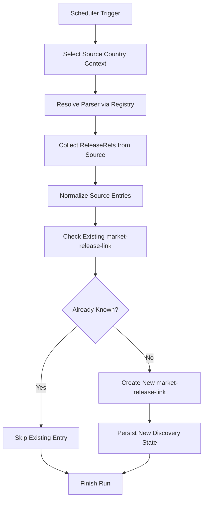

# Market Release Discovery Pipeline

The market release discovery pipeline is responsible for scanning official and retail market sources, extracting release references, and creating persistent `market-release-link` records for newly discovered source entries.

:::note Scope
This pipeline does **not** collect historical pricing data.

Its responsibility is discovery, source coverage expansion, and durable market link creation.
:::

---

## Purpose

The discovery pipeline exists to answer a simple but important question:

> **Which releases are currently present in a commercial source and not yet known to the market layer?**

Its outputs become the source inventory used by the recurring price collection pipeline.

---

## Pipeline Role Inside Market Ingestion

Within the broader market ingestion architecture, release discovery is the first stage.

| Responsibility | In scope |
|---|---|
| Scanning market sources for product references | ✓ |
| Extracting source-specific release entries | ✓ |
| Checking whether entries are already known | ✓ |
| Creating new `market-release-link` records | ✓ |

| Responsibility | Out of scope |
|---|---|
| Recurring price history collection | ✗ |
| MSRP source comparison | ✗ |
| Historical commercial observations | ✗ |
| Catalog domain ownership | ✗ |
| Media processing | ✗ |
| Public API delivery | ✗ |

---

## Trigger Model

The pipeline is fully scheduler-driven.

| Property | Value |
|---|---|
| Trigger type | scheduler |
| Source isolation | different sources run independently |
| Pod deployment | one source typically runs in its own Kubernetes pod |
| Country support | a single service may define multiple scheduler triggers for different country contexts |

This allows country-specific discovery behavior even when the underlying logical source is the same.

For example, a source with multiple country storefronts may expose different listings and must therefore be scanned through separate country-aware runs.

---

## Source Context Model

The pipeline operates on a combination of:

- **logical source** — the platform-level source definition
- **country-specific source context** — a `source_country` entry

:::tip Why this matters
One commercial source may have:
- different storefront URLs
- different product catalogs
- different prices
- different release availability by country

As a result, discovery must operate at the `source_country` level, not only at the `source` level.
:::

---

## High-Level Discovery Flow

---

## Discovery Stages

### 1. Scheduler starts the run
A scheduler trigger starts the discovery process for a specific source or country-aware source context.

### 2. Source adapter is resolved
The pipeline resolves the correct parser implementation through the registry layer.

This allows discovery logic to remain orchestration-driven while source-specific parsing stays inside dedicated adapters.

### 3. Release references are collected
The parser retrieves `ReleaseRef`-like entries from the source.

These references represent market-facing release candidates discovered in the source inventory.

### 4. Acquisition strategy depends on source technology
The exact collection logic depends on `source_tech_type`.

| Pattern | Description |
|---|---|
| XML feeds | structured XML product catalog |
| Source APIs | programmatic JSON/REST endpoints |
| HTML parsing | page-level scraping |

This makes discovery adaptable to different source integration styles without changing the orchestration model.

### 5. Existing links are checked
For each discovered source entry, the pipeline checks whether the corresponding `market-release-link` already exists.

### 6. New links are inserted
If the entry is not yet known, a new persistent `market-release-link` record is created.
If it already exists, the entry is skipped and the pipeline continues.

---

## Parsing Model

The release discovery pipeline does not use a single universal parser.

Instead, the platform uses a **registry-based integration model** where parser implementations are resolved by source name and port contract.

- orchestration code selects the source context
- the registry provides the correct parser adapter
- the parser returns source-specific release references in a normalized shape

---

## Registry Resolution

Monstrino uses a `PortsRegistry` pattern to map:

- source
- port type
- adapter implementation

| Benefit | Description |
|---|---|
| Separation of concerns | orchestration and parsing are fully decoupled |
| Scalability | adding new sources does not touch orchestration code |
| Replaceability | source adapters can be swapped independently |
| Architectural alignment | matches clean architecture port/adapter boundaries |

---

## Identity and Deduplication

The discovery process must avoid creating duplicate market links for the same source entry.

At the source-entry level, uniqueness is determined by:

- `source_country_id`
- `external_id`

This allows:
- the same source to expose different entries by country
- the same release to exist across multiple source-country combinations
- the market layer to remain country-aware without collapsing distinct commercial listings

---

## Persistence Outcome

The discovery pipeline mainly persists one type of business outcome:

> A new `market-release-link` record for a previously unseen source entry.

That record becomes a durable pointer between:
- the source-country storefront
- the source-side release entry
- the future commercial observation stream

This is the foundational dataset required for recurring market collection.

---

## Observability

For operational visibility, the pipeline should expose logs and metrics for:

- scheduler executions
- sources scanned
- country-specific runs
- release references parsed
- new market links created
- skipped existing entries
- source-level parsing failures
- run duration by source

---

## Reliability Model

:::note
The discovery pipeline should be able to progress even when a source is imperfect or partially structured.

The key design goal is **durability of newly discovered valid entries** rather than requiring fully complete source data on every run.

Detailed retry and low-level failure handling remain implementation concerns.
:::

---

## Future Evolution

Over time, the discovery pipeline may expand to support:

- more commercial source types
- deeper country-specific storefront strategies
- prioritization of high-trust commercial sources
- source ranking heuristics
- broader second-hand source discovery

---

## Design Summary

The market release discovery pipeline is designed around:

- scheduler-driven source scanning
- country-aware source modeling
- adapter-based parser resolution
- source-technology-dependent acquisition
- durable creation of `market-release-link` records
- clear separation from recurring price collection

---

## Related Pages

- [Pipelines Overview](../overview)
- [Market Ingestion Pipeline](./market-ingestion-pipeline)
- [Market Price Collection Pipeline](./market-price-collection-pipeline)
