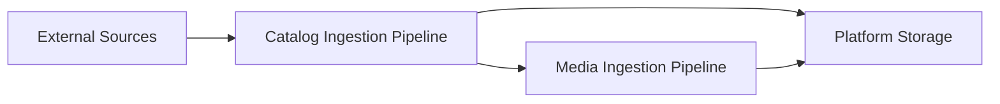

# Pipelines Overview

The Monstrino platform processes external data through a set of structured ingestion pipelines.
Each pipeline is responsible for transforming raw external information into normalized, reusable
domain data that can be safely exposed through platform APIs.

Pipelines are intentionally separated by responsibility so that different types of processing
can evolve independently without affecting the entire system.

At a high level, the system currently operates these main pipelines:

| Pipeline | Purpose |
|--------|--------|
| **Catalog Ingestion Pipeline** | Collects and normalizes product catalog information such as releases, characters, pets, and series |
| **Media Ingestion Pipeline** | Downloads, deduplicates, stores, and normalizes images associated with catalog entities |
| **Market Ingestion Pipeline** | Collects and normalizes products msrp and daily prices |

---

# High-Level Pipeline Architecture

The pipelines operate sequentially but are loosely coupled through durable storage and messaging.

External data first enters the **catalog ingestion pipeline**, which parses and normalizes
release-related information. When images are discovered during this process, the catalog pipeline
emits image references that trigger the **media ingestion pipeline**.

---

# Pipeline Design Principles

## Separation of Responsibilities

Each pipeline is responsible for a single domain of processing:

- catalog pipeline handles **structured domain data**
- media pipeline handles **image assets and transformations**

This separation ensures that computationally heavy image processing does not block catalog ingestion.

## Durable Intermediate State

Each stage writes its results to the database or object storage before moving forward.

This design provides:

- fault tolerance
- observability of processing states
- safe retry mechanisms

## Asynchronous Processing

Most pipeline stages are triggered through schedulers or event subscriptions rather than synchronous calls.

This allows:

- independent scaling of workers
- resilience against temporary external failures
- improved throughput when processing large datasets

## Content Deduplication

Where possible, pipelines attempt to detect duplicates early in the processing flow.

For example:

- catalog pipeline checks for existing releases before import
- media pipeline uses SHA256 hashing to detect duplicate images

---

# Pipeline Documentation Structure

Each pipeline is documented separately in this directory.

| Document | Description |
|--------|-------------|
| `catalog-ingestion-pipeline.md` | Detailed flow of catalog data ingestion and normalization |
| `media-ingestion-pipeline.md` | Detailed flow of media ingestion, rehosting, and normalization |

These documents describe:

- pipeline stages
- processing state transitions
- service responsibilities
- data transformations

---

# Relationship to Other Architecture Documents

Pipeline documentation complements the broader architecture documentation of the platform.

| Document | Description |
|--------|-------------|
| `architecture-overview.md` | High-level architecture of the entire platform |
| `container-architecture.md` | Service-level architecture and runtime components |
| `ingestion-architecture.md` | Architectural concepts behind the ingestion system |
| `storage-architecture.md` | Database schemas and object storage design |

---

# Future Pipeline Expansion

The pipeline architecture is designed to support additional pipelines in the future.

Potential additions include:

- **Market Data Pipeline** — collection and normalization of second‑hand market prices
- **User Content Pipeline** — ingestion and moderation of user‑generated media
- **AI Enrichment Pipeline** — large‑scale semantic enrichment of catalog metadata

Because pipelines communicate through storage and events rather than tight service coupling,
new pipelines can be added without redesigning the existing architecture.