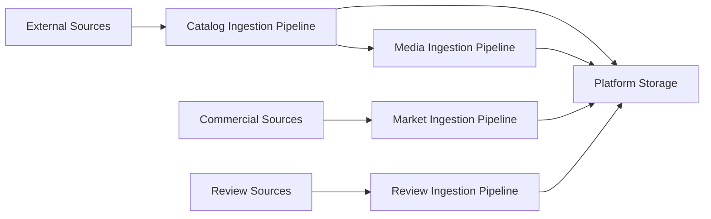

# Pipelines Overview

The Monstrino platform processes external data through a set of structured ingestion pipelines.
Each pipeline is responsible for transforming raw external information into normalized, reusable
domain data that can be safely exposed through platform APIs.

Pipelines are intentionally separated by responsibility so that different types of processing
evolve independently without affecting the entire system.

At a high level, the system currently operates these main pipelines:

| Pipeline | Purpose |
|--------|--------|
| **Data Ingestion** | Discovers external sources, builds canonical catalog records, and produces normalized media assets. Consists of two sequential sub-pipelines: catalog ingest (source discovery → enrichment → import) followed by media ingest (image download → deduplication → variant generation), connected via Kafka. |
| **Market Ingestion** | Collects commercial pricing data for known releases across official stores and retail sources. Consists of two sub-pipelines: market release discovery (scan sources → create `market-release-link` records) and market price collection (revisit known links → store price observations → maintain MSRP ownership based on source trust). |
| **Review Ingestion** | Discovers and collects user and editorial review data for known releases from external sources. Follows the same discovery + collector architecture as market ingestion. Internal data model is still being defined. |

---

# High-Level Pipeline Architecture

The pipelines operate sequentially but are loosely coupled through durable storage and messaging.

External data first enters the **catalog ingestion pipeline**, which parses and normalizes
release-related information. When images are discovered during this process, the catalog pipeline
emits image references that trigger the **media ingestion pipeline**.

---

# Pipeline Design Principles

## Separation of Responsibilities

Each pipeline is responsible for a single domain of processing:

- catalog pipeline handles **structured domain data**
- media pipeline handles **image assets and transformations**

This separation ensures that computationally heavy image processing does not block catalog ingestion.

## Durable Intermediate State

Each stage writes its results to the database or object storage before moving forward.

This design provides:

- fault tolerance
- observability of processing states
- safe retry mechanisms

## Asynchronous Processing

Most pipeline stages are triggered through schedulers or event subscriptions rather than synchronous calls.

This allows:

- independent scaling of workers
- resilience against temporary external failures
- improved throughput when processing large datasets

## Content Deduplication

Where possible, pipelines attempt to detect duplicates early in the processing flow.

For example:

- catalog pipeline checks for existing releases before import
- media pipeline uses SHA256 hashing to detect duplicate images

---

# Pipeline Documentation Structure

Each pipeline is documented separately in this directory.

| Document | Description |
|--------|-------------|
| [Data Ingestion Overview](./data-ingestion/overview.md) | How catalog and media ingestion relate, their stages, and the Kafka handoff between them |
| [Catalog Ingest Overview](./data-ingestion/catalog-ingest/overview.md) | Source discovery, enrichment, AI orchestration, and import into canonical tables |
| [Media Ingest Overview](./data-ingestion/media-ingest/overview.md) | Image rehosting, deduplication, normalization, and variant generation |
| [Market Ingestion Overview](./market-ingestion/market-ingestion-pipeline.md) | End-to-end overview of market data flow: release discovery, price collection, MSRP tracking, and source trust handling |
| [Market Release Discovery](./market-ingestion/market-release-discovery-pipeline.md) | Scheduler-driven discovery of new market-facing release entries; creates persistent `market-release-link` records |
| [Market Price Collection](./market-ingestion/market-price-collection-pipeline.md) | Recurring collection of price observations for known market links; MSRP initialization and trust-based ownership |
| [Review Ingestion Overview](./review-ingestion/overview.md) | Architecture overview of the review ingestion pipeline: discovery + collector pattern, scheduler-driven, adapter-based source integration |

These documents describe:

- pipeline stages
- processing state transitions
- service responsibilities
- data transformations

---

# Relationship to Other Architecture Documents

Pipeline documentation complements the broader architecture documentation of the platform.

| Document | Description |
|--------|-------------|
| `architecture-overview.md` | High-level architecture of the entire platform |
| `container-architecture.md` | Service-level architecture and runtime components |
| `ingestion-architecture.md` | Architectural concepts behind the ingestion system |
| `storage-architecture.md` | Database schemas and object storage design |

---

# Future Pipeline Expansion

The pipeline architecture is designed to support additional pipelines in the future.

Potential additions include:

- **User Content Pipeline** - ingestion and moderation of user‑generated media
- **AI Enrichment Pipeline** - large‑scale semantic enrichment of catalog metadata
- **Secondary Market Pipeline** - collection and normalization of second‑hand market prices (eBay, StockX, etc.)

Because pipelines communicate through storage and events rather than tight service coupling,
new pipelines can be added without redesigning the existing architecture.