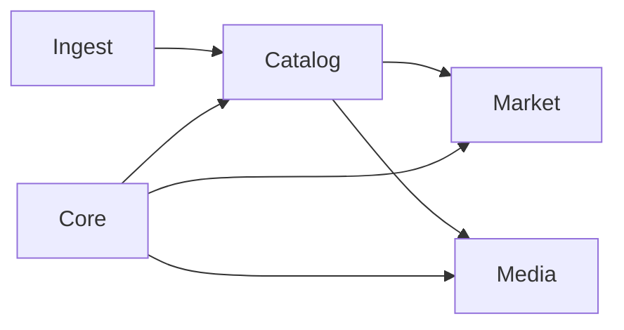
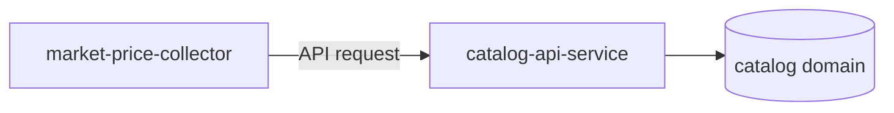
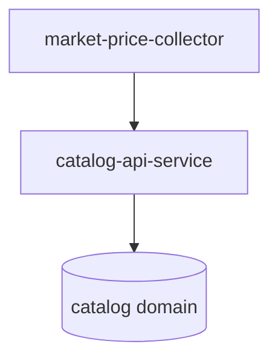

import Admonition from '@theme/Admonition';

# Service Boundaries

This document defines the service boundaries of the Monstrino platform.

Monstrino is designed as a system of specialized services grouped around distinct data and processing domains. Each service is expected to operate within a clear area of responsibility. These boundaries are essential for keeping the platform scalable, maintainable, and resistant to accidental coupling between unrelated parts of the system.

<Admonition type="info" title="Boundary Model">
In Monstrino, a service may work directly with its own domain data, but cross-domain access must happen through the corresponding API service.
</Admonition>

---

# Purpose

The purpose of service boundaries in Monstrino is to ensure that:

- each service has a clearly defined responsibility
- domain ownership remains predictable
- changes in one service do not force unrelated changes in others
- cross-domain dependencies stay explicit
- data access rules remain controlled

The most important rule is:

**Changes in one service must not require changes in unrelated services.**

---

# Domain Structure

Monstrino is organized around the following core domains:

- catalog
- ingest
- media
- market
- core

These domains represent logical areas of responsibility rather than just storage locations.

---

# Domain Ownership

Each domain is owned by a specific group of services.

## Catalog Domain

Primary services:

- `catalog-api-service`
- `catalog-importer`

Responsibility:

- normalized catalog entities
- catalog relationships
- stable structured release data
- access point for other domains that need catalog information

---

## Ingest Domain

Primary services:

- `catalog-collector`
- `catalog-importer`
- `catalog-data-enricher`

Responsibility:

- collecting raw external data
- intermediate ingestion processing
- enrichment before normalized catalog integration

---

## Media Domain

Primary services:

- `media-rehosting-subscriber`
- `media-rehosting-processor`
- `media-normalizator`

Responsibility:

- rehosting images
- processing and normalization of media
- generating media variants
- maintaining internal ownership of platform media assets

---

## Market Domain

Primary services:

- `market-release-discovery`
- `market-price-collector`

Responsibility:

- market discovery
- price collection
- market-specific observations
- price history and external market tracking

---

## Core Domain

The `core` domain acts as shared reference support for multiple services.

This domain is used by many services across the platform.

Typical responsibility includes shared reference data required by several domains.

<Admonition type="note" title="Core Domain">
The core domain is shared infrastructure-level business data. It is not treated as a free-access replacement for proper domain boundaries.
</Admonition>

---

# API Services as Domain Entry Points

Each domain exposes a dedicated API service that acts as the official access point into that domain.

This means that API services serve as domain boundaries.

Examples:

- `catalog-api-service` is the access point to catalog data
- domain-specific API services protect their internal structures from direct external dependency

A service must not bypass the API layer when it needs information from another domain.

---

# Direct Database Access Rules

Monstrino allows direct database access only inside a service's own domain boundary.

## Allowed

A service may read or write data directly if that data belongs to its own domain.

Example:

- `market-price-collector` may access market-related tables directly

## Not Allowed

A service must not directly read or write tables that belong to another domain.

Example:

- a market service must not directly access catalog tables to resolve release identity
- it must use `catalog-api-service`

This rule applies both to reads and writes across domain boundaries.

---

# Cross-Domain Communication

Whenever a service needs data from another domain, it must use the API service responsible for that domain.

Example:

- if a market service needs a `release_id` based on an `mpn`, it must request this through `catalog-api-service`

This makes all cross-domain dependencies:

- explicit
- traceable
- easier to evolve safely

---

# Write Boundaries

Writing directly to another domain's database area is prohibited.

Cross-domain modification is only allowed when performed through the responsible API service.

This ensures that:

- each domain keeps control over its own rules
- validation stays in the owning domain
- unrelated services do not become tightly coupled

---

# Workers and Processing Services

Pipeline services are treated primarily as **workers**, not as general-purpose domain gateways.

Their role is to:

- process data
- move data through pipelines
- transform collected information
- prepare domain-specific outputs

They are not intended to become universal entry points for other services.

This distinction is important because workers belong to processing flow, while API services define domain access boundaries.

---

# Collector Services

Collector services are a special category of services inside Monstrino.

Examples:

- `catalog-collector`
- `market-price-collector`

These services interact with external data sources and therefore sit at the outer edge of ingestion and market pipelines.

They are treated as special components because they:

- connect the platform to external systems
- bring untrusted data into the platform
- are operationally sensitive
- represent platform-specific logic

For platform security reasons, these services are treated with additional care.

---

# Boundary Principles

Monstrino follows the following service boundary principles.

### A service owns its own domain logic

Every service operates inside a clear responsibility area.

### Cross-domain access must be explicit

If a service needs foreign domain data, it must use the appropriate API.

### Direct cross-domain database access is forbidden

Services must not bypass domain ownership.

### API services are boundary gateways

API services define how other domains may interact with a domain.

### Workers are not public domain gateways

Processing services move data, but they do not replace proper domain APIs.

### Unrelated services must remain unaffected

A change inside one service should not require changes in unrelated services.

---

# Why These Boundaries Exist

These boundaries exist to prevent several common architectural failures:

- hidden dependencies between services
- accidental coupling through shared tables
- domain leakage
- fragile integration between pipelines
- changes propagating into unrelated parts of the system

By enforcing explicit boundaries, Monstrino remains easier to extend as new pipelines, data sources, and domains are added.

---

# Practical Examples

## Correct Pattern

A market service needs catalog identity data.

Solution:

- call `catalog-api-service`
- receive the resolved catalog information
- continue market processing

## Incorrect Pattern

A market service directly queries catalog tables for release mapping.

Why this is wrong:

- it bypasses domain ownership
- it creates hidden coupling
- it makes catalog schema changes dangerous for market services

---

# Architectural Intent

The service boundary model in Monstrino is designed to ensure that the system can grow by adding:

- new pipelines
- new data sources
- new workers
- new domains

without causing unrelated services to break.

The architecture prefers **clear responsibility boundaries** over short-term convenience.

This keeps the platform stable even as the system becomes larger and more complex.