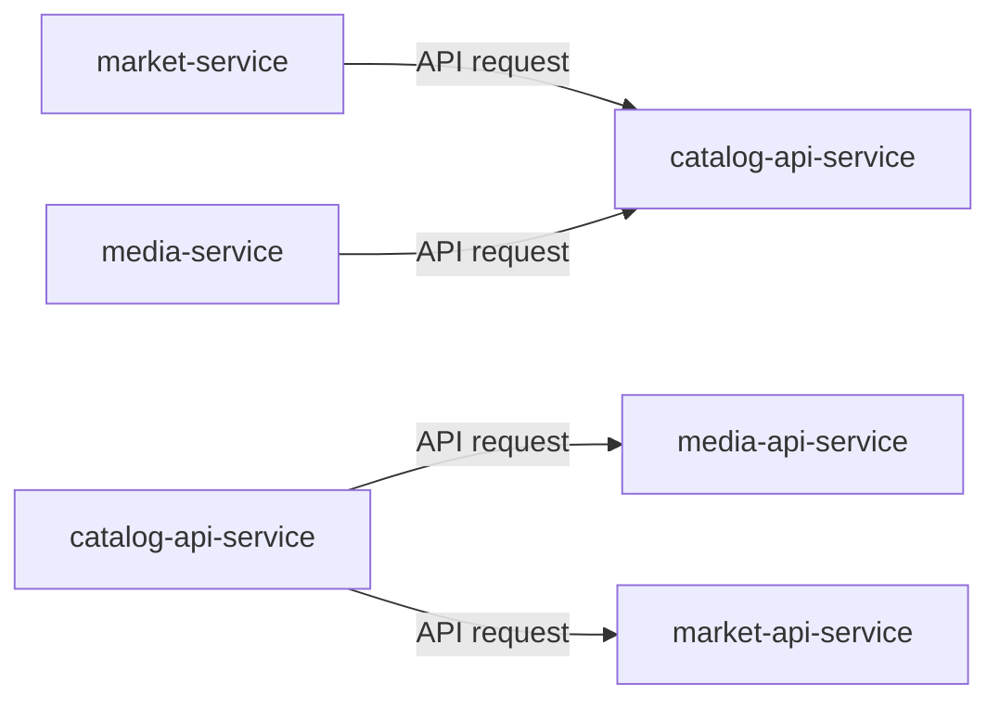

import Admonition from '@theme/Admonition';

# Data Ownership

This document defines the data ownership model used in the Monstrino platform.

Monstrino is organized around several functional domains. Each domain owns a specific set of data and is responsible for managing the structure, lifecycle, and integrity of that data.

The purpose of this document is to define:

- which domains own which data
- which services are allowed to modify that data
- how other services may access it

<Admonition type="info" title="Ownership Model">
In Monstrino, data belongs to a **domain**, not to the database itself.  
Only services inside that domain may directly read or modify the corresponding tables.
</Admonition>

---

# Ownership Principles

Monstrino follows a strict data ownership model.

### Domain Ownership

Every dataset belongs to a specific domain.

The domain defines:

- the structure of the data
- how the data is validated
- which services are allowed to modify it

### Local Data Access

Services may directly access database tables only if those tables belong to their own domain.

### Cross-Domain Access

If a service needs data from another domain, it must request it through the **API service responsible for that domain**.

### Cross-Domain Writes

Writing directly into tables owned by another domain is strictly prohibited.

---

# Domain Ownership Model

Monstrino currently operates with the following domains:

- catalog
- ingest
- media
- market
- core

Each domain owns a distinct category of platform data.

---

# Catalog Domain

Owned by:

- `catalog-collector`
- `catalog-data-enricher`
- `catalog-importer`
- `catalog-api-service`

Catalog domain data represents the normalized structured dataset used by the platform.

Typical catalog-owned data includes:

- releases
- characters
- pets
- series
- relationships between catalog entities
- normalized catalog identifiers

The catalog domain acts as the **central reference layer** for the platform.

Other domains frequently rely on catalog identifiers but must obtain them through the catalog API.

---

# Ingest Domain

Owned by:

- `catalog-collector`
- `catalog-data-enrichter`
- `catalog-importer`

The ingest domain stores intermediate ingestion data collected from external sources.

Typical ingest-owned data includes:

- raw collected data
- parsed ingestion results
- enrichment results before catalog normalization

Raw ingestion data is intentionally preserved so that ingestion pipelines can be debugged or reprocessed when needed.

---

# Media Domain

Owned by:

- `media-rehosting-subscriber`
- `media-rehosting-processor`
- `media-normalizator`

The media domain manages all media assets used by the platform.

Typical media-owned data includes:

- original images
- normalized images
- generated media variants
- media metadata

Media services are responsible for:

- rehosting external images
- generating optimized media variants
- maintaining internal ownership of platform media assets

---

# Market Domain

Owned by:

- `market-release-discovery`
- `market-price-collector`

The market domain tracks marketplace observations and price information.

Typical market-owned data includes:

- discovered marketplace items
- observed product prices
- historical price observations
- marketplace mappings

Market services collect and maintain this data independently from the catalog domain.

---

# Core Domain

The core domain contains shared reference data used across multiple domains.

Typical core-owned data includes:

- reference tables
- shared identifiers
- common lookup data

Many services interact with the core domain because it provides platform-wide reference information.

---

# Direct Data Access Rules

Monstrino allows direct database access only when a service operates within its own domain.

### Allowed

A service may directly read or write tables belonging to its own domain.

Example:

- `market-price-collector` reading and writing market price data.

### Not Allowed

A service must not directly access tables belonging to another domain.

Examples of forbidden operations:

- reading catalog tables directly from a market service
- writing media tables from a catalog service
- accessing ingestion tables from unrelated pipelines

---

# Cross-Domain Access Pattern

When a service needs data from another domain, it must use the responsible API service.

Examples:

- market service needs release identity → calls `catalog-api-service`
- media service needs release relationship → calls `catalog-api-service`
- catalog service needs image list → calls `media-api-service`
- catalog service needs price data → calls `market-api-service`

This pattern ensures that domain ownership remains clear and that services do not depend on internal database structures of other domains.

---

# Forbidden Access Patterns

The following patterns are not allowed in Monstrino.

### Direct Write to Foreign Domain Tables

A service must never write data into tables owned by another domain.

### Direct Read from Foreign Domain Tables

A service must never bypass the domain API and directly query another domain's database tables.

### Schema Coupling

Services must not rely on the internal schema structure of foreign domains.

---

# Ownership Rule

The core ownership rule of Monstrino is:

**Only services inside a domain may directly read or write the tables belonging to that domain.**

All cross-domain interactions must occur through the corresponding API service.

---

# Architectural Intent

The purpose of the Monstrino data ownership model is to ensure that:

- services remain loosely coupled
- database schema changes stay isolated within domains
- pipelines can evolve independently
- domain responsibilities remain clear

By enforcing domain ownership, Monstrino avoids the common failure mode of microservice systems where services become tightly coupled through shared database access.