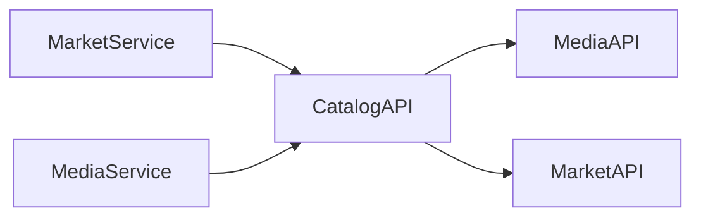

import Admonition from '@theme/Admonition';

# API Design Principles

This document defines the API design principles used across the Monstrino platform.

The goal of these principles is to ensure that APIs across all services follow a consistent, predictable, and maintainable structure.

All services in the platform must follow the same API conventions. This allows services to evolve without forcing large-scale changes across the system.

<Admonition type="info" title="Core Principle">
All API endpoints in the Monstrino platform must follow the same structural and behavioral rules.
</Admonition>

---

# Purpose

The API design model of Monstrino is designed to achieve:

- consistent communication between services
- predictable request and response formats
- centralized API contracts
- minimal duplication of API logic
- easier evolution of service interfaces

---

# Unified API Structure

All APIs across the platform must follow the same response envelope structure.

Example response:

```json
{
  "status": "success",
  "request_id": "req_cee2f468f547",
  "correlation_id": "req_cee2f468f547",
  "trace_id": null,
  "data": {},
  "error": null,
  "meta": {
    "service": "catalog-api-service",
    "version": "v1",
    "timestamp": "2026-03-07T16:14:36.875306Z"
  }
}
```

This unified structure allows all services to interact with APIs in a predictable way.

---

# Shared API Contracts

All API request and response models must be defined in the **`monstrino-contracts`** package.

This ensures that:

- API schemas are defined in one place
- services reuse the same models
- API changes propagate consistently across services

Services must not define their own local request or response structures if a contract already exists.

---

# Centralized API Infrastructure

The Monstrino platform separates API concerns across several packages.

## monstrino-contracts

Defines the request and response models used by services when communicating with each other.

## monstrino-api

Defines the core API behavior used by all services, including:

- response envelope models
- response factory
- error models
- validation rules
- exception handlers
- request context middleware

This package ensures that all services follow the same API behavior.

## monstrino-infra

Provides infrastructure utilities used by services, including:

- API client implementations
- authentication configuration
- token verification logic
- shared adapters and utilities

Centralizing this infrastructure ensures that changes to API behavior only need to be implemented in a small number of locations.

---

# Domain API Entry Points

Each domain exposes a dedicated API service that acts as the official entry point into that domain.

Examples include:

- `catalog-api-service`
- `media-api-service`
- `market-api-service`

Other services must interact with a domain through its API service rather than accessing its database tables directly.

This keeps domain boundaries explicit and stable.

---

# Cross-Domain API Usage

When a service needs information from another domain, it must request it through the responsible API service.

Examples:

- market services request release identity from `catalog-api-service`
- media services request catalog relations from `catalog-api-service`
- catalog services request image lists from `media-api-service`
- catalog services request price information from `market-api-service`



---

# Authentication

All internal APIs require bearer token authentication.

Each service generates a unique authentication token during startup using shared infrastructure from `monstrino-infra`.

Example header:

```http
Authorization: Bearer <token>
```

Authentication logic is centralized so that changes to token validation do not require modifications across multiple services.

---

# Error Handling Model

All API errors must follow the unified error model defined in `monstrino-api`.

The platform defines predefined error structures that services should use when returning errors.

Services do not implement custom error formats.

Instead, they select the appropriate predefined error type and provide contextual information.

Example error response:

```json
{
  "status": "error",
  "error": {
    "code": "Internal Error",
    "message": "Internal server error",
    "retryable": true
  }
}
```

This ensures that error handling remains consistent across the platform.

---

# API Evolution

API interfaces should evolve in a way that minimizes disruption to dependent services.

For small changes:

- update API contracts
- update API clients

For larger changes affecting multiple services:

- introduce a new API version

This approach allows services to adopt new interfaces gradually.

---

# Response Completeness

Whenever possible, APIs should provide complete information inside the response envelope.

Returning more structured information reduces the need for additional API calls and simplifies service interactions.

---

# Architectural Intent

The purpose of the Monstrino API design model is to ensure that:

- services communicate using predictable interfaces
- API changes remain manageable
- cross-service dependencies remain explicit
- services can evolve independently

By enforcing consistent API behavior, the platform avoids fragmentation of communication rules across services.