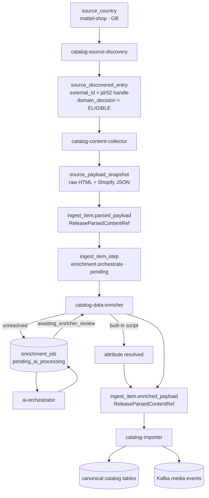
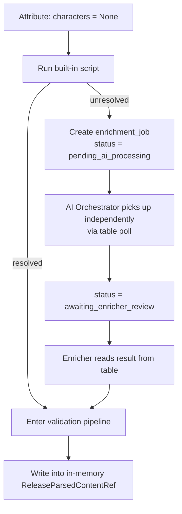
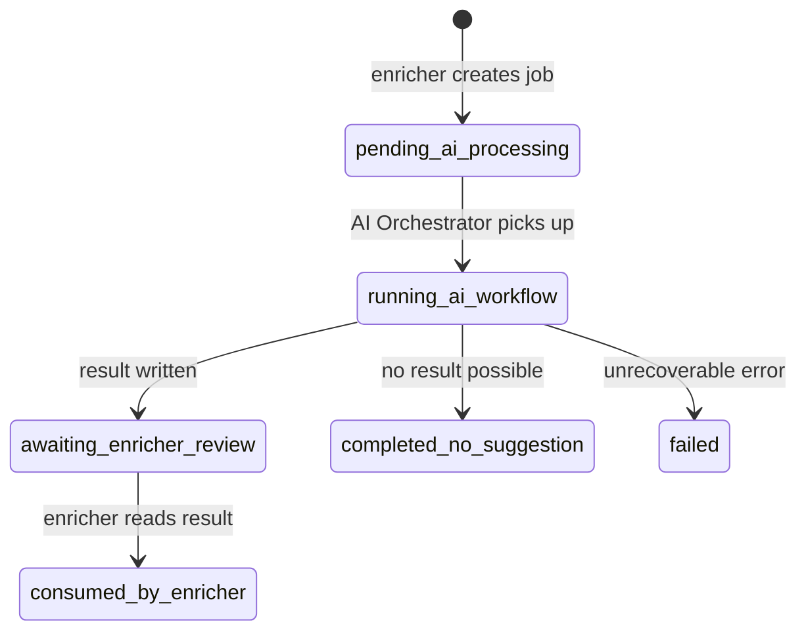
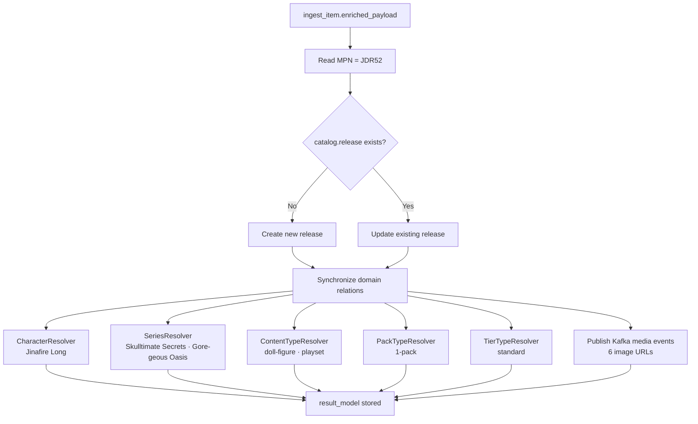

# From Raw Data to Structured Catalog

One of the most important questions about Monstrino's architecture is:

> Why is the ingestion pipeline so complex?

The answer is simple: **the input data is incomplete, inconsistent, and
cannot be reliably parsed with rule-based logic alone.**
To build a reliable catalog, the system must transform raw external
content through several explicit lifecycle stages.

This page traces a **real product** from the Mattel shop through every
transformation until it becomes a normalized canonical catalog entry.

---

## High-Level Pipeline



---

## Step 0 — Source Discovery

Before any fetch occurs, the pipeline must first discover that a product exists.

`catalog-source-discovery` scans the country-specific listing surface for the `(mattel-shop, GB)` source country. It finds a product link on the listing page and extracts a lightweight reference:

```python
ReleaseRef(
    source_country_id="<uuid>",
    external_id="monster-high-skulltimate-secrets-gore-geous-oasis-jinafire-long-doll-jdr52-en-gb",
    url="https://shopping.mattel.com/en-gb/products/monster-high-skulltimate-secrets-...-jdr52-en-gb",
    title="Monster High Skulltimate Secrets Gore-Geous Oasis Playset, Jinafire Long Doll And Accessories",
    region="GB",
    language="en",
)
```

Domain rules are then applied. This product is a doll playset — it is **eligible**. A notebook, jewelry set, or plush toy would be **ignored**.

The result is persisted as `catalog.source_discovered_entry`:

```text
external_id       = monster-high-...-jdr52-en-gb
domain_decision   = ELIGIBLE
collection_status = READY_FOR_FETCH
```

Ignored entries are also stored — so the system does not re-evaluate the same out-of-scope link on the next discovery run.

---

## Step 1 — Raw Source Data

Product page:

[https://shopping.mattel.com/en-gb/products/monster-high-skulltimate-secrets-gore-geous-oasis-jinafire-long-doll-jdr52-en-gb](https://shopping.mattel.com/en-gb/products/monster-high-skulltimate-secrets-gore-geous-oasis-jinafire-long-doll-jdr52-en-gb)

From the HTML page alone we can extract only a few attributes:

- Title
- Description
- "What's in the box" text
- Images

This is **far from enough** to build a structured catalog entry.

We still have no idea about:

- which characters are included
- which series this belongs to
- pack type, content type, release tier
- gender target
- structured item list

---

## Step 2 — Hidden Structured Data (Shopify JSON)

Mattel stores run on Shopify. By appending `?view=json` to the URL
we can access structured product data.

[https://shopping.mattel.com/en-gb/products/monster-high-skulltimate-secrets-gore-geous-oasis-jinafire-long-doll-jdr52-en-gb?view=json](https://shopping.mattel.com/en-gb/products/monster-high-skulltimate-secrets-gore-geous-oasis-jinafire-long-doll-jdr52-en-gb?view=json)

Example excerpt (shortened for clarity):

```json
{
  "product": {
    "productJson": {
      "id": 15212691947906,
      "title": "Monster High Skulltimate Secrets Gore-Geous Oasis Playset, Jinafire Long Doll And Accessories",
      "handle": "monster-high-skulltimate-secrets-gore-geous-oasis-jinafire-long-doll-jdr52-en-gb",
      "published_at": "2025-12-17T20:45:59+00:00",
      "vendor": "Monster High",
      "tags": [
        "Filter-Subtype: Fantasy",
        "Filter-Subtype: Skulltimate Secrets",
        "Filter-WebCategory: Dolls"
      ],
      "variants": [
        {
          "sku": "JDR52",
          "barcode": "0194735288892"
        }
      ]
    },
    "metaPayload": {
      "product_description": "Reveal a Monster High doll, unlock accessories...",
      "bullet_feature_2": "Inside the luggage case lurks a dragon and 19 surprises!",
      "bullet_feature_7": "Uncover even more mysteries with Draculaura and Lagoona Blue!",
      "whats_in_the_box": "Includes 1 Jinafire Long doll, 1 storage case, 3 keys, 2 suitcases, and assorted clothing and accessories"
    }
  }
}
```

This gives us more: `mpn` (SKU), `gtin` (barcode), `external_id` (handle), tags, and structured descriptions.

But the key attributes are still missing.

---

## Why Rule-Based Parsing Fails

The missing fields cannot be reliably extracted with a rule-based parser.

Consider these real description variants from different releases:

**Example A:**

> Includes Jinafire Long doll and accessories

**Example B:**

> Draculaura joins Clawdeen Wolf and Frankie Stein

**Example C:**

> Uncover even more mysteries with Draculaura and Lagoona Blue!

**Example D:**

> Features characters from the Monster High universe

A regex or keyword-matching parser would:

- in Example A: correctly extract `Jinafire Long`
- in Example B: extract three names — but are all of them in this product, or just mentioned?
- in Example C: extract `Draculaura` and `Lagoona Blue` as included characters — but in this product they appear only in a teaser bullet, not as included dolls
- in Example D: return nothing, or extract random nouns

The same logic that works for one release **silently fails** on another.

**Therefore AI enrichment is required.**

---

## Step 3 — catalog-content-collector

`catalog-content-collector` claims the `source_discovered_entry` and performs the first real fetch.

It resolves a source-specific adapter from `PortsRegistry`:

```text
source = MATTEL_SHOP
port   = ParseReleasePort → MattelShopParseReleaseAdapter
```

The adapter fetches the product page, retrieves the Shopify JSON shown above, and extracts all available structured fields. Three objects are then stored:

**`catalog.source_payload_snapshot`** — the raw fetched content stored for reproducibility:

```text
source_discovered_entry_id = <uuid>
fetched_at                 = 2026-03-12T10:00:00Z
content_type               = text/html
payload_storage_ref        = s3://bucket/catalog/mattel-shop/gb/jdr52/2026-03-12.html
content_fingerprint        = sha256:...
```

**`catalog.ingest_item`** — the downstream work unit, with `parsed_payload` storing the structured intermediate representation:

```python
# ingest_item.parsed_payload → ReleaseParsedContentRef
ReleaseParsedContentRef(
    title="Monster High Skulltimate Secrets Gore-Geous Oasis Playset, Jinafire Long Doll And Accessories",
    external_id="monster-high-skulltimate-secrets-gore-geous-oasis-jinafire-long-doll-jdr52-en-gb",
    url="https://shopping.mattel.com/en-gb/product/...",

    # Metadata
    mpn="JDR52",
    subtype=["Fantasy", "Skulltimate Secrets"],
    language="en-GB",
    region="GB",
    gtin="0194735288892",

    # Content
    description="Reveal a Monster High doll, unlock accessories...",
    content_description="Includes 1 Jinafire Long doll, 1 storage case, 3 keys, 2 suitcases, and assorted clothing and accessories",
    year=2025,
    year_raw="2025-12-17",
    content_type=["Doll"],

    # ---- Everything below is still unknown ----
    gender=None,
    characters=None,
    pets=None,
    series=None,
    pack_type=None,
    tier_type=None,
    exclusive_vendor=None,
    reissue_of=None,

    primary_image_url="https://shopping.mattel.com/cdn/shop/files/ab46c79b5...",
    images=["..."],
)
```

**`catalog.ingest_item_step`** — the first processing step, signalling that enrichment should begin:

```text
step_type = enrichment.orchestrate
status    = pending
```

The `parsed_payload` intentionally stores incomplete data. That is its purpose — it captures everything the source exposes directly, without inventing what is not there.

---

## Step 4 — catalog-data-enricher

`catalog-data-enricher` claims the `ingest_item_step` and advances its status:

```text
pending → claimed_for_enrichment → running_enrichment
```

It reads `ingest_item.parsed_payload` and deserializes it into a `ReleaseParsedContentRef` working model held in memory. The enricher never writes to the database during attribute processing — it works entirely on the in-memory model until all attributes are settled.

For each attribute that is `None` or insufficient, the enricher first attempts a **built-in script**:



Scripts can handle deterministic cases — extracting a year from a structured MPN, normalizing a `language` field from source metadata, mapping a known tag to a canonical `content_type` value. For `characters`, `series`, `pack_type`, and `tier_type`, the source data is too ambiguous for scripted resolution.

For each unresolved attribute the enricher creates one `enrichment_job` record in the `ai_orchestrator` schema:

```text
target_domain      = catalog
target_entity_type = ingest_item
target_entity_id   = <uuid>
target_attribute   = characters
status             = pending_ai_processing
```

The enricher does **not** call the AI Orchestrator directly. It writes the record to the table and the AI Orchestrator picks it up independently via its own polling loop.

The `ingest_item_step` does not advance until every attribute is either resolved, skipped, or failed with a logged decision record.

---

## Step 5 — AI Orchestration

The AI Orchestrator polls the `enrichment_job` table for pending jobs and executes an attribute-specific scenario — in this case `ReleaseCharactersEnrichment`.

### Job State Machine



### Multi-Step Reasoning

The model does not always return a final answer immediately.

For character extraction, the model detects candidate names in the description but needs to verify them against known catalog data. It returns a command instead of a final result:

```json
{
  "status": "request_action",
  "is_final": false,
  "requested_action": {
    "command_name": "lookup_characters_by_names",
    "command_params": {
      "character_names": ["Draculaura", "Clawdeen Wolf", "Jinafire Long"]
    }
  },
  "metadata": {
    "reasoning_stage": "character_lookup_requested"
  }
}
```

The AI Orchestrator validates the command against its allowlist, calls `catalog-api-service` to fetch the matching character records, and injects the lookup result back into the AI context for the next reasoning step.

Once the model has enough information, it returns the final structured result:

```json
{
  "status": "final",
  "is_final": true,
  "final_payload": {
    "characters": [
      { "name": "Jinafire Long", "slug": "jinafire-long" }
    ],
    "matched_characters_count": 1,
    "confidence": 0.96
  },
  "metadata": {
    "reasoning_stage": "completed"
  }
}
```

The model correctly identified that only **Jinafire Long** is the included character.
`Draculaura` and `Lagoona Blue` appear in a marketing bullet (`"Uncover even more mysteries with Draculaura and Lagoona Blue!"`) — they are not included in this product.

This is exactly the kind of distinction a rule-based parser cannot make reliably.

:::info
The AI model **cannot call services directly**. It returns structured commands. The AI Orchestrator validates the command against an allowlist, calls the appropriate service, and injects the result into the next reasoning step. AI remains a reasoning component, not an autonomous actor.
:::

The result is written to `enrichment_job.result_payload` and the job status becomes `awaiting_enricher_review`. The enricher polls the table, reads the result, and applies the same validation and policy pipeline as for script-resolved values before writing the accepted value into the in-memory model.

---

## Step 6 — ingest_item.enriched_payload

After all attributes are settled, the enricher persists the final in-memory model to `ingest_item.enriched_payload`. This is a single write — no partial updates happen during processing.

```python
# ingest_item.enriched_payload → ReleaseParsedContentRef
ReleaseParsedContentRef(
    # Originally collected by catalog-content-collector
    title="Monster High Skulltimate Secrets Gore-Geous Oasis Playset, Jinafire Long Doll And Accessories",
    external_id="monster-high-skulltimate-secrets-gore-geous-oasis-jinafire-long-doll-jdr52-en-gb",
    url="https://shopping.mattel.com/en-gb/product/...",
    mpn="JDR52",
    gtin="0194735288892",
    subtype=["Fantasy", "Skulltimate Secrets"],
    language="en-GB",
    region="GB",
    description="Reveal a Monster High doll, unlock accessories...",
    content_description="Includes 1 Jinafire Long doll, 1 storage case, 3 keys, 2 suitcases, and assorted clothing and accessories",
    year=2025,
    year_raw="2025-12-17",
    primary_image_url="https://shopping.mattel.com/cdn/shop/files/ab46c79b5...",
    images=[
        "https://shopping.mattel.com/cdn/shop/files/ab46c79b5fe09b17182c55f56eab7fa94154891c_68e0983b-3737-41df-9aa0-d2a4bff659f5.jpg?v=1766004361",
        "https://shopping.mattel.com/cdn/shop/files/f66eea15cb671628a24c4545e80efe80c89a28ce_8fc4a799-e373-4105-b4dc-58cbaa73377c.jpg?v=1766004360",
        "https://shopping.mattel.com/cdn/shop/files/effa2bb532443cf0825c248770c2f735b29df821_24abe026-5b96-48d6-9378-42048e3d9f60.jpg?v=1766004360",
        "https://shopping.mattel.com/cdn/shop/files/255672cdacb99ef685e689fcdd7dc4b523dc7a58_09c1ee51-c41a-490b-aaab-ce97532ff38e.jpg?v=1766004361",
        "https://shopping.mattel.com/cdn/shop/files/a7bc2656bff29450db388e4116ac3a5ceccf2db8_e9d048c9-e84a-42ae-b8a0-350b5d0d0e43.jpg?v=1766004361",
        "https://shopping.mattel.com/cdn/shop/files/24b105f77cbe4d29a57df7955f37710105365b38_94620675-d65b-449e-a9b6-5f281f8503f6.jpg?v=1766004361",
    ],

    # Resolved by enrichment (scripts + AI Orchestrator)
    gender=["ghoul"],
    characters=["Jinafire Long"],
    pets=None,
    series=["Skulltimate Secrets", "Destination: Gore-geous Oasis"],
    content_type=["doll-figure", "playset"],
    pack_type=["1-pack"],
    tier_type="standard",
    exclusive_vendor=None,
    reissue_of=None,
)
```

This is the same `ReleaseParsedContentRef` type as `parsed_payload` — the difference is that the fields that were `None` are now filled. These are still raw strings and lists, not domain objects. Resolver services have not run yet.

The `ingest_item_step` is marked `completed` and the next step for the import stage is created.

---

## Step 7 — catalog-importer

`catalog-importer` reads `ingest_item.enriched_payload` and converts it into canonical domain entities.

It uses **MPN** as the primary business key. If no MPN is present, the import fails — this guarantees deterministic identity resolution and avoids fuzzy duplicate matching.



For each relation, the resolver either finds an existing canonical entity by normalized name or creates a new one. All operations run inside a single `UnitOfWork` transaction.

After the catalog write, the importer publishes a media ingestion event to Kafka for each image URL. A separate media rehosting service consumes the events, downloads the original image, normalizes and rehouses it under the Monstrino CDN, and stores the result. This is why the canonical `Release` in the final result has a `hosted_url` — that URL did not exist before the import step.

The import result is stored in `ingest_item.result_model`:

```json
{
  "mode": "created",
  "canonical_release_id": "<uuid>",
  "mpn": "JDR52",
  "relations_synced": ["characters", "series", "content_type", "pack_type", "tier"],
  "media_events_emitted": 6,
  "warnings": []
}
```

---

## Final Result — Canonical Catalog Entry

After the importer completes, the canonical domain record looks like this:

```python
Release(
    mpn="JDR52",
    gtin="0194735288892",
    title="Monster High Skulltimate Secrets Gore-Geous Oasis Playset",
    year=2025,
    gender=GenderType.GHOUL,
    tier=TierType.STANDARD,

    characters=[Character(name="Jinafire Long", slug="jinafire-long")],
    series=[
        Series(name="Skulltimate Secrets",           slug="skulltimate-secrets"),
        Series(name="Destination: Gore-geous Oasis", slug="destination-gore-geous-oasis"),
    ],
    release_types=[ReleaseType(slug="doll-figure"), ReleaseType(slug="playset")],
    pack_types=[PackType(slug="1-pack")],
    items=[
        ReleaseItem(title="storage case",   category="item"),
        ReleaseItem(title="key_1",          category="item"),
        ReleaseItem(title="key_2",          category="item"),
        ReleaseItem(title="key_3",          category="item"),
        ReleaseItem(title="suitcase_1",     category="clothes"),
        ReleaseItem(title="suitcase_2",     category="clothes"),
    ],
    media=ReleaseMedia(
        primary_image=MediaAsset(
            original_url="https://shopping.mattel.com/cdn/shop/files/ab46c79b5...",
            hosted_url="https://media.monstrino.com/assets/image/sha256/ab/46/ab46c79b5...jpg",
        ),
    ),
)
```

This is a fully normalized, queryable, relational catalog entry — created without a single line of manual input.

---

## Transformation Summary

| Stage | Service | Object | Data available |
| --- | --- | --- | --- |
| External page | — | — | `title`, `description`, images |
| Shopify JSON | — | — | + `mpn=JDR52`, `gtin`, tags |
| Discovered | `catalog-source-discovery` | `source_discovered_entry` | Reference stored, `domain_decision = ELIGIBLE` |
| Collected | `catalog-content-collector` | `ingest_item.parsed_payload` | + normalized metadata; `characters=None`, `series=None`, `gender=None` |
| Enriched | `catalog-data-enricher` + `ai-orchestrator` | `ingest_item.enriched_payload` | + `characters`, `series`, `gender`, `pack_type`, `content_type`, `tier_type` (strings) |
| Imported | `catalog-importer` | `catalog.release` | Fully structured canonical entity with resolved domain relationships |

This transformation allows the system to convert **thousands of inconsistent product pages** into a reliable, structured, queryable catalog — automatically.
