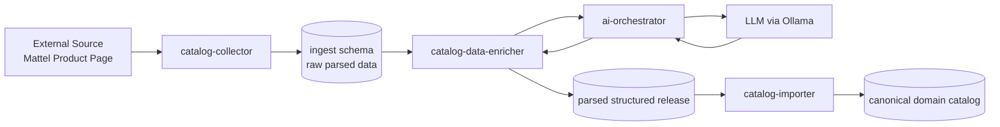

# From Raw Data to Structured Catalog

One of the most important questions about Monstrino's architecture is:

> Why is the ingestion pipeline so complex?

The answer is simple: **the input data is extremely messy, incomplete, and inconsistent.**
To build a reliable catalog, the system must transform this raw information into a structured canonical domain model.

This page shows a **real end-to-end example** of how the pipeline works — using a real product from the Mattel store.

---

## High Level Pipeline



---

## Step 1 — Raw Source Data

Product page:

https://shopping.mattel.com/en-gb/products/monster-high-skulltimate-secrets-gore-geous-oasis-jinafire-long-doll-jdr52-en-gb

From the HTML page we can extract only a few attributes:

- Title
- Description
- "What's in the box" text
- Images

This is **far from enough** to build a structured catalog entry.

We still have no idea about:

- which characters are included
- which series this belongs to
- pack type, content type, release tier
- gender target
- structured item list

---

## Step 2 — Hidden Structured Data (Shopify JSON)

Mattel stores run on Shopify. By appending `?view=json` to the URL we can access structured product data.

https://shopping.mattel.com/en-gb/products/monster-high-skulltimate-secrets-gore-geous-oasis-jinafire-long-doll-jdr52-en-gb?view=json

Example excerpt (shortened for clarity):

```json
{
  "product": {
    "productJson": {
      "id": 15212691947906,
      "title": "Monster High Skulltimate Secrets Gore-Geous Oasis Playset, Jinafire Long Doll And Accessories",
      "handle": "monster-high-skulltimate-secrets-gore-geous-oasis-jinafire-long-doll-jdr52-en-gb",
      "published_at": "2025-12-17T20:45:59+00:00",
      "vendor": "Monster High",
      "tags": [
        "Filter-Subtype: Fantasy",
        "Filter-Subtype: Skulltimate Secrets",
        "Filter-WebCategory: Dolls"
      ],
      "variants": [
        {
          "sku": "JDR52",
          "barcode": "0194735288892"
        }
      ]
    },
    "metaPayload": {
      "product_description": "Reveal a Monster High doll, unlock accessories...",
      "bullet_feature_2": "Inside the luggage case lurks a dragon and 19 surprises!",
      "bullet_feature_7": "Uncover even more mysteries with Draculaura and Lagoona Blue!",
      "whats_in_the_box": "Includes 1 Jinafire Long doll, 1 storage case, 3 keys, 2 suitcases, and assorted clothing and accessories"
    }
  }
}
```

This gives us more: `mpn` (SKU), `gtin` (barcode), `external_id` (handle), tags, and structured descriptions.

But the key attributes are still missing.

---

## Step 3 — catalog-collector

The **catalog-collector** service performs the first transformation.

It scrapes the page, retrieves the Shopify JSON, extracts available fields, and stores the result in the **ingest schema**.

Result stored in the database:

```python
ReleaseParsedContentRef(
    title="Monster High Skulltimate Secrets Gore-Geous Oasis Playset, Jinafire Long Doll And Accessories",
    external_id="monster-high-skulltimate-secrets-gore-geous-oasis-jinafire-long-doll-jdr52-en-gb",
    url="https://shopping.mattel.com/en-gb/product/...",

    # Metadata
    mpn="JDR52",
    subtype=["Fantasy", "Skulltimate Secrets"],
    language="en-GB",
    region="GB",
    gtin="0194735288892",

    # Content
    description="Reveal a Monster High doll, unlock accessories...",
    content_description="Includes 1 Jinafire Long doll, 1 storage case, 3 keys, 2 suitcases...",
    year=2025,
    content_type=["Doll"],

    # ---- Everything below is still unknown ----
    gender=None,         # unknown
    characters=None,     # unknown
    pets=None,           # unknown
    series=None,         # unknown
    pack_type=None,      # unknown
    tier_type=None,      # unknown
    exclusive_vendor=None,
    reissue_of=None,

    primary_image_url="https://shopping.mattel.com/cdn/shop/files/ab46c79b5...",
    images=["..."],
)
```

The ingest schema intentionally stores incomplete data. That is its purpose.

---

## Why Rule-Based Parsing Fails

The missing fields cannot be reliably extracted with a rule-based parser.

Consider these real description variants from different releases:

**Example A:**

> Includes Jinafire Long doll and accessories

**Example B:**

> Draculaura joins Clawdeen Wolf and Frankie Stein

**Example C:**

> Uncover even more mysteries with Draculaura and Lagoona Blue!

**Example D:**

> Features characters from the Monster High universe

A regex or keyword-matching parser would:

- in Example A: correctly extract `Jinafire Long`
- in Example B: extract three names — but are all of them in this product, or just mentioned?
- in Example C: extract `Draculaura` and `Lagoona Blue` as included characters — but in this product they appear only in a teaser bullet, not as included dolls
- in Example D: return nothing, or extract random nouns

The same logic that works for one release **silently fails** on another.

**Therefore AI enrichment is required.**

---

## Step 4 — catalog-data-enricher

The **catalog-data-enricher** service analyzes each parsed release and attempts to fill missing attributes.

First, it checks whether this release already exists in the catalog:

```json
{
  "query": {
    "filters": { "mpn": "JDR52" },
    "page": { "limit": 10, "offset": 0 },
    "include": { "id": true, "mpn": true }
  },
  "context": { "locale": "en" }
}
```

Then it iterates over each empty attribute. For every `None` field — `characters`, `gender`, `series`,
`pack_type`, etc. — it sends an enrichment request to `ai-orchestrator` via `AIOrchestratorApiClient`.

After all requests are dispatched, the release is set to `waiting-for-enrichment`.
When `ai-orchestrator` finishes a scenario, it calls back `catalog-data-enricher` with the result.
Once all fields are resolved, the release state moves to `ready-for-import`.

---

## Step 5 — AI Orchestration

Each enrichment request targets a specific scenario.

Example request for character extraction:

```json
{
  "scenario_name": "enrich-release-characters",
  "payload": {
    "mpn": "JDR52",
    "title": "Monster High Skulltimate Secrets Gore-Geous Oasis Playset...",
    "description": "Reveal a Monster High doll, unlock accessories...",
    "content_description": "Includes 1 Jinafire Long doll, 1 storage case..."
  }
}
```

Inside `ai-orchestrator`, a Job wires the correct Use Case and AI client, then executes the scenario.

---

## Multi-Step AI Response

The model does not always return a final answer immediately.

If the model detects potential characters but needs to verify them against known catalog data,
it returns a **command** instead of a result:

```json
{
  "status": "request_action",
  "is_final": false,
  "requested_action": {
    "command_name": "get_more_info_about_characters",
    "command_params": {
      "character_names": ["Draculaura", "Clawdeen Wolf", "Jinafire Long"]
    }
  },
  "metadata": {
    "reasoning_stage": "character_lookup_requested"
  }
}
```

The Use Case intercepts this command, calls `catalog-api-service` to fetch character data,
and continues the conversation with the model — injecting the additional context.

Once the model has enough information, it returns the final structured result:

```json
{
  "status": "final",
  "is_final": true,
  "final_payload": {
    "data": {
      "characters": [
        { "name": "Jinafire Long", "slug": "jinafire-long" }
      ],
      "matched_characters_count": 1,
      "confidence": 0.96
    }
  },
  "metadata": {
    "reasoning_stage": "completed"
  }
}
```

The model correctly identified that only Jinafire Long is the included character —
the others appeared in marketing copy, not in the product itself.

:::info
The AI model **cannot call services directly**. It returns structured commands. The Use Case
decides whether a command is valid, which service to call, and how to incorporate the response.
AI remains a reasoning component, not an autonomous actor.
:::

---

## Step 6 — Enriched Parsed Release

After all enrichment scenarios complete, the parsed release looks like this:

```python
ParsedRelease(
    title="Monster High Skulltimate Secrets Gore-Geous Oasis Playset, Jinafire Long Doll And Accessories",
    mpn="JDR52",
    gtin="0194735288892",
    year=2025,
    year_raw="2025-12-17",

    # ---- Filled by AI enrichment ----
    characters_raw=["Jinafire Long"],
    gender_raw="ghoul",
    series_raw=[
        "Skulltimate Secrets",
        "Destination: Gore-geous Oasis",
    ],
    content_type_raw=["doll-figure", "playset"],
    pack_type_raw=["1-pack"],
    tier_type_raw=["standard"],
    release_items=[
        {"title": "storage case", "category": "item"},
        {"title": "key_1",        "category": "item"},
        {"title": "suitcase",     "category": "clothes"},
    ],

    description_raw="Reveal a Monster High doll, unlock accessories...",
    content_description="Includes 1 Jinafire Long doll, 1 storage case...",

    external_id="monster-high-skulltimate-secrets-gore-geous-oasis-jinafire-long-doll-jdr52-en-gb",
    url="https://shopping.mattel.com/en-gb/product/...",
    primary_image="https://shopping.mattel.com/cdn/shop/files/ab46c79b5...",
    images=["...", "...", "...", "...", "...", "..."],
)
```

All previously empty attributes are now filled.

---

## Step 7 — catalog-importer

The **catalog-importer** reads every `ParsedRelease` with state `ready-for-import` and converts it
into canonical domain entities.

For each release, the importer runs a set of **resolver services** that translate raw string values
into normalized domain objects:

| Resolver | Input | Output |
|---|---|---|
| `CharacterResolver` | `characters_raw=["Jinafire Long"]` | `Character` entity (created or matched) |
| `SeriesResolver` | `series_raw=[...]` | `Series` entities |
| `GenderResolver` | `gender_raw="ghoul"` | `GenderType.GHOUL` |
| `ContentTypeResolver` | `content_type_raw=[...]` | `ReleaseContentType` records |
| `PackTypeResolver` | `pack_type_raw=[...]` | `ReleasePackType` records |
| `TierTypeResolver` | `tier_type_raw=[...]` | `TierType.STANDARD` |
| `ReleaseItemResolver` | `release_items=[...]` | `ReleaseItem` records |

Each resolver either finds an existing entity by normalized name or creates a new one.
All operations run inside a single `UnitOfWork` transaction.

---

## Final Result — Canonical Catalog Entry

After the importer completes, the canonical domain record looks like this:

```python
Release(
    mpn="JDR52",
    gtin="0194735288892",
    title="Monster High Skulltimate Secrets Gore-Geous Oasis Playset",
    year=2025,
    gender=GenderType.GHOUL,
    tier=TierType.STANDARD,

    # Resolved relationships
    characters=[
        Character(name="Jinafire Long", slug="jinafire-long"),
    ],
    series=[
        Series(name="Skulltimate Secrets",           slug="skulltimate-secrets"),
        Series(name="Destination: Gore-geous Oasis", slug="destination-gore-geous-oasis"),
    ],
    release_types=[
        ReleaseType(slug="doll-figure"),
        ReleaseType(slug="playset"),
    ],
    pack_types=[
        PackType(slug="1-pack"),
    ],
    items=[
        ReleaseItem(title="storage case", category="item"),
        ReleaseItem(title="key_1",        category="item"),
        ReleaseItem(title="suitcase",     category="clothes"),
    ],
    media=ReleaseMedia(
        primary_image=MediaAsset(
            original_url="https://shopping.mattel.com/cdn/shop/files/ab46c79b5...",
            hosted_url="https://media.monstrino.com/assets/image/sha256/ab/46/ab46c79b5...jpg",
        ),
    ),
)
```

This is a fully normalized, queryable, relational catalog entry — created without a single line of
manual input.

---

## Before vs After

| Stage | Data Available |
|---|---|
| Raw HTML | `title`, `description`, images |
| Shopify JSON | + `mpn=JDR52`, `gtin=0194735288892`, tags |
| After catalog-collector | + normalized metadata, stored in ingest schema |
| After AI enrichment | + `characters`, `series`, `gender`, `pack_type`, `content_type`, `tier`, `items` |
| After catalog-importer | Fully structured canonical `Release` with resolved entity relationships |

This transformation allows the system to convert **thousands of inconsistent product pages** into a
reliable, structured, queryable catalog — automatically.
