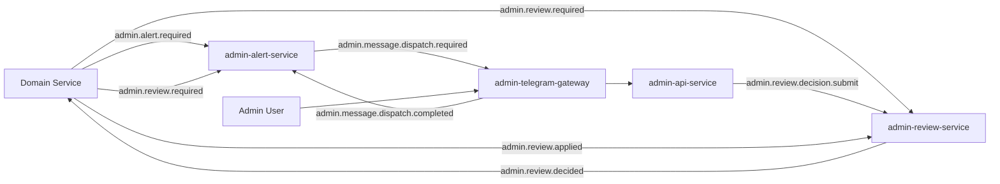

# Admin Services Overview

The admin domain is split into two independent workflows:

- alert workflow (notification and delivery tracking)
- review workflow (manual decision lifecycle and feedback confirmation)

These workflows share events, but keep state ownership separated.

---

## Service Map

| Service | Primary role |
| --- | --- |
| `admin-alert-service` | materializes alert events and tracks delivery lifecycle |
| `admin-review-service` | stores review cases, captures decisions, dispatches final outcome |
| `admin-api-service` | unified admin-facing API for reads and admin actions |
| `admin-telegram-gateway` | Telegram transport adapter for outbound and interaction flows |

---

## High-Level Flow

---

## Ownership Boundaries

- `admin-alert-service` owns alert tables and delivery confirmation handling
- `admin-review-service` owns review tables and decision dispatch lifecycle
- `admin-api-service` is the admin interaction boundary; it reads admin domain
  models and submits commands
- `admin-telegram-gateway` is transport-only and does not own admin domain
  persistence

---

## Design Principles

1. notification state and decision state are modeled separately
2. final review decisions are event-driven and confirmed by feedback events
3. delivery tracking is explicit and retry-safe
4. external admin transport must not bypass domain validation rules

---

## Related Service Pages

- [Admin Alert Service](./admin-alert-service.md)
- [Admin Review Service](./admin-review-service.md)
- [Admin API Service](./admin-api-service.md)
- [Admin Telegram Gateway](./admin-telegram-gateway.md)
- [Admin Pipelines Overview](../../pipelines/admin-pipelines/overview.md)
