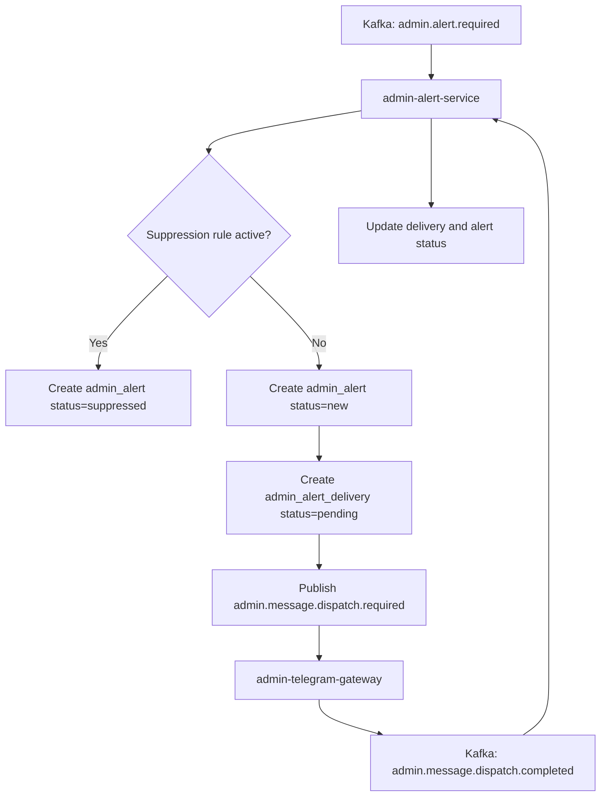

# Admin Alert Service

`admin-alert-service` is the alert branch owner in the admin domain.
It consumes alert-worthy events, persists alert records, initiates channel
dispatch, and updates delivery/alert state from gateway feedback events.

The service is intentionally separate from manual review decision handling.

---

## Responsibilities

The service:

- consumes `admin.alert.required`
- checks suppression rules before dispatch
- creates `admin_alert` records
- creates `admin_alert_delivery` rows
- publishes `admin.message.dispatch.required` for channel gateways
- consumes `admin.message.dispatch.completed`
- updates delivery and alert status
- enforces severity lifecycle expectations (`info`/`warning` vs
  `error`/`critical`)
- supports semantic deduplication via `dedup_key`

The service does not:

- store review options or review decisions
- apply domain changes in source services
- parse Telegram replies as review commands

---

## Event Contracts

| Direction | Topic | Purpose |
| --- | --- | --- |
| In | `admin.alert.required` | create/suppress alert and prepare delivery |
| Out | `admin.message.dispatch.required` | request channel dispatch |
| In | `admin.message.dispatch.completed` | confirm delivery and finalize delivery state |

---

## Processing Flow



---

## Data Ownership

Primary tables owned by the service:

- `admin_alert`
- `admin_alert_delivery`
- `admin_alert_suppression_rule`

Key lifecycle statuses for `admin_alert`:

- `new`, `sent`, `acknowledged`, `resolved`, `suppressed`, `failed`

Key lifecycle statuses for `admin_alert_delivery`:

- `pending`, `sent`, `failed`

---

## Severity Rules

- `info`, `warning`: close operational flow after confirmed delivery
- `error`, `critical`: remain open after delivery until explicit admin
  acknowledge/resolve actions via `admin-api-service`

Open incident query concept:

```sql
SELECT * FROM admin_alert
WHERE severity IN ('error', 'critical')
  AND status = 'sent'
  AND acknowledged_at IS NULL;
```

---

## Boundaries

- Domain: **admin**
- Communication: Kafka event-driven
- Write ownership: alert tables and delivery state updates
- Read sharing: `admin-api-service` may read alert tables for admin-facing DTOs
- Gateway rule: `admin-telegram-gateway` must not write alert state directly

---

## Related Services

| Service | Relationship |
| --- | --- |
| `admin-telegram-gateway` | executes dispatch and sends completion events |
| `admin-api-service` | exposes alert read/acknowledge/resolve operations |
| `admin-review-service` | may trigger reminder alerts through alert pipeline |
