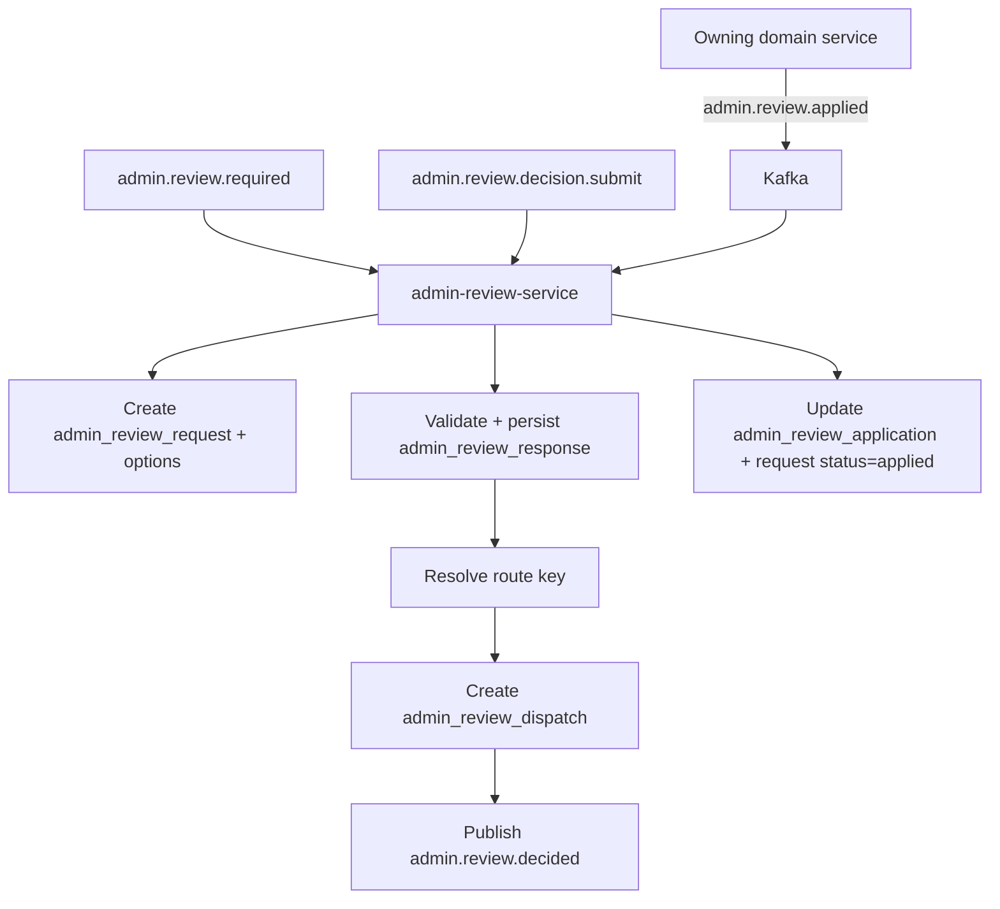

# Admin Review Service

`admin-review-service` owns the review workflow in the admin domain.
It handles ambiguous cases that require a human decision and sends the final
decision back to the requesting domain through Kafka.

This service is separate from notification delivery concerns.

---

## Responsibilities

The service:

- consumes `admin.review.required`
- creates `admin_review_request` and `admin_review_option`
- consumes `admin.review.decision.submit`
- validates decision command and persists `admin_review_response`
- resolves route key to target topic via runtime config
- creates `admin_review_dispatch` and publishes `admin.review.decided`
- consumes `admin.review.applied` feedback from owning services
- updates application/overall review status to `applied`
- runs scheduled reminder and expiration logic

The service does not:

- mutate source domain tables directly
- own generic alert delivery
- allow external transport layers to bypass validation

---

## Event Contracts

| Direction | Topic | Purpose |
| --- | --- | --- |
| In | `admin.review.required` | register review case and options |
| In | `admin.review.decision.submit` | accept async admin decision command |
| Out | `admin.review.decided` | publish validated final decision |
| In | `admin.review.applied` | receive apply confirmation from owning domain |
| Out (scheduler) | `admin.alert.required` | reminder alerts for stale open reviews |

---

## Processing Flow

---

## Data Ownership

Primary tables owned by the service:

- `admin_review_request`
- `admin_review_option`
- `admin_review_response`
- `admin_review_dispatch`
- `admin_review_application`

Review lifecycle statuses:

- `open`, `answered`, `published`, `applied`, `cancelled`, `expired`

Dispatch lifecycle statuses:

- `pending`, `published`, `failed`

Application lifecycle statuses:

- `pending`, `applied`, `failed`

---

## Idempotency and Validation Rules

- request creation dedup: `source_event_id`
- decision command dedup: `command_id`
- accept decisions only when request status is `open`
- selected option must exist for the request
- dispatch retries must not recreate response rows

---

## Scheduler Responsibilities

- expiration of overdue open reviews (`expires_at`)
- reminder emission for unanswered reviews by `reminder_interval_days`
- reminder event shape reused through alert pipeline with
  `alert_type = review_reminder`

---

## Boundaries

- Domain: **admin**
- Communication: Kafka event-driven + scheduler-driven reminders
- Write ownership: all review tables
- API rule: `admin-api-service` publishes commands instead of direct writes
- Gateway rule: `admin-telegram-gateway` should talk to `admin-api-service`,
  not directly to this service

---

## Related Services

| Service | Relationship |
| --- | --- |
| `admin-api-service` | submits decision/cancel actions as validated workflow inputs |
| `admin-alert-service` | notifies admin and receives reminders |
| owning domain services | consume `admin.review.decided` and publish `admin.review.applied` |
