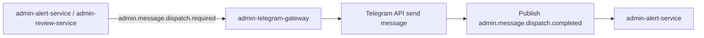
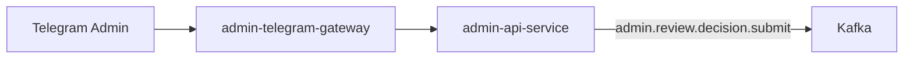

# Admin Telegram Gateway

`admin-telegram-gateway` is a transport adapter between admin-domain workflows
and Telegram. It is responsible for message delivery and transport-level user
interaction handling, not for owning admin domain state.

---

## Responsibilities

The service:

- consumes `admin.message.dispatch.required`
- sends outbound messages to Telegram admins
- publishes delivery confirmation as `admin.message.dispatch.completed`
- forwards admin interaction flows to `admin-api-service`
  (for review list/read and decision submission paths)

The service does not:

- write alert tables directly
- write review tables directly
- publish final review decision events (`admin.review.decided`)

---

## Event Contracts

| Direction | Topic | Purpose |
| --- | --- | --- |
| In | `admin.message.dispatch.required` | send outbound alert/review notification message |
| Out | `admin.message.dispatch.completed` | confirm external delivery to alert domain |

---

## Processing Flow

For review decisions, gateway interaction path is:

---

## Delivery Semantics

- Delivery tracking is confirmed asynchronously by feedback event
- Gateway success updates are consumed by `admin-alert-service`
- Transport failure must not delete or mutate source alert records

---

## Boundaries

- Domain role: **communication adapter**, not domain owner
- Primary protocol: Telegram API + Kafka
- Data ownership: none for admin alert/review core tables
- Integration rule: interacts with review workflows through
  `admin-api-service`, not direct DB access

---

## Related Services

| Service | Relationship |
| --- | --- |
| `admin-alert-service` | sends dispatch requests and consumes delivery confirmations |
| `admin-review-service` | indirectly supported via notifications/reminders |
| `admin-api-service` | receives gateway-driven admin actions in a controlled API flow |
