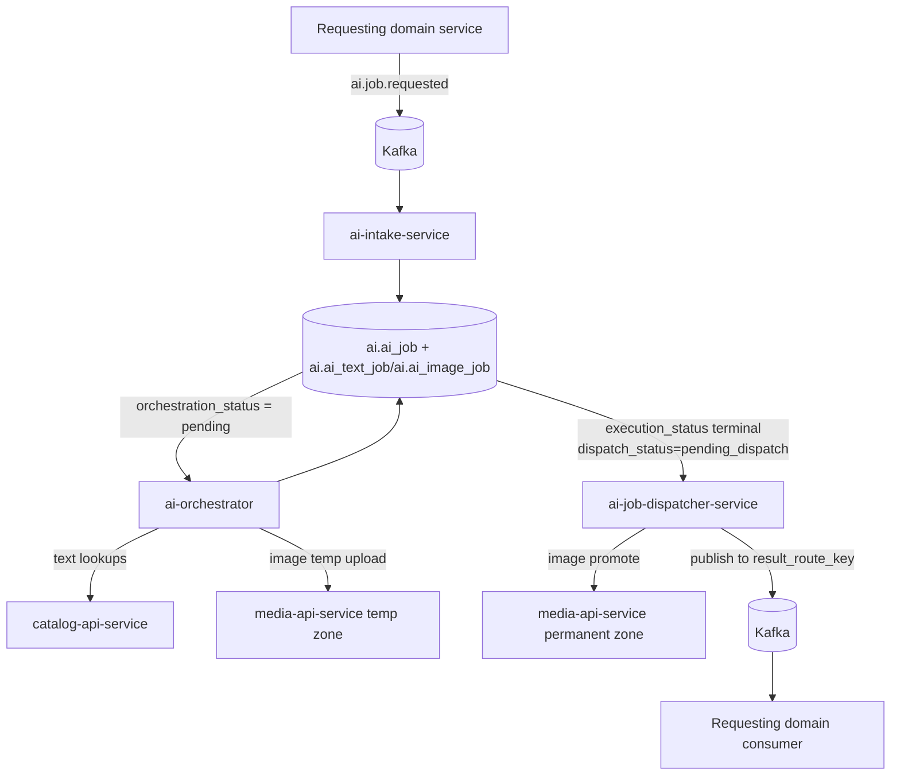

# AI Services Overview

The AI domain executes internal AI jobs in three isolated phases:
intake, orchestration, and dispatch.

Each phase is owned by a dedicated service and coordinated through AI-domain
tables in the `ai` schema plus Kafka topics at the domain boundary.

---

## Service Map

| Service | Primary role |
| --- | --- |
| `ai-intake-service` | consumes `ai.job.requested`, validates and deduplicates requests, creates `ai_job` + modality rows |
| `ai-orchestrator` | claims pending modality jobs, runs scenario-based reasoning loops, stores normalized results |
| `ai-job-dispatcher-service` | claims terminal jobs, promotes image temp assets, publishes result to `result_route_key` |

---

## High-Level Flow

---

## Ownership Boundaries

- `ai-intake-service` is the only Kafka consumer for external AI requests
- `ai-orchestrator` is the only service that executes scenarios and calls models
- `ai-job-dispatcher-service` is the only service that publishes AI results back
  to requesting domains
- orchestrator and dispatcher claim work from DB via
  `SELECT FOR UPDATE SKIP LOCKED`
- requesting domains do not write internal AI tables directly

---

## Design Principles

1. strict phase isolation: intake -> execution -> dispatch
2. state-machine activation via modality rows (`orchestration_status`)
3. event-level dedup at intake by Kafka `event_id`
4. orchestrator actions are allowlisted and bounded by execution limits
5. outbound routing is dynamic via `ai_job.result_route_key`

---

## Related Service Pages

- [AI Intake Service](./ai-intake-service.md)
- [AI Orchestrator](./ai-orchestrator.md)
- [AI Job Dispatcher Service](./ai-job-dispatcher.md)
- [AI Pipelines Overview](../../pipelines/ai-pipelines/overview.md)
