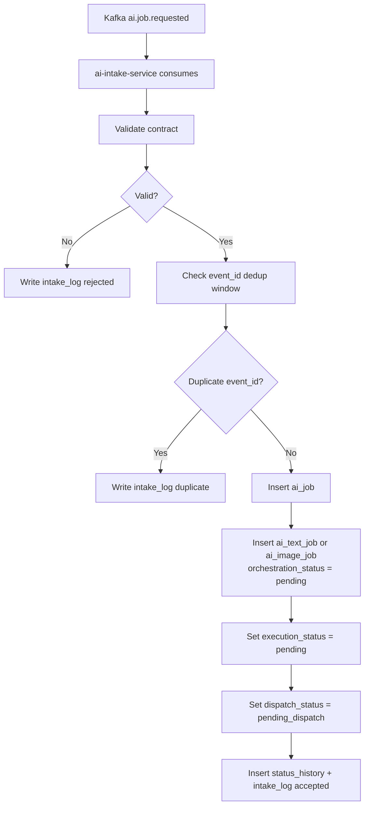

# AI Intake Service

`ai-intake-service` is the controlled entry boundary into the AI domain.
It receives `ai.job.requested` events, validates request contracts, performs
Kafka-redelivery deduplication, and materializes internal job rows.

---

## Responsibilities

The service:

- consumes `ai.job.requested` from Kafka
- validates schema, route metadata, caller identity, and payload shape
- deduplicates by `event_id` within a rolling time window
- creates `ai_job` rows and initializes lifecycle status axes
- creates one modality row per job (`ai_text_job` or `ai_image_job`) with
  `orchestration_status = pending`
- writes intake audit rows (`ai_job_intake_log`)
- records initial status transitions in `ai_job_status_history`

The service does not:

- execute AI scenarios
- call models or external lookup actions
- publish completed results to requesting domains

---

## Intake Lifecycle

---

## Request Validation and Deduplication

- intake checks `job_type`, `source_service`, `source_request_id`,
  `result_route_key`, and modality payload
- caller identity must be in an allowlist configured in intake service
- deduplication key is Kafka envelope `event_id`
- `source_request_id` is for traceability, not deduplication
- same `source_request_id` with a new `event_id` creates a new `ai_job`

---

## Data Written by Intake

All writes happen in one transaction:

1. insert `ai.ai_job`
2. insert exactly one modality row (`ai.ai_text_job` or `ai.ai_image_job`)
3. insert `ai.ai_job_intake_log`
4. insert `ai.ai_job_status_history` rows for initialized statuses

If transaction fails, message is not acknowledged and Kafka redelivery handles
retry.

---

## Boundaries

- domain role: AI request intake and internal job materialization
- communication:
  - asynchronous in: Kafka (`ai.job.requested`)
  - persistence: AI schema (`ai.*`)
- ownership ends after job creation; execution/dispatch are downstream phases

---

## Related Services

| Service | Relationship |
| --- | --- |
| `catalog-data-enricher` and other domain callers | publish `ai.job.requested` consumed by intake |
| `ai-orchestrator` | discovers created modality rows via `orchestration_status = pending` |
| `ai-job-dispatcher-service` | dispatches final outcomes after orchestrator finishes |
