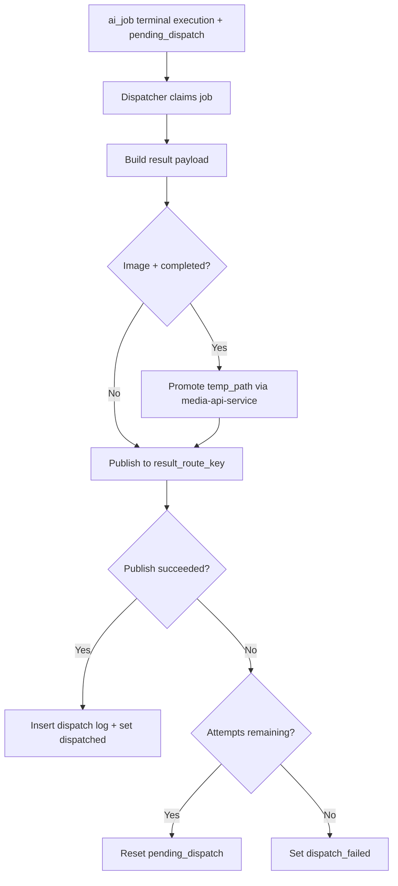

# AI Job Dispatcher Service

`ai-job-dispatcher-service` is the outbound boundary of the AI domain.
It picks up terminal jobs, builds result contracts, publishes to the dynamic
Kafka target (`result_route_key`), and finalizes dispatch state.

For completed image jobs it also promotes temporary media assets to permanent
storage before publishing.

---

## Responsibilities

The service:

- claims eligible jobs with `SELECT FOR UPDATE SKIP LOCKED`
- handles terminal execution outcomes: `completed`, `no_result`, `failed`
- resolves outbound topic from `ai_job.result_route_key`
- builds outbound event payloads per modality and outcome
- publishes via infrastructure `kafka-publisher`
- inserts dispatch attempt logs (`ai_job_dispatch`)
- updates `dispatch_status`, `dispatched_at`, and `finished_at`
- retries dispatch failures up to configured attempt limit

The service does not:

- create AI jobs from incoming domain requests
- execute models or orchestrate AI reasoning
- mutate requesting-domain business entities directly

---

## Dispatch Lifecycle

---

## Route Resolution

- dispatcher does not keep a static routing table
- `ai_job.result_route_key` is treated as the Kafka topic name
- requesting domain sets this value during intake request
- dispatcher publishes to that topic as-is

This keeps outbound routing ownership with the requesting domain.

---

## Image Asset Promotion

For `job_type = image` and `execution_status = completed`:

1. read `temp_path` from `ai_image_job.result_asset_payload_json`
2. call `media-api-service` promote endpoint
3. receive permanent `storage_key`
4. include `storage_key` in outbound result payload

If promotion fails, dispatch attempt is marked failed and retried by dispatcher
policy.

---

## Boundaries

- domain role: outbound result dispatcher for AI domain
- communication:
  - synchronous out: `media-api-service` for image promotion
  - asynchronous out: Kafka publish to `result_route_key`
  - persistence: `ai_job`, `ai_job_dispatch`, `ai_job_status_history`
- no ownership over orchestration state machine

---

## Related Services

| Service | Relationship |
| --- | --- |
| `ai-intake-service` | initializes `dispatch_status = pending_dispatch` |
| `ai-orchestrator` | produces terminal execution outcomes consumed by dispatcher |
| `media-api-service` | image promotion dependency (`temp_path` -> `storage_key`) |
| requesting domain consumers | consume outbound AI results from `result_route_key` |
