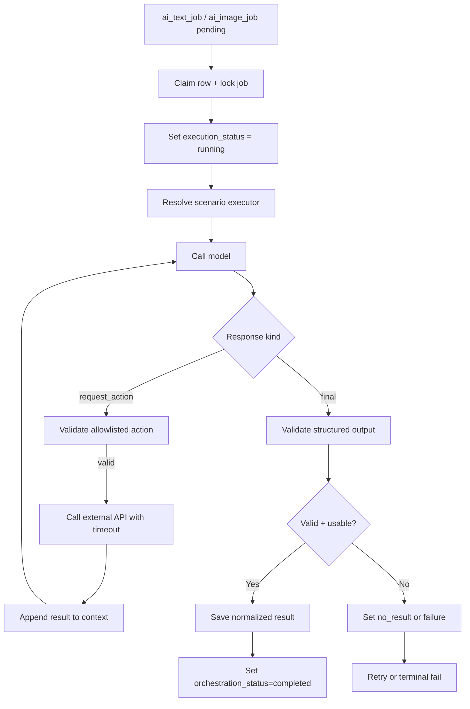

# AI Orchestrator

`ai-orchestrator` is the AI execution engine.
It processes internal jobs created by `ai-intake-service`, runs scenario logic
against local models, optionally performs allowlisted external lookups, and
stores terminal execution results in AI-domain tables.

---

## Responsibilities

The service:

- discovers work by `orchestration_status = pending` on modality tables
- claims jobs with `SELECT FOR UPDATE SKIP LOCKED`
- transitions execution lifecycle (`pending` -> `running` -> terminal state)
- resolves scenario executor and model policy
- runs bounded multi-step reasoning loops
- validates model commands and output contracts
- executes allowlisted actions to external APIs
- persists normalized result payloads and failure metadata
- handles retry/backoff and stale-lock recovery

The service does not:

- consume external request topics
- publish results to requesting domains
- write business data in requesting domains

---

## Execution Flow

---

## Allowlisted External Actions

| Target service | Purpose |
| --- | --- |
| `catalog-api-service` | read-only catalog lookups for text scenarios |
| `media-api-service` | save generated image bytes to temp zone and receive `temp_path` |

The orchestrator validates every action against allowlisted commands before
execution. The model never calls services directly.

---

## Retry and Failure Model

- retryable failures: `model_error`, `action_timeout`, `execution_timeout`
- structural terminal failures: `invalid_model_output`, `action_not_allowed`,
  `max_steps_exceeded`
- fixed backoff for retry scheduling (documented as 60s in AI pipeline docs)
- stale lock recovery resets stuck `picked_up`/`running` jobs back to pending

---

## Boundaries

- domain role: AI scenario execution runtime
- communication:
  - synchronous out: allowlisted API calls (`catalog-api-service`,
    `media-api-service`)
  - persistence: updates `ai_job` and modality rows in `ai` schema
- does not own outbound Kafka publishing

---

## Related Services

| Service | Relationship |
| --- | --- |
| `ai-intake-service` | supplies pending modality jobs for execution |
| `ai-job-dispatcher-service` | consumes terminal execution outcomes for outbound delivery |
| `catalog-api-service` | lookup dependency for text reasoning |
| `media-api-service` | temp image upload target for image generation flows |
