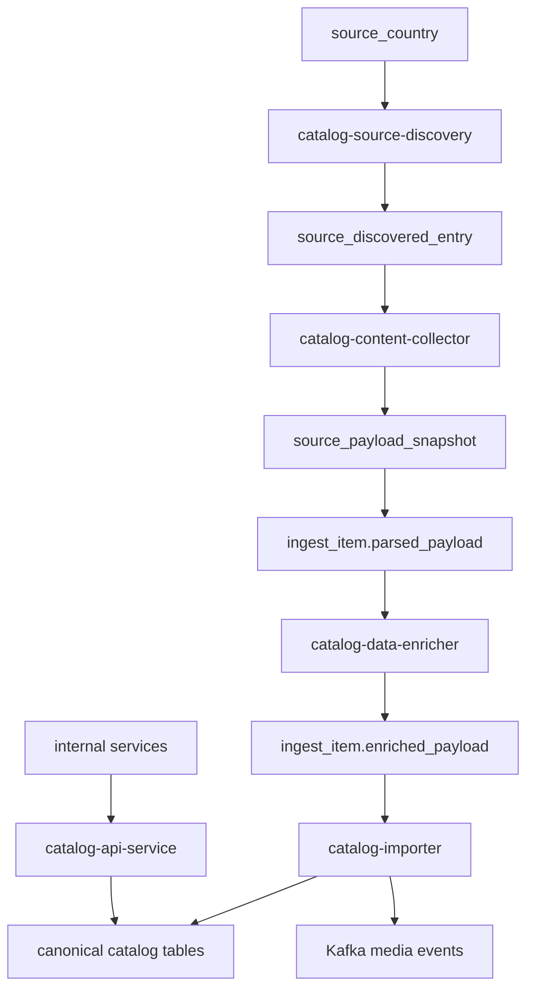

# Catalog Services Overview

The catalog domain combines ingestion-stage processing services with a dedicated
read API.

End-to-end flow:

1. discover candidate entries from country-specific sources
2. fetch payloads and create ingest work units
3. enrich parsed attributes (scripts first, AI fallback)
4. import enriched items into canonical catalog entities
5. expose normalized catalog data through read-only API endpoints

---

## Service Map

| Service | Primary role |
| --- | --- |
| `catalog-source-discovery` | scans source surfaces and creates `source_discovered_entry` records |
| `catalog-content-collector` | claims eligible entries, fetches payloads, creates `ingest_item` work units |
| `catalog-data-enricher` | enriches parsed attributes and writes `ingest_item.enriched_payload` |
| `catalog-importer` | synchronizes canonical catalog entities and emits media events |
| `catalog-api-service` | read-only catalog query interface for internal services |

---

## High-Level Flow

---

## Ownership Boundaries

- ingestion lifecycle objects are processed through explicit pipeline stages
- `catalog-importer` is the authoritative write boundary into canonical catalog
  tables
- `catalog-api-service` is read-only and acts as cross-domain catalog entrypoint
- other domains (media/market/review) must use `catalog-api-service` for catalog
  lookups instead of direct foreign-domain reads

---

## Design Principles

1. explicit lifecycle objects (`source_discovered_entry`, `source_payload_snapshot`,
   `ingest_item`, `ingest_item_step`) instead of implicit queues
2. scripts-first enrichment with AI fallback through Kafka events
3. deterministic import identity resolution by `MPN`
4. canonical writes and read APIs are separated
5. downstream media processing is triggered asynchronously by importer events

---

## Related Service Pages

- [Catalog Source Discovery](./catalog-source-discovery.md)
- [Catalog Content Collector](./catalog-content-collector.md)
- [Catalog Data Enricher](./catalog-data-enricher.md)
- [Catalog Importer](./catalog-importer.md)
- [Catalog API Service](./catalog-api-service.md)
- [Catalog Ingest Overview](../../pipelines/data-ingestion/catalog-ingest/overview.md)
