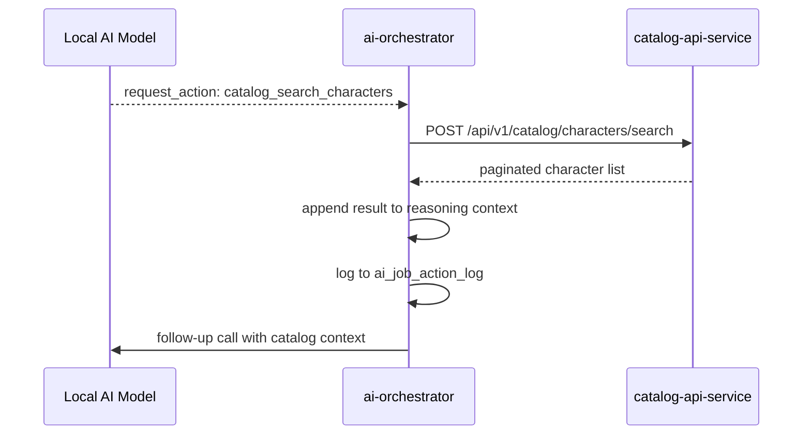

# Catalog API Service

`catalog-api-service` is the read-only query interface for the catalog domain.
It provides structured search and lookup access to catalog entities for any
internal service that needs authoritative catalog data.

The service exposes no write operations. It reads from the `catalog` schema
and returns data through a consistent response envelope used across the
platform.

---

## Responsibilities

The service:

- accepts structured search queries with filters, pagination, and locale context
- returns paginated lists of catalog entities
- provides lookup endpoints for reference data (release types, relationship types)
- enforces the platform response envelope on all responses
- propagates `correlation_id` and `request_id` for tracing

The service does not:

- write or modify catalog data
- perform AI reasoning or enrichment
- expose data directly to end users (that is handled by the public API layer)

---

## Standard Response Envelope

All responses follow the platform-wide envelope format:

```json
{
  "status": "success",
  "request_id": "req_be60f3718556",
  "correlation_id": "req_be60f3718556",
  "trace_id": null,
  "data": {
    "items": [],
    "total": 0,
    "page": 1,
    "page_size": 10
  },
  "error": null,
  "meta": {
    "service": "catalog-api-service",
    "version": "v1",
    "timestamp": "2026-03-15T12:28:42.208144Z"
  }
}
```

`data` content is route-specific. All other envelope fields are standard
across the platform.

On error:

```json
{
  "status": "error",
  "request_id": "req_be60f3718556",
  "correlation_id": "req_be60f3718556",
  "data": null,
  "error": {
    "code": "VALIDATION_ERROR",
    "message": "Invalid filter value for year_from"
  },
  "meta": { ... }
}
```

---

## Standard Query Request Envelope

All search routes accept the same outer request structure:

```json
{
  "query": {
    "filters": {},
    "page": { "limit": 10, "offset": 0 }
  },
  "context": { "locale": "en" }
}
```

| Field | Type | Description |
| --- | --- | --- |
| `query.filters` | object | Route-specific filter object |
| `query.page.limit` | int | Max items to return (default 10, max 100) |
| `query.page.offset` | int | Pagination offset (default 0) |
| `context.locale` | string | Locale for localised fields (default `en`) |

---

## Routes

### Releases

#### Search releases

```
POST /api/v1/catalog/releases/search
```

Returns a paginated list of releases matching the given filters.

**Filter model — `ReleaseSearchFilters`:**

| Field | Type | Description |
| --- | --- | --- |
| `release_ids` | `list[str]` | Filter by specific release UUIDs |
| `search` | `str` | Full-text search on release name and description |
| `series_ids` | `list[str]` | Filter by series UUIDs |
| `character_ids` | `list[str]` | Filter releases that include these characters |
| `year_from` | `int` | Released on or after this year |
| `year_to` | `int` | Released on or before this year |
| `release_type_ids` | `list[str]` | Filter by release type UUIDs |
| `exclusive_ids` | `list[str]` | Filter by retailer exclusivity UUIDs |
| `has_images` | `bool` | Only return releases that have images |
| `is_reissue` | `bool` | Filter original releases or reissues only |
| `mpn` | `str` | Filter by manufacturer part number |

**Example request:**

```json
{
  "query": {
    "filters": {
      "search": "Gloom and Bloom",
      "year_from": 2012,
      "year_to": 2016,
      "is_reissue": false
    },
    "page": { "limit": 5, "offset": 0 }
  },
  "context": { "locale": "en" }
}
```

**Example response `data`:**

```json
{
  "items": [
    {
      "id": "uuid",
      "name": "Gloom and Bloom",
      "release_type": { "id": "uuid", "name": "Single" },
      "series": { "id": "uuid", "name": "Core Line" },
      "year": 2013,
      "is_reissue": false,
      "mpn": "Y7692"
    }
  ],
  "total": 1,
  "page": 1,
  "page_size": 5
}
```

---

### Characters

#### Search characters

```
POST /api/v1/catalog/characters/search
```

Returns a paginated list of characters matching the given filters.

**Filter model — `CharacterSearchFilters`:**

| Field | Type | Description |
| --- | --- | --- |
| `character_ids` | `list[str]` | Filter by specific character UUIDs |
| `search` | `str` | Full-text search on character name |
| `series_ids` | `list[str]` | Filter characters that appear in these series |
| `release_ids` | `list[str]` | Filter characters appearing in these releases |

**Example request:**

```json
{
  "query": {
    "filters": { "search": "Draculaura" },
    "page": { "limit": 5, "offset": 0 }
  },
  "context": { "locale": "en" }
}
```

**Example response `data`:**

```json
{
  "items": [
    {
      "id": "uuid",
      "name": "Draculaura",
      "slug": "draculaura",
      "series": { "id": "uuid", "name": "Monster High" }
    }
  ],
  "total": 1,
  "page": 1,
  "page_size": 5
}
```

---

### Pets

#### Search pets

```
POST /api/v1/catalog/pets/search
```

Returns a paginated list of pets matching the given filters. Used by the
orchestrator to determine whether a pet from raw input is unique or already
exists in the catalog.

**Filter model — `PetSearchFilters`:**

| Field | Type | Description |
| --- | --- | --- |
| `pet_ids` | `list[str]` | Filter by specific pet UUIDs |
| `search` | `str` | Full-text search on pet name |
| `character_ids` | `list[str]` | Filter pets belonging to these characters |
| `release_ids` | `list[str]` | Filter pets appearing in these releases |

**Example request:**

```json
{
  "query": {
    "filters": { "search": "Count Fabulous" },
    "page": { "limit": 5, "offset": 0 }
  },
  "context": { "locale": "en" }
}
```

---

### Reference Data

Reference data routes return complete lists without pagination.
These are used by the orchestrator to validate or select values
for `release_type`, relationship labels, and similar constrained fields.

#### Get release types

```
GET /api/v1/catalog/release-types
```

**Example response `data`:**

```json
{
  "items": [
    { "id": "uuid", "name": "Single" },
    { "id": "uuid", "name": "2-Pack" },
    { "id": "uuid", "name": "Playset" },
    { "id": "uuid", "name": "Collector Edition" }
  ]
}
```

#### Get release relationship types

```
GET /api/v1/catalog/release-relationship-types
```

Describes the valid relationship labels between releases — for example
whether the current release is a reissue, a bundle variant, or a
region-specific edition of an existing release.

**Example response `data`:**

```json
{
  "items": [
    { "id": "uuid", "name": "reissue_of" },
    { "id": "uuid", "name": "variant_of" },
    { "id": "uuid", "name": "bundle_includes" },
    { "id": "uuid", "name": "region_edition_of" }
  ]
}
```

---

## How It Fits With AI Orchestrator

The orchestrator calls `catalog-api-service` as an allowlisted action during
text scenario reasoning loops. The model requests a lookup when it needs
catalog context that was not present in the original job payload.



The orchestrator never writes to `catalog-api-service`. Every call is a
read-only query. The action is logged in `ai_job_action_log` with the full
request and response payloads for auditability.

### Typical lookup patterns used by the orchestrator

| Scenario | Action | Purpose |
| --- | --- | --- |
| Character resolution | `catalog_search_characters` | Confirm canonical name and slug |
| Pet resolution | `catalog_search_pets` | Determine uniqueness |
| Reissue detection | `catalog_search_releases` with `is_reissue: false` | Find the original release |
| Release type assignment | `GET release-types` | Select the correct type from constrained list |
| Relationship labeling | `GET release-relationship-types` | Select valid relationship label |

---

## Error Handling

| Scenario | Behavior |
| --- | --- |
| Invalid filter value | `400 Bad Request` with `VALIDATION_ERROR` |
| Unknown route | `404 Not Found` |
| Service unavailable | `503 Service Unavailable` — orchestrator treats as `action_timeout` |
| Empty result | `200 OK` with `items: []` — valid, model handles no-match case |

---

## Ownership Boundaries

| Component | Responsibility |
| --- | --- |
| `catalog-api-service` | exposes read-only search interface over the catalog domain |
| `catalog-api-service` | enforces platform response envelope |
| `catalog-api-service` | propagates correlation and trace identifiers |
| `ai-orchestrator` | calls catalog routes as allowlisted actions during reasoning |
| Catalog write services | own all writes to the catalog schema |

---

## Key Design Principles

1. **Read-only — no write operations are exposed through this service**
2. **Consistent envelope across all routes — callers always parse the same
   outer structure**
3. **Caller provides all filter intent — the service does not infer or
   default business logic**
4. **Empty results are valid — a `total: 0` response is not an error**
5. **Reference data routes return complete lists — no pagination needed
   for constrained value sets**
