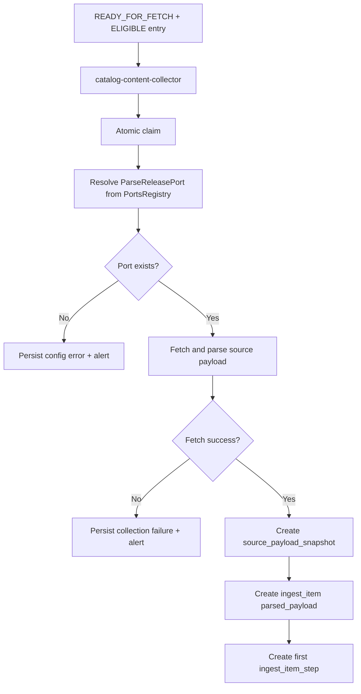

# Catalog Content Collector

`catalog-content-collector` converts discovered entries into durable ingest
objects. It claims eligible entries, fetches source content, stores snapshots,
and creates downstream `ingest_item` work units.

---

## Responsibilities

The service:

- reads `source_discovered_entry` with
  `collection_status = READY_FOR_FETCH` and `domain_decision = ELIGIBLE`
- claims entries atomically (`claimed_by`, `claimed_at`)
- resolves source-specific `ParseReleasePort` from `PortsRegistry`
- fetches and parses source payload into `ReleaseParsedContentRef`
- creates `source_payload_snapshot`
- creates `ingest_item` with `parsed_payload`
- creates initial `ingest_item_step`
- marks discovered entry as fetched when successful

The service does not:

- discover new links
- own source-country traversal strategy
- perform attribute enrichment

---

## Inputs and Outputs

| Inputs | Outputs |
| --- | --- |
| eligible `source_discovered_entry` records | `source_payload_snapshot`, `ingest_item`, initial `ingest_item_step` |

---

## Processing Flow

---

## Claiming and Concurrency

Collector workers must claim entries atomically before fetch to prevent
duplicate processing by multiple workers.

Typical claim-related fields:

- `collection_status`
- `claimed_by`
- `claimed_at`
- `collection_attempt_count`

---

## Ports and Source Adapters

Payload fetching is delegated to source-specific adapters resolved through
`PortsRegistry` by `(source, ParseReleasePort)`.

If no adapter is registered for the source, collector treats it as configuration
error, persists failure state, and sends alert signal for operator review.

---

## Boundary and Ownership

- Domain role: bridge from discovery lifecycle to ingest work lifecycle
- Persistence ownership: snapshot and ingest work creation
- Handoff contract: `ingest_item.parsed_payload` consumed by
  `catalog-data-enricher`

---

## Related Services

| Service | Relationship |
| --- | --- |
| `catalog-source-discovery` | produces discovered entries for this service |
| `catalog-data-enricher` | consumes `ingest_item` produced by this service |
| `catalog-importer` | downstream after enrichment completion |
