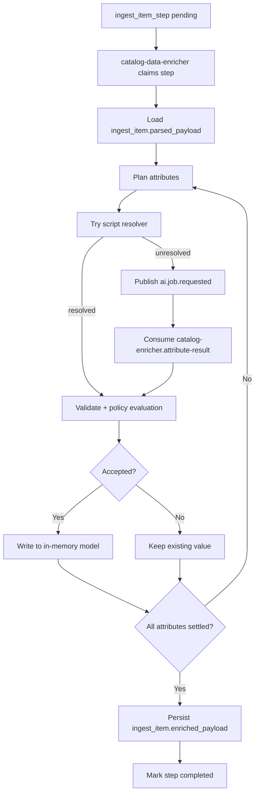

# Catalog Data Enricher

`catalog-data-enricher` transforms `ingest_item.parsed_payload` into
`ingest_item.enriched_payload`.

The service orchestrates per-attribute resolution using built-in scripts first.
If scripts cannot resolve an attribute, it delegates via Kafka to the AI
pipeline and consumes results back asynchronously.

---

## Responsibilities

The service:

- claims `ingest_item_step` records for enrichment
- deserializes parsed payload into working model (`ReleaseParsedContentRef`)
- plans which attributes require enrichment
- runs script-based resolution first
- publishes `ai.job.requested` for unresolved attributes
- consumes results from `catalog-enricher.attribute-result`
- validates and evaluates all candidates (script or AI)
- writes accepted values into in-memory model
- persists final model to `ingest_item.enriched_payload` after all attributes
  are settled
- records decision logs and execution outcomes
- marks enrichment step completed and advances pipeline stage

The service does not:

- call AI services directly
- share tables with AI domain
- import canonical catalog entities

---

## Enrichment Lifecycle

Typical step progression:

- `pending`
- `claimed_for_enrichment`
- `running_enrichment`
- `completed`

Only when all attributes are resolved/skipped/failed with logged outcome does
the service persist `enriched_payload` and close the step.

---

## Kafka Contracts

| Direction | Topic | Purpose |
| --- | --- | --- |
| Out | `ai.job.requested` | submit unresolved attribute jobs to AI pipeline |
| In | `catalog-enricher.attribute-result` | receive AI result for matching attribute request |

Matching key uses `source_request_id`.

---

## Processing Flow

---

## Scripts-First Strategy

Script resolution is preferred for deterministic cases (normalization and known
mappings). AI fallback is used for ambiguous or semantic tasks.

Both script and AI candidates pass through the same validation/policy pipeline
before acceptance.

---

## Failure Model

- enrichment step failure: state remains visible for operational retry/alerting
- AI `no_result`: keep existing value and log unresolved outcome
- AI `failed`: log failure and mark for review path

AI-side retries are handled inside AI services; enricher consumes terminal
results via Kafka.

---

## Boundary and Ownership

- Domain role: enrichment orchestrator between collection and import stages
- Persistence ownership: `ingest_item.enriched_payload` and decision history
- Cross-domain rule: communicates with AI domain only through events

---

## Related Services

| Service | Relationship |
| --- | --- |
| `catalog-content-collector` | produces parsed ingest work consumed here |
| `ai-intake-service` / `ai-orchestrator` / `ai-job-dispatcher-service` | execute unresolved attribute AI jobs |
| `catalog-importer` | consumes final `enriched_payload` produced by this service |
