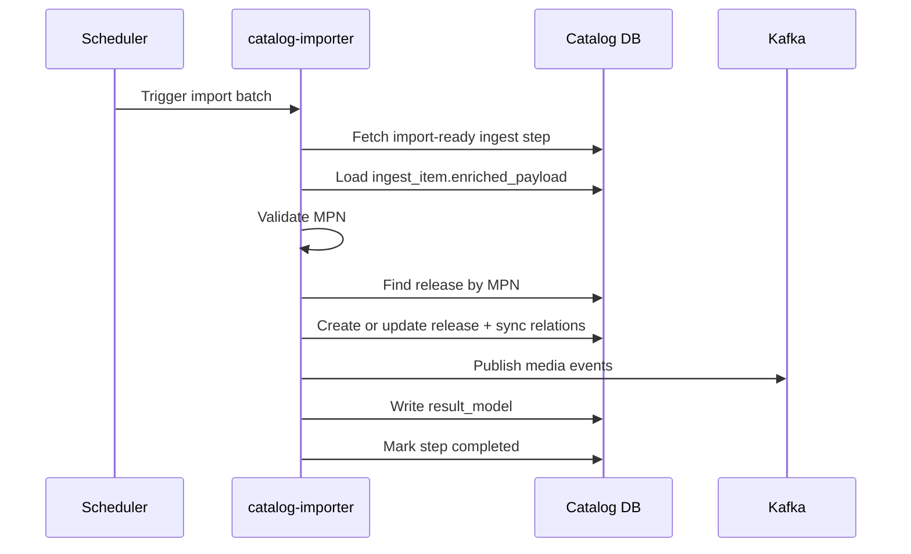

# Catalog Importer

`catalog-importer` is the authoritative write boundary from ingest lifecycle
objects into canonical catalog domain tables.

It consumes enriched ingest work, resolves canonical identity by MPN, syncs
relations, stores import results, and publishes media ingestion events.

---

## Responsibilities

The service:

- selects ingest steps ready for import
- loads `ingest_item.enriched_payload`
- validates business identity requirements (`MPN`)
- resolves release identity by MPN (create or update)
- synchronizes related catalog entities and relations
- writes canonical catalog state
- publishes Kafka media events for downstream media pipeline
- stores import summary in `ingest_item.result_model`
- marks import step completed

The service does not:

- perform source discovery or payload collection
- run attribute enrichment logic
- process media binaries directly

---

## Core Identity Rule

Primary business key for deterministic import: **MPN**.

- no MPN -> import fails
- MPN exists -> find and update existing release
- MPN not found -> create new release

---

## Processing Flow

---

## Outputs

Canonical write outputs include:

- `Release`
- release-character relations
- release-series relations
- release-pet relations
- release type and related normalized links

Pipeline outputs include:

- Kafka media ingestion events
- `ingest_item.result_model` with import mode, canonical release id, synced
  relations, and media event count

---

## Failure Model

Failure classes include:

- retryable operational failures
- non-retryable validation failures (for example missing MPN)
- domain conflicts requiring review

Import result tracking in `result_model` supports auditability and replay
decisions.

---

## Boundary and Ownership

- Domain role: canonical catalog write boundary
- Upstream input: enriched ingest work from `catalog-data-enricher`
- Downstream handoff: Kafka media events consumed by media ingestion pipeline
- Cross-domain rule: importer owns catalog mutation, not media transformation

---

## Related Services

| Service | Relationship |
| --- | --- |
| `catalog-data-enricher` | produces `ingest_item.enriched_payload` consumed by importer |
| `media-rehosting-subscriber` | consumes importer-emitted media events |
| `catalog-api-service` | exposes imported canonical data to other domains |
