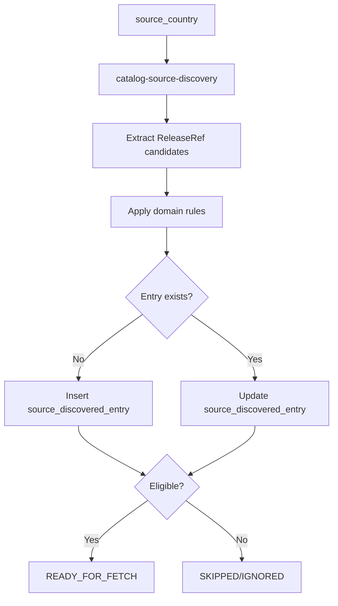

# Catalog Source Discovery

`catalog-source-discovery` is the first acquisition stage in catalog ingest.
It finds candidate source entries and persists them as lifecycle records for
downstream collection.

---

## Responsibilities

The service:

- selects `source_country` targets
- scans listing pages, sitemaps, and source discovery endpoints
- extracts lightweight `ReleaseRef` candidates
- applies domain eligibility rules
- inserts or updates `source_discovered_entry`
- marks eligible entries as ready for fetch
- marks out-of-scope entries as ignored to avoid repeated re-evaluation

The service does not:

- create canonical catalog entities
- create `ingest_item` directly
- own payload fetching as a primary responsibility

---

## Inputs and Outputs

| Inputs | Outputs |
| --- | --- |
| `core.source`, `core.geo_country`, `core.source_country`, source surfaces | `source_discovered_entry` lifecycle rows |

Typical output status markers:

- `domain_decision = ELIGIBLE` + `collection_status = READY_FOR_FETCH`
- `domain_decision = IGNORED_BY_DOMAIN_RULES` + `collection_status = SKIPPED`

---

## Processing Flow

---

## Data Contract

Discovery writes a lightweight lifecycle object that includes:

- identity (`source_country_id`, `external_id`, `url`)
- discovery and collection status
- domain decision and reason
- operational claim/error fields (`claimed_by`, `claimed_at`,
  `collection_attempt_count`, last error info)

Recommended uniqueness: `(source_country_id, external_id)`.

---

## Boundary and Ownership

- Domain role: acquisition-stage input shaping
- Primary persistence: discovered entry lifecycle records
- Downstream handoff: persisted state contract consumed by
  `catalog-content-collector`
- Failure path: errors are persisted and may trigger alerting workflow

---

## Related Services

| Service | Relationship |
| --- | --- |
| `catalog-content-collector` | consumes entries marked `READY_FOR_FETCH` |
| `catalog-data-enricher` | downstream stage after collection creates ingest work units |
| `catalog-importer` | final catalog synchronization stage after enrichment |
