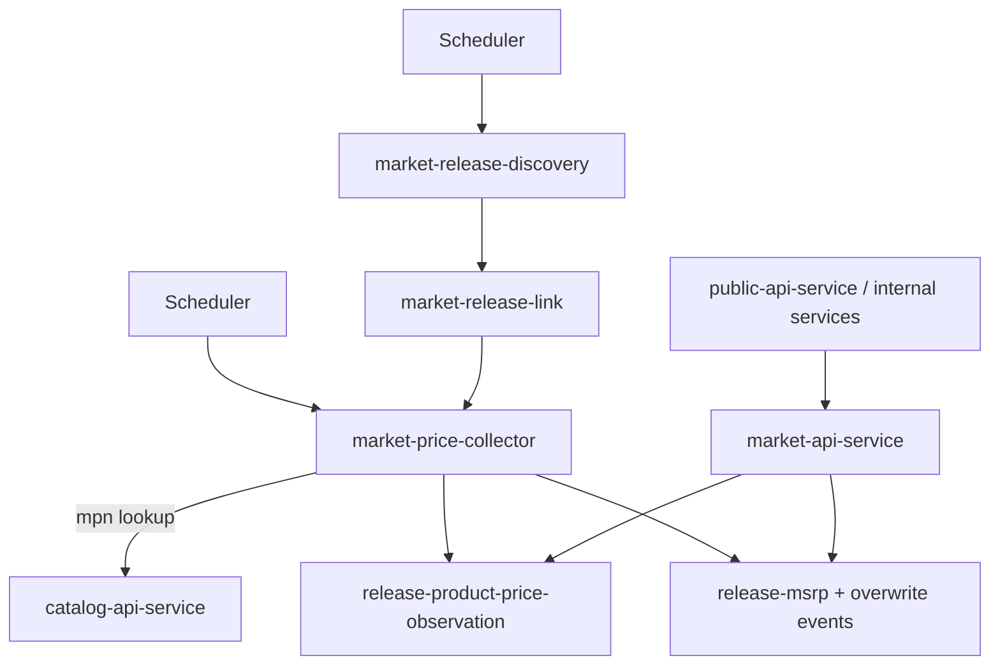

# Market Services Overview

The market domain collects and serves commercial pricing data for known
releases.

Its ingestion area is split into two independent stages: discovery of
market-facing source links and recurring price collection from known links.

---

## Service Map

| Service | Primary role |
| --- | --- |
| `market-release-discovery` | scans source-country storefronts and creates missing `market-release-link` records |
| `market-price-collector` | revisits known links, resolves `release_id`, stores append-only price observations, maintains MSRP ownership rules |
| `market-api-service` | read-only API boundary for market data consumed by other domains and public aggregation layer |

---

## High-Level Flow

---

## Ownership Boundaries

- discovery owns source coverage and durable `market-release-link` creation
- price collector owns recurring observations and MSRP trust-based updates
- release identity is resolved via `catalog-api-service`, not by direct foreign
  table access
- `market-api-service` is the domain entrypoint for cross-domain market reads
- external services should not read market tables directly

---

## Design Principles

1. scheduler-driven execution with source and country context
2. registry-based adapters (`PortsRegistry`) for source-specific parsing
3. append-only historical observation model for prices
4. trust-based MSRP ownership using source confidence
5. clear separation: discovery finds links, collector observes prices

---

## Related Service Pages

- [Market Release Discovery](./market-release-discovery.md)
- [Market Price Collector](./market-price-collector.md)
- [Market API Service](./market-api-service.md)
- [Market Ingestion Pipeline](../../pipelines/market-ingestion/market-ingestion-pipeline.md)
